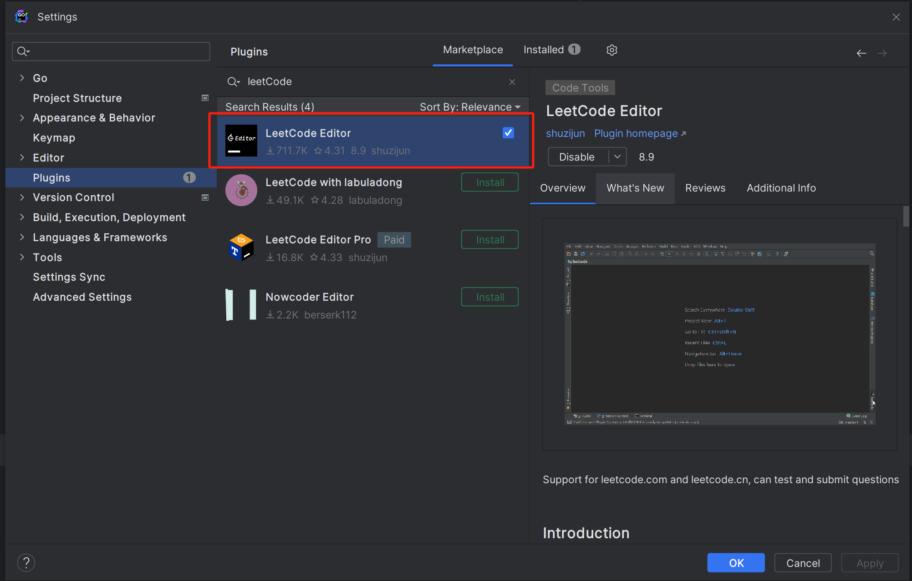
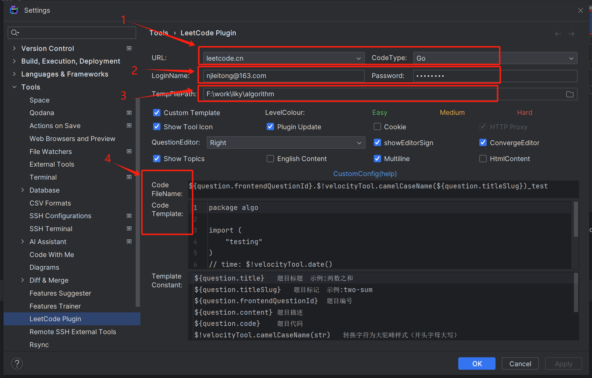
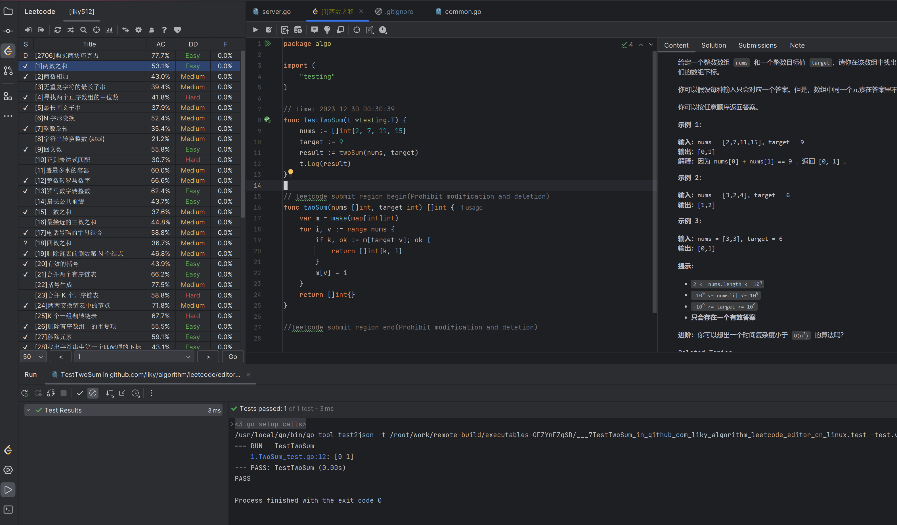

## step1



在 goland 的 setting 界面找到 Plugins，然后搜索关键字 leetcode，找到 **LeetCode Editor**。

## step 2



1. 配置 URL:  **leetcode.cn**，选择语言：**go**
2. 选择账号密码
3. 生成临时文件的位置
4. 选择自定义模板

为了本地调试我们修改 

- Code FileName: **{question.frontendQuestionId}.$!velocityTool.camelCaseName(${question.titleSlug})_test**

- Code Template:

  ```go
  package algo
  
  import (
  	"testing"
  )
  //time: $!velocityTool.date()
  func Test$!velocityTool.camelCaseName(${question.titleSlug})(t *testing.T) {
     
  }
  
  ${question.code}
  ```

通过这样，就可以构建出 xxx_test.go 文件。

最终效果如下图：

