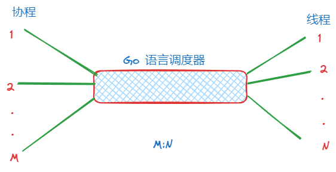
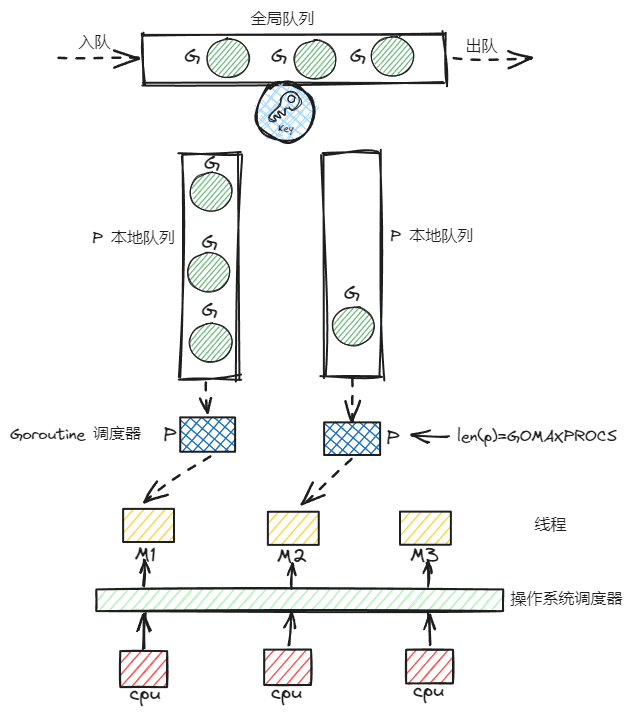
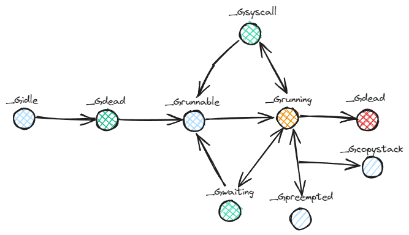
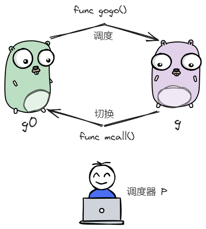
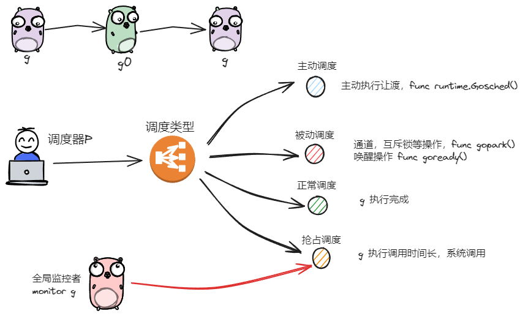
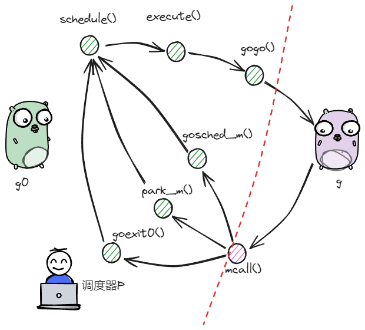
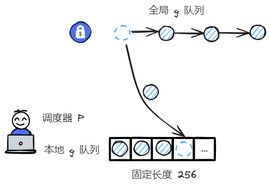

date: 2024-02-01

goversion:  go1.21.6

# 1. 概念

## 1.1 进程与线程

进程是操作系统资源分配的基本单位，线程是处理器任务调度和执行的基本单元。

一个进程可以存在多个线程，这些线程可以共享进程的内存等资源。不同进程具有不同的内存地址。

## 1.2 线程上下文切换

为了平衡每个线程被 CPU 公平利用，操作系统会在适当时间通过 定时器中断、IO 设备中断、系统调用进行上下文切换。

CPU 需完成用户态与内核态间的切换。

在之后说的线程通常指的是内核级线程

## 1.3 线程与协程

和线程不同，协程的创建、销毁、调度 依赖 Go 运行时调度器，对内核透明。

从几个方面来说明他们之间的不同

### 1.3.1 调度方式

协程和线程依赖 运行时调度器，对象关系是: M:N ，多对多的关系




### 1.3.2 上下文切换

协程切换不经过操作系统用户态和内核态的切换

### 1.3.3 调度策略

线程调度是抢占式的

协程调度是协作式的，当完成任务的时候主动将执行权让给其他协程。若一个协程运行很长时间，Go 调度才会抢占。

### 1.3.4 栈的大小

线程的栈大小一般在创建时指定，默认大小 2M；协程默认为2kb，可以动态的扩容


# 2. gmp 模型 

gmp = goroutine + machine + processor，GMP 模型概况了线程与协程的关系，协程依托于线程，借助操作系统将线程调度到 CPU 执行，从而最终执行协程。

## 2.1 g

1. g 即 goroutine，是 golang 中对协程的抽象；
2. g 有自己的运行栈、状态、以及执行的任务函数（由 go func 指定）；
3. g 需要绑定 p 才能执行，在 g 的视角中，p 就是它的 cpu；


## 2.2 p

1. p 即 processor，是 golang 中的调度器；
2. p 是 gmp 中枢，实现 g 和 m 之间的动态有机结合；
3. 对 g 而言，p 是其 cpu，g 只有被 p 调度，才得以执行；
4. 对 m 而言，p 是其执行代理，为其提供必要信息的同时，隐藏了调度细节；
5. p 的数量决定了 g 最大并行数量，可由用户通过 GOMAXPROCS 进行设定；


## 2.3 m

1. m 即 machine，是 golang 中对线程的抽象；
2. m 不直接执行 g，而是先和 p 绑定，由其实现代理；
3. 借由 p 的存在，m 无需和 g 绑死，也无需记录 g 的状态信息，因此在 g 的生命周期中可实现跨 m 执行


## 2.4 GMP




上图是 GMP 宏观模型

1. M 是线程的抽象；G 是 goroutine；P 是承上启下的调度器；
2. M 调度 G 前，需要和 P 绑定；
3. 全局有多个 M 和多个 P，但同时并行的 G 的最大数量等于 P 的数量；
4. G 的存放队列有三类：P 的本地队列；全局队列；wait 队列（上图没有，为 io 阻塞就绪态 goroutine 队列）；
5. M 调度 G 时，优先取 P 的本地队列，其次取全局队列，最后取 wait 队列；这样的好处：取本地队列时，可以接近于无锁化，减少全局竞争；
6. 为了防止不同 P 的闲忙差异过大，设立 work-stealing 机制，本地队列为空的 P 可以尝试从其他 P 队列偷取一半的 G 补充到自身队列；


# 3. 核心数据结构

gmp 数据结构定义在 runtime/runtime2.go 文件中。

## 3.1 g

```go
type g struct {
    // ...
    m *m
    // ...
    sched gobuf
    // ...
}

type gobuf struct {
	sp   uintptr
	pc   uintptr
	ret  uintptr
	bp   uintptr // for framepointer-enabled architectures
    // ...
}
```

1.  m :  在 p 的代理，负责执行当前 g 的  m ；
2. sched.sp: 保存 CPU 的 rsp 寄存器的值，指向调用函数栈顶；
3. sched.pc: 保存 CPU 的 rip 寄存器的值，执行程序下一条执行指令的地址；
4. sched.ret: 保存系统调用的返回值；
5. sched.bp: 保存 CPU 的 rbp 寄存器的值，存储函数栈帧的起始位置；

其中 g 的生命周期由以下几种状态组成：



```go
const (
	_Gidle = iota // 0
	_Grunnable // 1
	_Grunning // 2
	_Gsyscall // 3
	_Gwaiting // 4
	_Gdead // 6
	_Genqueue_unused // 7
	_Gcopystack // 8
	_Gpreempted // 9
)
```

1. _Gidle 值为 0，为协程开始创建状态时的状态，此时尚未完成初始化；
2. _Grunnable 值为 1，协程在等待执行队列中，等待被执行；
3. _Gunning 值为 2，协程正在被执行，同一时刻一个 p 中只有一个 g 处于此状态；
4. _Gsyscall 值为 3，协程正在执行系统调用；
5. _Gwaiting 值为 4，协程处于挂起态，需要等待被唤醒. gc、channel 通信或者锁操作时经常会进入这种状态；
6. _Gdead 值为 6，协程刚初始化完成或者已经被销毁，会处于此状态；
7. _Gcopystack 值为 8，协程正在栈扩容流程中；
8. _Greempted 值为 9，协程被抢占后的状态.


## 3.2 m

```go
type m struct {
	g0      *g     // goroutine with scheduling stack
	// ...
    tls     [tlsSlots]uintptr // thread-local storage (for x86 extern register)
    // ...
}
```

1. g0 : 一类特殊的调度协程，不用执行用户函数，负责 g 之间的切换调度，与  m 的关系为 1:1；
2. tls：thread-local storage，线程本地存储，存储内容只对当前线程可见. 线程本地存储的是 m.tls 的地址，m.tls[0] 存储的是当前运行的 g 的地址，因此线程可以通过线程本地存储 找到当前线程上的 g、m、p、g0 等信息.


## 3.3 p

```go
type p struct {
    // ...
    runqhead uint32
    runqtail uint32
    runq     [256]guintptr
    
    runnext guintptr
    // ...
}
```

1. runq：本地 goroutine 队列，最大长度为 256；
2. runqhead：队列头部；
3. runqtail：队列尾部；
4. runnext：下一个可执行的 goroutine；


## 3.4 schedt

```go
type schedt struct {
    // ...
    lock mutex
    // ...
    runq     gQueue
    runqsize int32
    // ...
}
```

sched 是全局 goroutine 队列的封装：

1. lock：一把操作全局队列时使用的锁;
2. runq：全局 goroutine 队列，是一个链表；
3. runqsize：全局 goroutine 队列的容量；


# 4. 调度流程

## 4.1 两种 g 的切换




之前说的 goroutine 的类型可分为两类：

1. 负责调度普通 g 的 g0，执行固定的调度流程，与 m 的关系为一对一；
2. 负责执行用户函数的普通 g；


m 通过 p 调度执行的 goroutine 永远在普通 g 和 g0 之间进行切换，当 g0 找到可执行的 g 时，会调用 gogo 方法，调度 g 执行用户定义的任务；

当 g 主动调度或被动调度时，会触发 mcall 方法，将执行权重新交给 g0。


gogo 和 mcall 可以理解为对偶关系，其定义在 runtime/stubs.go 文件中

```go
// ...
func gogo(buf *gobuf)
// ...
func mcall(fn func(*g))
```


## 4.2 调度类型




通常调度指的是由 g0 按照特定策略找到下一个可执行 g 的过程。本节谈论的是广义上的“调度”，指的是调度器 P 实现从执行一个 g 切换到另一个 g 的过程。

这种广义上“调度”可分为几种类型：

1. 主动调度

​	用户主动执行让渡的方式，主要方式是，用户在执行代码中调用了 runtime.Goshced() 方法，此时当前 g 会让出执行权，主动进行队列等待下次被调用。放入的是全局队列里面。大多数情况下，用户并不需要执行此函数。

代码位于 runtime/proc.go。

```go
func Gosched() {
	checkTimeouts()
	mcall(gosched_m)
}
```


2. 被动调度

指协程在休眠、channel 通道阻塞、网络 IO 阻塞、执行垃圾回收而暂停，被动让渡自己执行权利的过程。放入的是本地队列，状态 _Grunning->_Gwaiting，所以被动调度需要一个额外的唤醒机制。

代码位于 runtime/proc.go

```go
func gopark(unlockf func(*g, unsafe.Pointer) bool, lock unsafe.Pointer, reason waitReason, traceReason traceBlockReason, traceskip int) {
	// ...
	mcall(park_m)
}
```

goready 方法通常与 gopark 方法成对出现，能够将 g 从阻塞态恢复，重新进入等待执行队列。

代码位于 runtime/proc.go

```go
func goready(gp *g, traceskip int) {
    systemstack(func() {
        ready(gp, traceskip, true)
    })
}
```


3.  正常调度

g 中执行任务已完成，g0 会将当前 g 置为死亡状态，发起新一轮的调度。


4. 抢占调度

Go  在初始化时会启动一个特殊的线程来执行系统监控任务。若 g 执行超过时间过长，或者处于系统调用阶段，全局的 p 资源比较紧缺，此时 p 和 g 进行解绑，抢占出来用于其他 g 的调度。等待 g 完成系统调用，会重新进入可执行队列中等待被调度。

为什么需要 monitor g 来完成？

因为发起系统调用时，此时是内核态，m 也会因为系统调用陷入，无法主动完成抢占调度的行为。

代码位于 runtime/proc.go

```go
func retake(now int64) uint32 {
// ...
}
```


## 4.3 宏观调度流程



对 gmp 宏观调度流程进行串联：

1. 以 g0 -> g -> g0 的一轮循环为例进行串联；
2. g0 执行 schedule() 函数，寻找到用于执行的 g；
3. go 执行 execute() 方法，更新当前 g、p 的状态信息，并调用 gogo() 方法，将执行权交给 g；
4. g 因主动调度（gosched_m）、被动调度（park_m）、正常结束（goexit0()）等原因，调用 mcall 函数，执行权重新回到 g0 手中；
5. g0 执行 schedule() 函数，进行新一轮循环；


## 4.4 schedule()

调度流程方法位于 runtime/proc.go 中的 schedule 函数，此时的执行权位于 g0 手中：

```go
// One round of scheduler: find a runnable goroutine and execute it.
// Never returns.
func schedule() {
	// ...
	gp, inheritTime, tryWakeP := findRunnable() // blocks until work is available
	// ...
	execute(gp, inheritTime)
}
```

schedule 函数处理具体的调度策略，选择下一个要执行的协程。

1. 寻找到下一个执行的 goroutine；
2. 执行该 goroutine；

## 4.5 findRunnable

```go
// Finds a runnable goroutine to execute.
// Tries to steal from other P's, get g from local or global queue, poll network.
func findRunnable() (gp *g, inheritTime, tryWakeP bool) {
	mp := getg().m

top:
	pp := mp.p.ptr()
	// ...

	// Check the global runnable queue once in a while to ensure fairness.
	// Otherwise two goroutines can completely occupy the local runqueue
	// by constantly respawning each other.
	if pp.schedtick%61 == 0 && sched.runqsize > 0 {
		lock(&sched.lock)
		gp := globrunqget(pp, 1)
		unlock(&sched.lock)
		if gp != nil {
			return gp, false, false
		}
	}

	// local runq
	if gp, inheritTime := runqget(pp); gp != nil {
		return gp, inheritTime, false
	}

	// global runq
	if sched.runqsize != 0 {
		lock(&sched.lock)
		gp := globrunqget(pp, 0)
		unlock(&sched.lock)
		if gp != nil {
			return gp, false, false
		}
	}

	// Poll network.
	// This netpoll is only an optimization before we resort to stealing.
	// We can safely skip it if there are no waiters or a thread is blocked
	// in netpoll already. If there is any kind of logical race with that
	// blocked thread (e.g. it has already returned from netpoll, but does
	// not set lastpoll yet), this thread will do blocking netpoll below
	// anyway.
	if netpollinited() && netpollWaiters.Load() > 0 && sched.lastpoll.Load() != 0 {
		if list := netpoll(0); !list.empty() { // non-blocking
			gp := list.pop()
			injectglist(&list)
			casgstatus(gp, _Gwaiting, _Grunnable)
			if traceEnabled() {
				traceGoUnpark(gp, 0)
			}
			return gp, false, false
		}
	}

	// Spinning Ms: steal work from other Ps.
	//
	// Limit the number of spinning Ms to half the number of busy Ps.
	// This is necessary to prevent excessive CPU consumption when
	// GOMAXPROCS>>1 but the program parallelism is low.
	if mp.spinning || 2*sched.nmspinning.Load() < gomaxprocs-sched.npidle.Load() {
		if !mp.spinning {
			mp.becomeSpinning()
		}

		gp, inheritTime, tnow, w, newWork := stealWork(now)
		if gp != nil {
			// Successfully stole.
			return gp, inheritTime, false
		}
		if newWork {
			// There may be new timer or GC work; restart to
			// discover.
			goto top
		}

		now = tnow
		if w != 0 && (pollUntil == 0 || w < pollUntil) {
			// Earlier timer to wait for.
			pollUntil = w
		}
	}
	// ...
	goto top
}
```

1. p 每执行 61 次调度，会从全局队列中获取一个 goroutine 执行  

```go
if pp.schedtick%61 == 0 && sched.runqsize > 0 {
	lock(&sched.lock)
	gp := globrunqget(pp, 1)
	unlock(&sched.lock)
	if gp != nil {
		return gp, false, false
	}
}
```

核心的代码就是 globrunqget()，得到的 goroutine 就是 min(1, sched.runqsize/gomaxprocs + 1,  sched.runqsize,  len(pp.runq)/2)

- sched.runqsize 即全局队列长度
- gomaxprocs 即 P 的数量
- pp.runq 即 P 本地队列长度，256

从代码可以看出，肯定能得到一个或者 没有

2. 尝试从 p 本地队列中获取一个可执行的 goroutine，核心逻辑位于 runqget 方法中：

```go
// local runq
if gp, inheritTime := runqget(pp); gp != nil {
	return gp, inheritTime, false
}
```

```go
func runqget(pp *p) (gp *g, inheritTime bool) {
	// If there's a runnext, it's the next G to run.
	next := pp.runnext
	// If the runnext is non-0 and the CAS fails, it could only have been stolen by another P,
	// because other Ps can race to set runnext to 0, but only the current P can set it to non-0.
	// Hence, there's no need to retry this CAS if it fails.
	if next != 0 && pp.runnext.cas(next, 0) {
		return next.ptr(), true
	}

	for {
		h := atomic.LoadAcq(&pp.runqhead) // load-acquire, synchronize with other consumers
		t := pp.runqtail
		if t == h {
			return nil, false
		}
		gp := pp.runq[h%uint32(len(pp.runq))].ptr()
		if atomic.CasRel(&pp.runqhead, h, h+1) { // cas-release, commits consume
			return gp, false
		}
	}
}
```

> 1. 若当前 p 的 runnext 非空，直接获取
>
>    ```go
>    if next != 0 && pp.runnext.cas(next, 0) {
>    	return next.ptr(), true
>    }
>    ```
>
> 2. 加锁，从本地队列获取 g.   
>
>    本地队列是 p 独有，为什么需要加锁？因为有 work-stealing 机制的存在，其他 p 可能来窃取。
>
>    由于窃取频率不会太高，因此当前 p 取得锁成功率是很高的，因此可以说 p 的本地队列是接近于无锁化，但不是真正意义上的无锁。
>
>    ```go
>    for {
>    	h := atomic.LoadAcq(&pp.runqhead) // load-acquire, synchronize with other consumers
>    	// ...
>    }
>    ```
>
> 3. 若本地队列为空，直接返回
>
>    ```go
>    t := pp.runqtail
>    if t == h {
>    	return nil, false
>    }
>    ```
>
> 4. 若本地队列存在 g，则取得队首的 g，解锁并返回。
>
>    ```go
>    gp := pp.runq[h%uint32(len(pp.runq))].ptr()
>    if atomic.CasRel(&pp.runqhead, h, h+1) { // cas-release, commits consume
>    	return gp, false
>    }
>    ```


3. 若本地队列没有可执行的 g，会从全局队列获取：

   ```go
   if sched.runqsize != 0 {
   	lock(&sched.lock)
   	gp := globrunqget(pp, 0)
   	unlock(&sched.lock)
   	if gp != nil {
   		return gp, false, false
   	}
   }
   ```

   加锁，尝试并从全局队列中取队首的元素，且把全局队列的 g ，放一些到 p 的本地队列中。

   ```go
   func globrunqget(pp *p, max int32) *g {
   	assertLockHeld(&sched.lock)
   
   	if sched.runqsize == 0 {
   		return nil
   	}
   
   	n := sched.runqsize/gomaxprocs + 1
   	if n > sched.runqsize {
   		n = sched.runqsize
   	}
   	if max > 0 && n > max {
   		n = max
   	}
   	if n > int32(len(pp.runq))/2 {
   		n = int32(len(pp.runq)) / 2
   	}
   
   	sched.runqsize -= n
   
   	gp := sched.runq.pop()
   	n--
   	for ; n > 0; n-- {
   		gp1 := sched.runq.pop()
   		runqput(pp, gp1, false)
   	}
   	return gp
   }
   ```

   > 注意这里 max = 0，所以 放入 p 本地队列的数量是：min( sched.runqsize/gomaxprocs + 1,  sched.runqsize,  len(pp.runq)/2) -1

   


将一些 g 由全局队列转移到 本地队列的执行逻辑位于 runqput 方法中：

```go
func runqput(pp *p, gp *g, next bool) {

    // 
retry:
	h := atomic.LoadAcq(&pp.runqhead) // load-acquire, synchronize with consumers
	t := pp.runqtail
	if t-h < uint32(len(pp.runq)) {
		pp.runq[t%uint32(len(pp.runq))].set(gp)
		atomic.StoreRel(&pp.runqtail, t+1) // store-release, makes the item available for consumption
		return
	}
	if runqputslow(pp, gp, h, t) {
		return
	}
	// the queue is not full, now the put above must succeed
	goto retry
}
```

