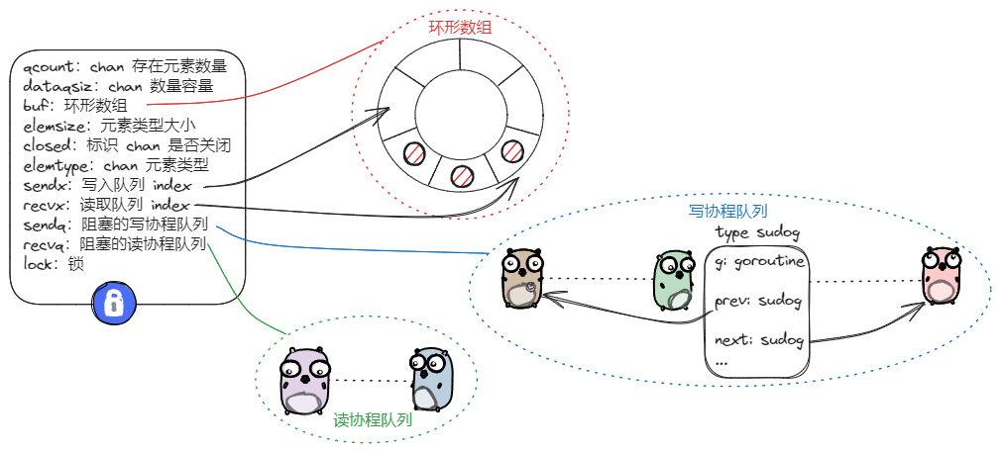
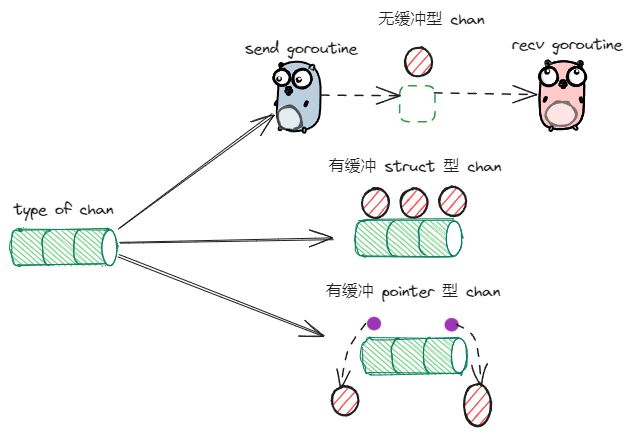

date: 2024-02-26

goversion:  go1.21.6


# 1. 核心数据结构



## 1.1 hchan

```go
type hchan struct {
	qcount   uint           // total data in the queue
	dataqsiz uint           // size of the circular queue
	buf      unsafe.Pointer // points to an array of dataqsiz elements
	elemsize uint16
	closed   uint32
	elemtype *_type // element type
	sendx    uint   // send index
	recvx    uint   // receive index
	recvq    waitq  // list of recv waiters
	sendq    waitq  // list of send waiters

	lock mutex
}
```

hcan：channel 数据结构

* qcount：当前 channel 存在多少个元素
* dataqsiz： 当前 channel 能够存放元素数量
* buf：存放元素的环形队列
* elemsize：元素类型大小
* closed：标识 channel 是否关闭
* elemtype：channel 元素类型
* sendx：发送元素环形队列的 index
* recvx：接收元素环形队列的 index
* sendq：因发送而陷入阻塞的协程队列
* recvq：因接受而陷入阻塞的协程队列


## 1.2 waitq

```go
type waitq struct {
	first *sudog
	last  *sudog
}
```

waitq：阻塞的协程队列

* first：队列头部
* last：队列尾部

## 1.3 sudog

```go
type sudog struct {

	g *g

	next *sudog
	prev *sudog
	elem unsafe.Pointer // data element (may point to stack)


	// isSelect indicates g is participating in a select, so
	// g.selectDone must be CAS'd to win the wake-up race.
	isSelect bool

	c        *hchan // channel
}
```

sudog：包装 g 的结构体

* g：当前 goroutine
* next：指向下一个节点
* prev：指向上一个节点
* elem：读取或者写入 chan 的数据
* isSelect: 表示当前协程是否在 select 多路复用的流程中
* c：标识与当前 sudog 交互的 chan

# 2 chan 初始化



```go
func makechan(t *chantype, size int) *hchan {
	elem := t.Elem
	
	// ...
	
	mem, overflow := math.MulUintptr(elem.Size_, uintptr(size))
	if overflow || mem > maxAlloc-hchanSize || size < 0 {
		panic(plainError("makechan: size out of range"))
	}

	var c *hchan
	switch {
	case mem == 0:
		// Queue or element size is zero.
		c = (*hchan)(mallocgc(hchanSize, nil, true))
		// Race detector uses this location for synchronization.
		c.buf = c.raceaddr()
	case elem.PtrBytes == 0:
		// Elements do not contain pointers.
		// Allocate hchan and buf in one call.
		c = (*hchan)(mallocgc(hchanSize+mem, nil, true))
		c.buf = add(unsafe.Pointer(c), hchanSize)
	default:
		// Elements contain pointers.
		c = new(hchan)
		c.buf = mallocgc(mem, elem, true)
	}

	c.elemsize = uint16(elem.Size_)
	c.elemtype = elem
	c.dataqsiz = uint(size)
	lockInit(&c.lock, lockRankHchan)

	if debugChan {
		print("makechan: chan=", c, "; elemsize=", elem.Size_, "; dataqsiz=", size, "\n")
	}
	return c
}
```

* 第一个参数代表通道类型，第二个参数代表通道中元素大小
* 判断申请内存空间大小是否越界，mem = elem.size * elem.num
  * 无缓冲类型 chan 时，elem.num =  0，mem = 0；
  * 缓冲类型 chan 的类型是 `struct{}`，elem.size = 0, mem = 0；
* 根据类型，chan 分为 无缓冲型、有缓冲型元素为 `struct` 、有缓冲型元素为 `pointer` 
* 若无缓冲型，则申请一个 hchan 结构体大小空间，默认值 96
* 若缓冲型元素为 `struct`，则申请 96 + mem 大小空间，并且调整 chan 的 buf 的指向 mem 的起始位置
* 若缓冲型元素为 `pointer`, 则分别申请 c 和 buf 的 空间，无需连续。因为当元素中包含指针时，需要单独分配空间才能正常进行垃圾回收
* 对 chan 其他字段进行初始化，包括元素类型，元素类型大小，容量，以及锁的初始化


# 3 写入 chan

## 3.1 两种异常

```go
func chansend(c *hchan, ep unsafe.Pointer, block bool, callerpc uintptr) bool {

	if c == nil {
	
		// ...
		
		gopark(nil, nil, waitReasonChanSendNilChan, traceBlockForever, 2)
		throw("unreachable")
	}
	
	// ...
	
	lock(&c.lock)

	if c.closed != 0 {
		unlock(&c.lock)
		panic(plainError("send on closed channel"))
	}
	...
}
```

* 没有初始化的 chan，写入操作会死锁
* 已关闭的 chan,  写入操作会 panic

## 3.2 case1 写时存在阻塞读协程

```go
func chansend(c *hchan, ep unsafe.Pointer, block bool, callerpc uintptr) bool {

	lock(&c.lock)
	
	// ...
	
	if sg := c.recvq.dequeue(); sg != nil {
		// Found a waiting receiver. We pass the value we want to send
		// directly to the receiver, bypassing the channel buffer (if any).
		send(c, sg, ep, func() { unlock(&c.lock) }, 3)
		return true
	}
    
	// ...
}

func send(c *hchan, sg *sudog, ep unsafe.Pointer, unlockf func(), skip int) {
    
	// ...
    
	if sg.elem != nil {
		sendDirect(c.elemtype, sg, ep)
		sg.elem = nil
	}
	gp := sg.g
	unlockf()
    
	// ...
    
	goready(gp, skip+1)
}
```

* 加锁
* 从阻塞读协程队列获取一个 sudog；
* 在 send 方法中的 sendDirect 方法，会基于 memmove  方法，直接见元素拷贝交给 sudog 对应的 goroutine；
* unlockf() 解锁；
* goready 唤醒 goroutine；

## 3.3 case2 写时无阻塞读队列，环形数组有空间

```go
func chansend(c *hchan, ep unsafe.Pointer, block bool, callerpc uintptr) bool {

	lock(&c.lock)
	
	// ...
	
	if c.qcount < c.dataqsiz {
		// Space is available in the channel buffer. Enqueue the element to send.
		qp := chanbuf(c, c.sendx)
		if raceenabled {
			racenotify(c, c.sendx, nil)
		}
		typedmemmove(c.elemtype, qp, ep)
		c.sendx++
		if c.sendx == c.dataqsiz {
			c.sendx = 0
		}
		c.qcount++
		unlock(&c.lock)
		return true
	}
	...
}
```

* 加锁；
* 将元素添加到环形数组中；
* sendx++；如果环形数组满了，将 sendx 置为 0； 
* qcount++；
* 解锁

## 3.4 case3 写时无阻塞队列，环形数组无空间

```go
func chansend(c *hchan, ep unsafe.Pointer, block bool, callerpc uintptr) bool {

	lock(&c.lock)
	
	// ...
	
	gp := getg()
	mysg := acquireSudog()
	mysg.elem = ep
	mysg.waitlink = nil
	mysg.g = gp
	mysg.isSelect = false
	mysg.c = c
	gp.waiting = mysg
	gp.param = nil
	c.sendq.enqueue(mysg)
	gp.parkingOnChan.Store(true)
	gopark(chanparkcommit, unsafe.Pointer(&c.lock), waitReasonChanSend, traceBlockChanSend, 2)
	
    gp.waiting = nil
	gp.activeStackChans = false
	closed := !mysg.success
	gp.param = nil
	if mysg.releasetime > 0 {
		blockevent(mysg.releasetime-t0, 2)
	}
	mysg.c = nil
	releaseSudog(mysg)
	if closed {
		if c.closed == 0 {
			throw("chansend: spurious wakeup")
		}
		panic(plainError("send on closed channel"))
	}
	return true
	// ...
}
```

* 加锁；
* 获取 sudog ；
* 完成指针指向，建立 sudog、goroutine、channel 的关系；
* 把 sudog 加到 chan 的阻塞写协程队列中；
* 阻塞当前 goroutine；
* 若 goroutine 被唤醒（goready），则回收 sudog（sudog 被唤醒，其对应的元素放到通道里面了）
* goroutine 被唤醒有两种可能：
  * 取走数据，succees = true
  * chan 关闭， success = false
* 解锁，返回，应该在 gopark 做的？？


# 4 读出 chan

## 4.1 异常 case1 读空 chan

```go
func chanrecv(c *hchan, ep unsafe.Pointer, block bool) (selected, received bool) {
    
    // ...
	if c == nil {
		if !block {
			return
		}
		gopark(nil, nil, waitReasonChanReceiveNilChan, traceBlockForever, 2)
		throw("unreachable")
	}
    // ...
}
```

* park 挂起，死锁

## 4.2 异常 case2 chan 关闭且里面没元素

```go
func chanrecv(c *hchan, ep unsafe.Pointer, block bool) (selected, received bool) {

    lock(&c.lock)
    // ...
    
	if c.closed != 0 {
		if c.qcount == 0 {
			if raceenabled {
				raceacquire(c.raceaddr())
			}
			unlock(&c.lock)
			if ep != nil {
				typedmemclr(c.elemtype, ep)
			}
			return true, false
		}
		// The channel has been closed, but the channel's buffer have data.
	}
    // ...
}
```

* 解锁直接返回


## 4.3 读时有阻塞的写协程

```go
func chanrecv(c *hchan, ep unsafe.Pointer, block bool) (selected, received bool) {
    
    lock(&c.lock)
    // ...
    
	if sg := c.sendq.dequeue(); sg != nil {
		recv(c, sg, ep, func() { unlock(&c.lock) }, 3)
		return true, true
	}
    // ...
}

func recv(c *hchan, sg *sudog, ep unsafe.Pointer, unlockf func(), skip int) {
	if c.dataqsiz == 0 {
		if ep != nil {
			// copy data from sender
			recvDirect(c.elemtype, sg, ep)
		}
	} else {
		qp := chanbuf(c, c.recvx)
		// copy data from queue to receiver
		if ep != nil {
			typedmemmove(c.elemtype, ep, qp)
		}
		// copy data from sender to queue
		typedmemmove(c.elemtype, qp, sg.elem)
		c.recvx++
		if c.recvx == c.dataqsiz {
			c.recvx = 0
		}
		c.sendx = c.recvx // c.sendx = (c.sendx+1) % c.dataqsiz
	}
	sg.elem = nil
	gp := sg.g
	unlockf()
	gp.param = unsafe.Pointer(sg)
	sg.success = true
	if sg.releasetime != 0 {
		sg.releasetime = cputicks()
	}
	goready(gp, skip+1)
}
```

* 加锁；

* 从阻塞的写协程队列获取一个写协程；

  ```go
  if sg := c.sendq.dequeue(); sg != nil {
  	// ...
  }
  ```

  

* 若 chan 无缓冲，直接获取

  ```
  if c.dataqsiz == 0 {
  	if ep != nil {
  		// copy data from sender
  		recvDirect(c.elemtype, sg, ep)
  	}
  }
  ```

* 若 chan 缓冲，读取缓冲区头部元素，并将写协程队列写入缓冲区尾部，唤醒写协程；

  ```go
  else {
  	qp := chanbuf(c, c.recvx)
  	// copy data from queue to receiver
  	if ep != nil {
  		typedmemmove(c.elemtype, ep, qp)
  	}
  	// copy data from sender to queue
  	typedmemmove(c.elemtype, qp, sg.elem)
  	c.recvx++
  	if c.recvx == c.dataqsiz {
  		c.recvx = 0
  	}
  	c.sendx = c.recvx // c.sendx = (c.sendx+1) % c.dataqsiz
  }
  sg.elem = nil
  gp := sg.g
  unlockf()
  sg.success = true
  goready(gp, skip+1)
  ```

* 解锁返回

  ```go
  unlockf()
  ```


## 4.4 case4 读时无阻塞写协程，缓冲区有元素

```go
func chanrecv(c *hchan, ep unsafe.Pointer, block bool) (selected, received bool) {
    
    lock(&c.lock)
    // ...
    
	if c.qcount > 0 {
		// Receive directly from queue
		qp := chanbuf(c, c.recvx)
		if ep != nil {
			typedmemmove(c.elemtype, ep, qp)
		}
		typedmemclr(c.elemtype, qp)
		c.recvx++
		if c.recvx == c.dataqsiz {
			c.recvx = 0
		}
		c.qcount--
		unlock(&c.lock)
		return true, true
	}
    // ...
}
```

* 加锁；
* 获取 recvx 位置的元素；
* recvx++；
* qcount--；
* 解锁，并返回；


## 4.5 case5 读时无阻塞写协程，缓冲区无元素

```go
func chanrecv(c *hchan, ep unsafe.Pointer, block bool) (selected, received bool) {
    
    lock(&c.lock)
    // ...
    
	// no sender available: block on this channel.
	gp := getg()
	mysg := acquireSudog()
	mysg.elem = ep
	mysg.waitlink = nil
	gp.waiting = mysg
	mysg.g = gp
	mysg.isSelect = false
	mysg.c = c
	gp.param = nil
	c.recvq.enqueue(mysg)
	
	gp.parkingOnChan.Store(true)
	gopark(chanparkcommit, unsafe.Pointer(&c.lock), waitReasonChanReceive, traceBlockChanRecv, 2)

	success := mysg.success
	gp.param = nil
	mysg.c = nil
	releaseSudog(mysg)
	return true, success
}
```

* 加锁；

* 获取 sudog；

  ```go
  mysg := acquireSudog()
  ```

* 完成指针指向，建立 sudog、goroutine、channel 的关系；

  ```go
  mysg.elem = ep
  gp.waiting = mysg
  mysg.g = gp
  mysg.isSelect = false
  mysg.c = c
  ```

* 把 sudog 添加到 chan 的阻塞读协程队列中；

  ```
  c.recvq.enqueue(mysg)
  ```

* 阻塞 goroutine

  ```
  gopark(chanparkcommit, unsafe.Pointer(&c.lock), waitReasonChanReceive, traceBlockChanRecv, 2)
  ```

* 若 goroutine 被唤醒，则回收 sudog （sudog 能被唤醒，其对应的元素必然已经被写入）；

  ```
  success := mysg.success
  gp.param = nil
  mysg.c = nil
  releaseSudog(mysg)
  ```

* 返回；


# 5 阻塞与非阻塞模式

在上述读写中，都是以非阻塞模式为主线进行描述的，忽略非阻塞模式的有关处理逻辑，有两个问题：

1. 非阻塞模式下，流程逻辑是什么样子？
2. 何时进入非阻塞模式？

## 5.1 非阻塞模式

非阻塞模式下，读写 chan 方法通过一个 bool 型的响应参数，用以标识是否读取、写入成功。

* 所有需要使得当前 goroutine 挂起的操作，在非阻塞模式下都会返回 false ；
* 所有使得 goroutine 死锁的操作，在非阻塞模式下都会返回 false；
* 所有能立即完成读取、写入操作，在非阻塞模式下都会返回 true；


## 5.2 何时进入非阻塞模式

在默认情况下，读写 chan 都是阻塞模式，只有 select 语句组成的多路复用分支中，与 chan 交互非变成非阻塞模式：

```go
ch := make(chan int)
select {
case <-ch:
default:
} 
```

## 5.3 代码

```go
func selectnbsend(c *hchan, elem unsafe.Pointer) (selected bool) {
	return chansend(c, elem, false, getcallerpc())
}
func selectnbrecv(elem unsafe.Pointer, c *hchan) (selected, received bool) {
	return chanrecv(c, elem, false)
}
```

读写在 第三个参数传递的是 false，可以查看，后续就会走非阻塞逻辑。

在 select 语句中，读写 channel 会被汇编成 selectnbsend selectnbrecv 方法，进行调用。


# 6 两种读 chan 的协议

读取 chan 时，可根据第二个 bool 型返回值用以判断当前 chan 是否已处于关闭状态：

```go
ch := make(chan int, 2)
v1 := <- ch
v2,ok := <- ch
```

实现上述功能的原因是，两种格式下，读 channel 操作会被汇编成不同的方法：

```go

func chanrecv1(c *hchan, elem unsafe.Pointer) {
	chanrecv(c, elem, true)
}

func chanrecv2(c *hchan, elem unsafe.Pointer) (received bool) {
	_, received = chanrecv(c, elem, true)
	return
}
```


# 7 关闭 chan

```go
func closechan(c *hchan) {
	if c == nil {
		panic(plainError("close of nil channel"))
	}

	lock(&c.lock)
	if c.closed != 0 {
		unlock(&c.lock)
		panic(plainError("close of closed channel"))
	}

	c.closed = 1

	var glist gList
	// release all readers
	for {
		sg := c.recvq.dequeue()
		if sg == nil {
			break
		}
		if sg.elem != nil {
			typedmemclr(c.elemtype, sg.elem)
			sg.elem = nil
		}
		if sg.releasetime != 0 {
			sg.releasetime = cputicks()
		}
		gp := sg.g
		gp.param = unsafe.Pointer(sg)
		sg.success = false
		if raceenabled {
			raceacquireg(gp, c.raceaddr())
		}
		glist.push(gp)
	}

	// release all writers (they will panic)
	for {
		sg := c.sendq.dequeue()
		if sg == nil {
			break
		}
		sg.elem = nil
		if sg.releasetime != 0 {
			sg.releasetime = cputicks()
		}
		gp := sg.g
		gp.param = unsafe.Pointer(sg)
		sg.success = false
		if raceenabled {
			raceacquireg(gp, c.raceaddr())
		}
		glist.push(gp)
	}
	unlock(&c.lock)

	// Ready all Gs now that we've dropped the channel lock.
	for !glist.empty() {
		gp := glist.pop()
		gp.schedlink = 0
		goready(gp, 3)
	}
}
```

* 关闭未初始化，panic；

  ```
  if c == nil {
  	panic(plainError("close of nil channel"))
  }
  ```

* 加锁

* 关闭已经关闭的 chan ，panic；

  ```
  if c.closed != 0 {
  	unlock(&c.lock)
  	panic(plainError("close of closed channel"))
  }
  ```

* 将阻塞读协程队列中的协程节点统一添加到 glist；

  ```go
  sg := c.recvq.dequeue()
  // ...
  glist.push(gp)
  ```

* 将阻塞写协程队列中的协程节点统一添加到 glist；

  ```
  sg := c.sendq.dequeue()
  glist.push(gp)
  ```

  > 读协程队列和写协程队列不可能两个同时存在

* 唤醒 glist 所有协程

