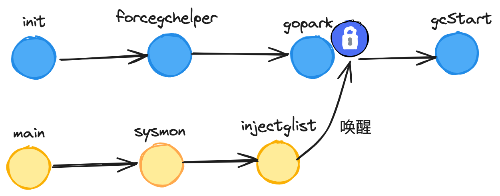

date: 2024-03-20

go version: go1.21.6

# 垃圾回收原理

## 1 垃圾回收算法

### 1.1 标记-清扫

  

标记-清扫（Mark-Sweep）算法，两个主要阶段：

1. 标记：扫描并标记当前活着的对象
2. 清扫：清扫没有被标记的垃圾对象

标记-清扫算法是一种间接的垃圾回收算法，它不直接查找垃圾对象，而是通过活着对象推断出垃圾对象。扫描一般从栈上的根对象开始，可以采用深度优先算法或广度优先算法进行扫描。

缺点：经过几次的标记-清扫之后，可能会产生内存碎片，如果这时需要分配大对象，会导致分配内存失败


### 1.2 标记-压缩


标记-压缩（Mark-Compact）的标记过程和标记-清扫算法类似，在压缩的阶段，需要扫描活着的对象并将其压缩到空闲的区域，使得整体空间更紧凑，从而解决内存碎片问题。

缺点：由于内存的位置是随机性的，会坏缓存的局部性，需要额外空间去标记对象移动的位置，还需要更新引用改对象的指针，增加了实现的复杂度。


### 1.3 半空间复制


半空间复制（Semispace Copy）是一种空间换时间的算法。只能使用一半的内存空间，保留另外一半的内存空间用于快速压缩内存。

* 分两片相等大小的空间，称为 fromspace 和 tospace
* 每次只使用 fromspace 空间，以 GC 区分
* GC 时，不分阶段，扫描根对象就开始压缩，从 frompace 到  tospace
* GC 后，交换 fromspace 和 tospace，开始新的轮次

半空间复制的压缩性消除了内存碎片，同时，其压缩时间比标记-压缩更短。其缺点就是浪费空间。


### 1.4 引用计数


引用计数（Reference Counting）是简单识别垃圾对象的算法。

* 对象每被引用一次，计数器加 1
* 对象每被删除引用一次，计数器减 1
* GC 时，把计数器等于 0 的对象删除

缺点：无法解决循环引用或自身引用问题。


### 1.5 分代 GC


分代 GC 指将对象按照存活时间进行划分。其对象分为年轻代和老年代（甚至更多代），采用不同的 GC 策略进行分类和管理。分代 GC 算法前提是死去的对象都是新创建不久的，拥有更高的 GC 回收率。

没有必要去扫描旧的对象，加快垃圾回收速度，提高处理能力和吞吐量。

缺点：没有办法及时回收老对象，并且需要额外开销引用和区分新老对象，特别是很多代。


## 2 Go 中的垃圾回收

golang 中的垃圾回收算法叫做并发三色标记法。它是标记-清扫算法的一种实现，由 Dijkstra 提出。

### 2.1 Go 垃圾回收演进

#### 2.1.1 Go 1.0

Go 1.0 的单协程垃圾回收，在垃圾回收开始阶段，需要停止所有用户的进程，并且在垃圾回收阶段只有一个协程执行垃圾回收。

  

#### 2.1.2 Go 1.1

垃圾回收由多个协程并行执行，大大加快了垃圾回收速度，但这个阶段仍然不允许用户协程执行。

  

#### 2.1.3 Go 1.5

该版本允许用户协程与后台垃圾回收同时执行，大大降低了用户协程暂停时间（300ms -> 40ms）

  

#### 2.1.4 Go 1.6 

大幅度减少了在 STW 期间的任务，使得用户协程暂停时间从 40 ms 降到 5ms.


#### 2.1.5 Go 1.8 

该版本使用了混合写屏障技术消除了栈重新扫描的时间，将用户协程暂停时间降到 0.5ms ，在之后 GC 框架就已确定：并发三色标记法 + 混合写屏障机制。

  


### 2.2 三色标记法


三色标记法的要点：

* 对象分为三种颜色标记：黑、灰、白
* 黑对象代表：对象自身存活，其指向对象都已标记完成
* 灰对象代表：对象自身存活，但其指向对象还未标记完成
* 白对象代表：对象尚未标记到，可能是垃圾对象
* 标记开始前，将根对象（全局对象、栈上局部变量等）置黑，将其所有指向的对象置灰
* 标记规则是，从灰对象出发，将其所有指向对象都置灰，所有指向对象置灰后，当前灰对象置黑
* 标记结束后，白色对象就是不可达的垃圾对象，需要进行清扫


### 2.3 几个问题

#### 2.3.1 Go 并发垃圾回收可能存在漏标问题


漏标问题指的是在用户协程与 GC 协程并发执行的场景下，部分存活对象未被标记从而被误删的情况。这问题产生的过程如下：

* 条件：初始时刻，对象 B 持有对象 C  的引用
* time1: GC 协程，对象 A 扫描完成，置黑；此时对象 B 是灰色，还未完成扫描
* time2: 用户协程，对象 A 建立指向对象 C 的引用
* time3: 用户协程，对象 B 删除指向对象 C 的引用
* time4: GC 协程，开始执行对对象 B 的扫描

在上述场景中，由于 GC 协程在 对象B 删除对象 C 的引用后才开始扫描对象 B ，因此无法到达对象 C 。又因为对象 A 已经被置黑，不会再重复扫描，因此从扫描结果上看，对象 C 不可达。

事实上，对象 C 应该是存活的（被对象 A 引用），而 GC 结束后会因为 C 仍然是白色，因此被 GC 误删。

漏标问题是无法容忍的，其引起的误删现象可能会导致程序出现致命的错误。针对漏标问题，Go 给出的方案是**屏障机制**。


#### 2.3.2 Go 并发垃圾回收可能存在多标问题


多标问题指的是在用户协程和 GC 协程并发执行的场景下，部分垃圾对象误标记从而导致 GC 未按时将其回收的问题。这问题产生过程如下：

* 条件：初始时刻，对象 A 持有对象 B
* time1：GC 协程，对象 A 被扫描完成，置黑；对象 B 被对象 A  引用，此时置灰
* time2：用户协程，对象 A 删除指向对象 B 的引用

上述场景引发的问题是，事实上，对象 B 在被对象 A 删除引用之后，已成为垃圾对象，但由于事先已经被置灰，因此最终会更新成黑色，不会被 GC 回收。下一轮删除

错标问题对比于漏标问题而言，是相对可以接受的。其导致本该被删除但仍侥幸存活的对象被称为“浮动垃圾“，至多下一轮 GC，这部分对象就会被 GC 回收，因此错误可以得到弥补。


#### 2.3.3 Go 为什么不选择压缩 GC

压缩算法主要优势就是减少碎片并且快速分配。Go 内存分配采用 TCMalloc  机制，依据对象大小将其归属到事先划分好的 spanClass 当中，这样能够消除外部碎片，并且将内部碎片限制在可控的范围内。虽然没有压缩算法那么极致，不过压缩算法实现的复杂高。那么压缩算法带来的优势并不明显。


#### 2.3.4 Go 为什么不选择分代 GC

 分代 GC 假设的是绝大部分变成垃圾对象都是新创建的

由于 Go 的内存逃逸机制，在编译过程中，编译器会将生命周期长的 v继续使用的对象分配在堆上，生命周期短的对象分配在栈上，并以栈为单位对这部分对象进行回收。所以内存逃逸减弱了分代 GC 带来的优势，分代算法也需要其他的成本（比如写屏障保护对象的隔代性），减慢 GC 速度，所以不选择分代 GC 。


## 3 屏障机制

屏障机制主要就是为了解决并发 GC 下漏标的问题

### 3.1 强弱三色不变式

漏标的本质就是，一个已经扫描完成的黑色对象指向了一个被灰\白色对象删除引用的白色对象。可以将这场景拆分来看：

1. 黑色对象指向了白色对象 D
2. 灰\白色对象删除了白色对象 D
3. 1, 2 中的 白色对象 D 是指同一个
4. 1 发生在 2 之前

用于解决漏标问题的方法论称之为强弱三色不变式：

* 强三色不变式：白色对象不能被黑色对象直接引用（直接破坏 1 ）
* 弱三色不变式：白色对象可以被黑色对象引用，但要从某个灰色对象出发仍然可达该白色对象（间接破坏 1，2 的联动）


### 3.2 插入写屏障


屏障机制类似于一个回调保护机制，指的是在完成某特定动作前，会先完成屏障成设置的内容。

插入写屏障（ dijkstra barrier ）的目标是实现强三色不变式，保证当一个黑色对象指向一个白色对象前，会先触发屏障将白色对象置为灰色，再建立引用。

如果所有流程能保证做到这一点，那么前面的 1 就会被破坏，漏标问题得到解决。


### 3.3 删除写屏障


删除写屏障（yuasa barrier）的目标是实现弱三色不变式，保证当一个白色对象即将被上游删除引用前，会触发屏障将其置灰，之后再删除上游指向其的引用。

这流程，前面的 2 就会被破坏，漏标问题得到解决。

### 3.4 混合写屏障

从前面两小节来看，插入写屏障和删除写屏障二者选其一，即可解决并发 GC 的漏标问题，至于错标问题，则采用容忍态度，放到下一轮 GC 中进行延后处理即可。

然而真实场景，需要补充一个新的设定：屏障机制不能作用于栈对象。

因为栈对象可能涉及频繁的轻量操作，倘若这些高频操作都需要一一触发屏障机制，这会大大减慢程序的速度。

在这背景下，单独看插入写屏障或删除写屏障，都无法真正解决漏标问题，除非引入额外的 STW （stop the world）阶段，对栈对象单独处理。

为了消除这额外的 STW 成本，Go 1.8 引入混合写屏障机制，要点如下：

* GC 开始前，以栈为单位分批扫描，将栈中所有对象置黑
* GC 期间，栈上新创建的对象直接置黑
* 堆对象正常启用插入写屏障
* 堆对象正常启用删除写屏障

下面举几个例子，来论证混合写屏障机制是否真正的能够解决并发 GC 下的各种极端场景问题。


#### 3.4.1 case1

 堆对象删除引用，栈对象建立引用

   

背景：

* 存在栈上对象 A ，黑色（扫描完）
* 存在堆上对象 B，白色（未被扫描）
* 存在堆上对象 C，被堆上对象 B 引用，白色（未被扫描）

time1：A 建立对 C 的引用，由于栈无屏障机制，因此正常建立引用，无额外操作

time2：B 尝试删除对 C 的引用，删除写屏障被触发，C 被置灰，因此不会被漏标


#### 3.4.2 case2

一个堆对象删除引用，成为另一个堆对象下游

  

背景：

* 存在堆对象 A，白色（未被扫描）
* 存在堆对象 B，黑色（已完成扫描）
* 存在堆对象 C，被堆上 对象A 引用，白色（未被扫描）

time1：B 尝试建立对 C 的引用，插入写屏障被触发，C 被置灰

time2：A 删除对对象 C 的引用，此时 C 已经被置灰了，不会误删除


#### 3.4.3 case3

栈对象删除引用，成为堆对象下游

  

背景：

* 存在栈上对象 A ，白色（未完成扫描，说明对应的栈未扫描）
* 存在堆上对象 B，黑色（已完成扫描）
* 存在堆上对象 C，被栈上对象 A 引用，白色（未被扫描）

time1：B 尝试建立对 C 引用，插入写屏障触被触发，C 被置灰

time2：A 删除对 C 的引用，此时 C 已置灰，因此不会被漏标


#### 3.4.4 case4 

一个栈中对象删除引用，一个栈中对象建立引用

  

背景：

* 存在栈对象 A，白色（未扫描，这是因为对应的栈还未开始扫描）
* 存在栈对象 B，黑色（已完成扫描，说明对应的栈已完成扫描）
* 存在堆对象 C，被栈对象 A 引用，白色（未被扫描）

time1：B 建立对 C 的引用

time2：A 删除对 C  的引用

结论：在这种场景下，C 要么已然被置灰，要么从某个灰对象触发仍然可达 C

原因在于：对象的引用不是从天而降的，一定要有来处。当前 case 中，对象 B 能够建立指向 C 的引用，至少满足下面三个条件之一：

1. 栈对象 B 原先就持有 C 的引用，若是如此，那么 C 必然是灰色的（因为 B 已经是黑色）
2. 栈对象 B 持有 A 的引用，通过 A 间接找到 C，这是不可能的，因为倘若 A 能够同时被另一栈上的 B 引用，那么 A 必然会升级到堆中，不满足作为一个栈的前提
3. B 同栈内存在其他对象 X 可达 C，此时从 X 出发，必然存在一个灰色对象，从其出发存在可达 C 的路线


综上，我们得以证明混合写屏障是能够胜任并发 GC 场景的解决方案的，并满足栈无需添加屏障的前提。


## 4 垃圾回收全流程

### 4.1 源码导读

#### 4.1.1源码框架


#### 4.1.2 文件位置

| 流程     | 文件                   |      |
| :------- | ---------------------- | ---- |
| 标记准备 | runtime/mgc.go         |      |
| 调步策略 | runtime/mgcspacer.go   |      |
| 并发标记 | runtime/mgcmark.go     |      |
| 清扫流程 | runtime/msweep.go      |      |
| 位图标识 | runtime/mbitmap.go     |      |
| 触发屏障 | runtime/mbwbuf.go      |      |
| 内存回收 | runtime/mgcscavenge.go |      |

### 4.2 触发 GC


#### 4.2.1 触发类型

触发 GC 的事件类型可以分为如下三种：

| 类型           | 触发事件                          | 校验条件             |
| -------------- | --------------------------------- | -------------------- |
| gcTriggerHeap  | 分配对象时触发                    | 堆已分配内存达到阈值 |
| gcTriggerTime  | 由 forcegchelper 守护协程定时触发 | 每 2 分钟触发一次    |
| gcTriggerCycle | 用户调度 runtime.GC 方法          | 上一轮 GC 已结束     |


在触发 GC 时，会通过 gcTrigger.test 方法，结合具体的触发事件类型进行触发条件校验，校验条件如上表

代码位置：runtime/mgc.go

```go
type gcTriggerKind int


const (
    // 根据堆分配内存情况，判断是否触发GC
    gcTriggerHeap gcTriggerKind = iota
    // 定时触发GC
    gcTriggerTime
    // 手动触发GC
    gcTriggerCycle
}

func (t gcTrigger) test() bool {
	// ...
	switch t.kind {
	case gcTriggerHeap:
		trigger, _ := gcController.trigger()
		return gcController.heapLive.Load() >= trigger
	case gcTriggerTime:
		if gcController.gcPercent.Load() < 0 {
			return false
		}
		lastgc := int64(atomic.Load64(&memstats.last_gc_nanotime))
		return lastgc != 0 && t.now-lastgc > forcegcperiod
	case gcTriggerCycle:
		return int32(t.n-work.cycles.Load()) > 0
	}
	return true
}
```

#### 4.2.2 定时触发 GC



定时触发源码文件及位置：

| 方法           | 文件            | 作用                                          |
| -------------- | --------------- | --------------------------------------------- |
| init           | runtime/proc.go | runtime 包初始化，开启一个 forcegchelper 协程 |
| forcegchelper  | runtime/proc.go | 循环阻塞挂起 + 定时触发 GC                    |
| main           | runtime/proc.go | 调用 sysmon 方法                              |
| sysmon         | runtime/proc.go | 定时唤醒 forcegchelper ，从而触发 GC          |
| gcTrigger.test | runtime/mgc.go  | 校验是否满足 gc 触发条件                      |
| gcStart        | runtime/mgc.go  | 标记准备阶段主流程方法                        |


1. 启动定时触发协程并阻塞等待

   runtime 包初始化的时候，即会异步开启一个守护协程，通过 for 循环 + park 的方式，循环阻塞等待被唤醒。

   当被唤醒后，则调用 gcStart 方法进入标记准备阶段，尝试开启新一轮 GC，此时触发 GC 的事件类型正是 gcTriggerTime（定时触发）。

   ```go
   var forcegc    forcegcstate
   
   type forcegcstate struct {
   	lock mutex
   	g    *g
   	idle atomic.Bool
   }
   
   func init() {
   	go forcegchelper()
   }
   
   func forcegchelper() {
   	forcegc.g = getg()
   	lockInit(&forcegc.lock, lockRankForcegc)
   	for {
   		lock(&forcegc.lock)
   		
   		forcegc.idle.Store(true)
       // 令 forcegc.g 陷入被动阻塞，g 的状态会设置为 waiting，当达成 gc 条件时，会被唤醒
   		goparkunlock(&forcegc.lock, waitReasonForceGCIdle, traceBlockSystemGoroutine, 1)
   		// g 被唤醒，则调用 gcStart 方法真正开启 gc 主流程
   		gcStart(gcTrigger{kind: gcTriggerTime, now: nanotime()})
   	}
   }
   ```

2. 唤醒定时触发协程

   runtime  包下的 main 函数会通过 systemstack 操作切换至 g0，并调用 system 方法，轮询尝试将 forcegchelper 协程添加到 gList 中，并在 injectglist 方法将其唤醒：

   ```go
   func main() {
   	// ...
     systemstack(func(){
       newm(sysmon, nil,  -1)
     })
     // ...
   }
   ```

   ```go
   func sysmon() {
   	// ...
     
   	for {
   		// ...
   		// 通过 gcTrigger.test 方法检查是否发起 gc，触发类型是 gcTriggerTime, 定时触发
   		if t := (gcTrigger{kind: gcTriggerTime, now: now}); t.test() && forcegc.idle.Load() {
   			lock(&forcegc.lock)
   			forcegc.idle.Store(false)
   			var list gList
         // 需要发起 gc，则将 forcegc.g 注入 list 中，injectglist 方法内部会执行唤醒操作
   			list.push(forcegc.g)
   			injectglist(&list)
   			unlock(&forcegc.lock)
   		}
   		// ...
   	}
     // ...
   }
   ```

3. 定时触发 GC 条件校验

   在 gcTrigger.test 方法中，针对 gcTriggerTime 类型的触发事件，其校验条件则是触发时间间隔到达 2 分钟以上。

   ```go
   // 2 * 60 * 1e9 纳秒 = 2 * 60 秒 = 2 分钟
   var forcegcperiod int64 = 2 * 60 * 1e9
   
   func (t gcTrigger) test() bool {
   	// ...
     // 等待 2 min 发起一轮
   	case gcTriggerTime:
   		// ...
   		lastgc := int64(atomic.Load64(&memstats.last_gc_nanotime))
   		return lastgc != 0 && t.now-lastgc > forcegcperiod
   	// ...
   }
   ```


#### 4.2.3 对象分配触发 GC

对象分配触发源码方法及文件如下：

| 方法           | 文件              | 作用                     |
| -------------- | ----------------- | ------------------------ |
| mallocgc       | runtime/malloc.go | 分配对象主流程方法       |
| gcTrigger.test | runtime/mgc.go    | 校验是否满足 gc 触发条件 |
| gcStart        | runtime/mgc.go    | 标记准备阶段主流程方法   |

在分配对象的 malloc 方法中，若满足如下两个条件之一，都会发起一次触发 GC 的尝试：

* 初始话对象在 mcache 中对应 spanClass 的 mspan 空间已用尽
* 初始化一个对象大小大于 32KB 

触发事件类型是：gcTriggerHeap，并在调用 gcStart 方法的内部执行 gcTrigger.test 进行条件检查。


1. 对象分配触发 GC

   mallocgc 是分配对象的主流程方法：

   ```go
   func mallocgc(size uintptr, typ *_type, needzero bool) unsafe.Pointer {
   	// ...
   	if size <= maxSmallSize {
   		if noscan && size < maxTinySize {
   		// ...
   		} else {
   			if v == 0 {
           // 若 mcache 中对应 spanClass 的 mspan 已满，置 true
   				v, span, shouldhelpgc = c.nextFree(spc)
   			}
   		}
   	} else {
       // 申请大小大于 32KB 的大对象
   		shouldhelpgc = true
   		// ...
   		}
   	}
   	// ...
   	// 尝试触发 gc，类型为 gcTriggerHeap，校验逻辑位于 gcTrigger.test 方法中
   	if shouldhelpgc {
   		if t := (gcTrigger{kind: gcTriggerHeap}); t.test() {
   			gcStart(t)
   		}
   	}
   	// ...
   }
   ```

2. 校验 GC 触发条件

   在 gcTrigger.test 方法中，针对 gcTriggerHeap 类型的触发事件，其校验条件是判断当前堆已使用内存是否到达阈值。此处的堆内存阈值会在上一轮 GC 结束时进行设定。

   ```go
   func (t gcTrigger) test() bool {
   	// ...
   	switch t.kind {
   	case gcTriggerHeap:
   		// ...
   		trigger, _ := gcController.trigger()
   		return gcController.heapLive.Load() >= trigger
   	}
   	return true
   }
   ```


#### 4.2.4 手动触发 GC

最后一种触发 GC 形式时手动触发，入口位于 runtime 包的公共方法：runtime.GC

| 方法    | 文件           | 作用                   |
| ------- | -------------- | ---------------------- |
| GC      | runtime/mgc.go | 手动触发 GC 主流程方法 |
| gcStart | runtime/mgc.go | 标记准备阶段主流程方法 |

这种类型的校验条件是：上一轮 GC 已经完成，此时才能开启新一轮 GC 任务。

```go
func (t gcTrigger) test() bool {
	// ...
	switch t.kind {
	// ...
	case gcTriggerCycle:
		// t.n > work.cycles, but accounting for wraparound.
		return int32(t.n-work.cycles.Load()) > 0
	}
	return true
}
```


### 4.3  标记准备

本章讲诉的是标记准备阶段，会讲解屏障机制以及 STW 的底层实现，所涉及的源码方法以及文件位置如下：

| 方法                         | 文件            | 作用                                                         |
| ---------------------------- | --------------- | ------------------------------------------------------------ |
| gcStart                      | runtime/mgc.go  | 标记准备阶段主流程方法                                       |
| gcBgMarkStartWorkers         | runtime/mgc.go  | 批量启动标记协程，数量对应于 P 的个数                        |
| gcBgMarkWorker               | runtime/mgc.go  | 标记协程主流程方法，启动之初会先阻塞挂起，待被唤醒后真正执行任务 |
| stopTheWorldWithSema         | runtime/proc.go | 即 STW，停止 P                                               |
| gcControllerState.startCycle | runtime/mgc.go  | 限制标记协程执行频率，目标是令标记协程对 CPU 的占用率趋近于 25 % |
| setGCPhase                   | runtime/mgc.go  | 更新 GC 阶段。当为标记阶段（GCMark）时会启用混合写屏障       |
| gcMarkTinyAllocs             | runtime/mgc.go  | 标记 mache 中的 tiny 对象                                    |
| startTheWorldWithSema        | runtime/mgc.go  | 与 STW 相反，重新唤醒各个 P                                  |


#### 4.3.1 主流程

```go
func gcStart(trigger gcTrigger) {
	// ...
  
  // 检查是否达到 GC 条件，会根据 trigger 类型作为 dispatch ，常见的就是 手动，堆内存，时间间隔
	for trigger.test() && sweepone() != ^uintptr(0) {
		sweep.nbgsweep++
	}

	// 加锁
	semacquire(&work.startSema)
	// 加锁之后再次检查
	if !trigger.test() {
		semrelease(&work.startSema)
		return
	}

	// ...

  // 由于进入了 GC 模式，会根据 P 的数量启动多个 GC 并发标记协程，但是会先阻塞挂起，等待被唤醒
	gcBgMarkStartWorkers()

	systemstack(gcResetMarkState)

	// 切换到 g0，执行 stop the world 操作
	systemstack(func() { stopTheWorldWithSema(stwGCSweepTerm) })
	
  // ...
  
  // 限制标记协程占用 CPU 时间片的比例趋近于 25%
	gcController.startCycle(now, int(gomaxprocs), trigger)

	// ...
  
  // 设置 GC 阶段为 _GCmark ，启用混合写屏障
	setGCPhase(_GCmark)

	// 对 mcache 中的 tiny 对象进行标记
	gcMarkTinyAllocs()

	// 切换至 g0 ，重新 start the world
	systemstack(func() {
		now = startTheWorldWithSema()
		// ...
	})

	// 　....
}
```


#### 4.3.2 启动标记流程

gcBgMarkStartWorkers 方法中启动了对应于 P 数量的并发标记协程，并且通过 notetsleepg 机制，使得 for 循环与 gcBgMarkWorker 内部的唤醒形成联动，确保每个 P 都能分得一个标记协程。

```go
func gcBgMarkStartWorkers() {
	// 开启对应于 P 个数标记协程，但是内部将 g 添加到全局的 pool 里面，并通过 gopark 阻塞挂起
	for gcBgMarkWorkerCount < gomaxprocs {
		go gcBgMarkWorker()
		// 挂起，等待 gcBgMarkWorker 方法中完成标记协程与 P 的绑定后唤醒
		notetsleepg(&work.bgMarkReady, -1)
		noteclear(&work.bgMarkReady)

		gcBgMarkWorkerCount++
	}
}
```


gcBgMarkWorker 方法中将 g 包装成一个 node 添加到

```go
func gcBgMarkWorker() {
	gp := getg()

	gp.m.preemptoff = "GC worker init"
	node := new(gcBgMarkWorkerNode)
	gp.m.preemptoff = ""

	node.gp.set(gp)

	node.m.set(acquirem())
  
  // 唤醒外部的 for 循环
	notewakeup(&work.bgMarkReady)

	for {
		// 当前 g 阻塞至此，直到 gcController.findRunnableGCWorker 方法调用，会将当前 g 唤醒
		gopark(func(g *g, nodep unsafe.Pointer) bool {
			node := (*gcBgMarkWorkerNode)(nodep)

			// 将当前 g 包装成一个 node 添加到 gcBgMarkWorkerPool 中
			gcBgMarkWorkerPool.push(&node.node)
			return true
		}, unsafe.Pointer(node), waitReasonGCWorkerIdle, traceBlockSystemGoroutine, 0)
		// ...
	}
}
```

#### 4.3.3 Stop the world

gcStart 方法在调用 gcBgMarkStartWorkers 方法异步启动标记协程后，会执行 STW 操作停止所有用户协程，其实现位于 stopTheWorldWithSema 方法：

* 取锁，sched.lock
* 将 sched.gcwaiting 置为 true，后续的调度流程见其标识，都会阻塞挂起
* 抢占所有 g，并将 p 的状态置为 syscall
* 将所有 p 的状态改为 stop
* 若部分任务无法被抢占，则等待其完成后再进行抢占
* 调度方法 worldStopped

```go
func stopTheWorldWithSema(reason stwReason) {
	gp := getg()

  // 全局调度锁
	lock(&sched.lock)
	sched.stopwait = gomaxprocs
  // 设置标志，之后所有的调度都会阻塞等待
	sched.gcwaiting.Store(true)
  // 发送抢占信息抢占所有 g 后，将 p 状态置为 syscall
	preemptall()
	// 将当前 p 的状态置为 stop
	gp.m.p.ptr().status = _Pgcstop // Pgcstop is only diagnostic.
	sched.stopwait--
	// 把所有 p 的状态置为 sop
	for _, pp := range allp {
		s := pp.status
		if s == _Psyscall && atomic.Cas(&pp.status, s, _Pgcstop) {
			pp.syscalltick++
			sched.stopwait--
		}
	}
	// 把空闲的 p 的状态置为 stop
	now := nanotime()
	for {
		pp, _ := pidleget(now)
		if pp == nil {
			break
		}
		pp.status = _Pgcstop
		sched.stopwait--
	}
	wait := sched.stopwait > 0
	unlock(&sched.lock)

	// 若有 p 无法被抢占，则阻塞直到将其统统抢占完成
	if wait {
		for {
			// wait for 100us, then try to re-preempt in case of any races
			if notetsleep(&sched.stopnote, 100*1000) {
				noteclear(&sched.stopnote)
				break
			}
			preemptall()
		}
	}

	
	// stop the world
	worldStopped()
}
```

#### 4.3.4 控制标记协程频率

gcStart 方法中，会通过 gcControllerState.startCycle 方法，将标记协程对 CPU 的占用率控制在 25% 左右，此时，根据 P 的数量是否能被 4 整除，分为两种处理方式：

* 若 P 能够被 4 整除，则简单将标记协程的数量设置为 P/4
* 若 P 不能被 4 整除，则通过控制标记协程执行时长的方式，来使全局标记协程对 CPU 的使用率趋近于 25%

```go

// 目标：标记协程对 CPU 的使用率维持在 25% 的水平
const gcBackgroundUtilization = 0.25

func (c *gcControllerState) startCycle(markStartTime int64, procs int, trigger gcTrigger) 

	// ...

	// P 的个数 * 0.25
	totalUtilizationGoal := float64(procs) * gcBackgroundUtilization
	// P 的个数 * 0.25 后四舍五入取整
	dedicatedMarkWorkersNeeded := int64(totalUtilizationGoal + 0.5)
	utilError := float64(dedicatedMarkWorkersNeeded)/totalUtilizationGoal - 1
	const maxUtilError = 0.3
	// 若 P 的个数不能被 4 整除
	if utilError < -maxUtilError || utilError > maxUtilError {
		if float64(dedicatedMarkWorkersNeeded) > totalUtilizationGoal {
			dedicatedMarkWorkersNeeded--
		}
    // 计算出每个 P 需要额外执行标记任务的时间片比例
		c.fractionalUtilizationGoal = (totalUtilizationGoal - float64(dedicatedMarkWorkersNeeded)) / float64(procs)
  // 若 P 的个数可以被 4 整除，则无需控制执行时长
	} else {
		c.fractionalUtilizationGoal = 0
	}

	// ...
}
```

#### 3.3.5 设置屏障

gcStart 调用 setGCPhase 方法，标志 GC 正式进入标记阶段，在 GCmark 和 GCmarktermination 阶段，会启用混合写屏障机制。

```go
func setGCPhase(x uint32) {
	atomic.Store(&gcphase, x)
	writeBarrier.needed = gcphase == _GCmark || gcphase == _GCmarktermination
	writeBarrier.enabled = writeBarrier.needed
}
```

#### 3.3.6 Tiny 对象标记

调用 gcMarkTinyAllocs 方法，遍历所有的 P，对 mcache 中的 tiny 对象分别调用 greyobject 方法进行置灰。

```go
func gcMarkTinyAllocs() {
	assertWorldStopped()

	for _, p := range allp {
		c := p.mcache
		if c == nil || c.tiny == 0 {
			continue
		}
    // 获取 tiny 对象
		_, span, objIndex := findObject(c.tiny, 0, 0)
		gcw := &p.gcw
    // tiny 对象置灰（标记 + 入队）
		greyobject(c.tiny, 0, 0, span, gcw, objIndex)
	}
}
```

#### 3.3.7 Start the world

stopTheWorldWithSema 和 startTheWorldWithSema 形成对偶。该方法会重新恢复世界，将所有 P 唤醒。若缺少 M，则会新建 M 和 P 进行绑定。

```go
func startTheWorldWithSema() int64 {
	assertWorldStopped()

	// ...
	p1 := procresize(procs)
	// 重启世界
	worldStarted()

  // 遍历所有 P，将其唤醒
	for p1 != nil {
		p := p1
		p1 = p1.link.ptr()
		if p.m != 0 {
			mp := p.m.ptr()
			p.m = 0
			if mp.nextp != 0 {
				throw("startTheWorld: inconsistent mp->nextp")
			}
			mp.nextp.set(p)
			notewakeup(&mp.park)
		} else {
			// Start M to run P.  Do not start another M below.
			newm(nil, p, -1)
		}
	}

	// ...
	return startTime
}
```

### 4.4 并发标记

标记协程如何被唤醒

#### 4.4.1 调度标记协程

| 方法                                   | 文件                | 作用                                   |
| -------------------------------------- | ------------------- | -------------------------------------- |
| schedule                               | runtime/proc.go     | 调度协程                               |
| findRunnable                           | runtime/proc.go     | 获取可执行的协程                       |
| gcControllerState.findRunnableGCWorker | runtime/mgcspace.go | 获取可执行的标记协程，同时将该协程唤醒 |
| execute                                | runtime/proc.go     | 执行协程                               |

在 GMP 调度的主干方法 schedule 中，会通过 g0 调用 findRunnable 方法为 P 寻找下一个可执行的 g，找到后会调用 execute 方法，内部完成由 g0 -> g 的切换，真正执行用户协程中的任务。

```go
func schedule() {
	// ...
    gp, inheritTime, tryWakeP := findRunnable()
    
    // ...
    execute(gp, inheritTime)
}
```


在 findRunnable 方法中，当通过全局标识 gcBlackenEnabled 发现当前开启 GC 模式时，会调用 gcController.findRunnableGCWorker 唤醒并取得标记协程

 ```go
 func findRunnable() (gp *g, inheritTime, tryWakeP bool) {
     // ...
 	if gcBlackenEnabled != 0 {
 		gp, tnow := gcController.findRunnableGCWorker(pp, now)
 		if gp != nil {
 			return gp, false, true
 		}
 	}
     // ...
 }
 ```


```go
func (c *gcControllerState) findRunnableGCWorker(pp *p, now int64) (*g, int64) {
	// ...
	// 保证当前 P 是可以调度标记协程的，每个 P 只能执行一个标记协程
	if !gcMarkWorkAvailable(pp) {
		return nil, now
	}

    // 从全局标记协程池 gcBgMarkWorkerPool 中取出 g
	node := (*gcBgMarkWorkerNode)(gcBgMarkWorkerPool.pop())
	if node == nil {
		return nil, now
	}

	decIfPositive := func(val *atomic.Int64) bool {
		for {
			v := val.Load()
			if v <= 0 {
				return false
			}

			if val.CompareAndSwap(v, v-1) {
				return true
			}
		}
	}

    // 确定标记模式
	if decIfPositive(&c.dedicatedMarkWorkersNeeded) {
		pp.gcMarkWorkerMode = gcMarkWorkerDedicatedMode
	} else if c.fractionalUtilizationGoal == 0 {
		gcBgMarkWorkerPool.push(&node.node)
		return nil, now
	} else {
		delta := now - c.markStartTime
		if delta > 0 && float64(pp.gcFractionalMarkTime)/float64(delta) > c.fractionalUtilizationGoal {
			gcBgMarkWorkerPool.push(&node.node)
			return nil, now
		}
		pp.gcMarkWorkerMode = gcMarkWorkerFractionalMode
	}

	// 建标记协程的状态置为 runnable
	gp := node.gp.ptr()
	casgstatus(gp, _Gwaiting, _Grunnable)
	if traceEnabled() {
		traceGoUnpark(gp, 0)
	}
	return gp, now
}
```

#### 4.4.2 并发标记启动


| 方法            | 文件               | 作用                               |
| --------------- | ------------------ | ---------------------------------- |
| gcBgMarkWorker  | runtime/mgc.go     | 标记协程主方法                     |
| gcDrain         | runtime/mgcmark.go | 循环处理 gcw 队列的主方法          |
| markroot        | runtime/mgcmark.go | 标记根对象                         |
| scanobject      | runtime/mgcmark.go | 扫描一个对象，将其指向对象分别置灰 |
| greyobject      | runtime/mgcmark.go | 将一个对象置灰                     |
| mbits.setMarked | runtime/mbitmap.go | 标记一个对象                       |
| gcw.putFast/put | runtime/mgcwork.go | 将一个对象加入 gcw 队列            |

标记协程被唤醒后，代码依然在 gcBgMarkWorker 方法中，此时会根据之前设置的标记模式，调用 gcDrain 方法开始执行并发标记任务。

标记模式包括以下三种：

* gcMarkWorkerDedicatedMode：专一模式，需要完整执行完标记任务，不可被抢占
* gcMarkWorkerFractionalMode：分时模式，当标记协程执行时长达到一定比例后，可以被抢占
* gcMarkWorkerIdleMode：空闲模式，可以被抢占

在专一模式下，会先以可被抢占模式尝试执行，若真的被用户协程抢占，则会先将当前 P 本地队列的用户协程放到全局 g 队列中，再将标记模式改为不可抢占模式。这样子设计优势，通过负载均衡的方式，减少当前 P 下用户协程的等待时间，提高用户体验。

> 如果判断是否被抢占：gp.preempt  ????


在 gcDrain 方法中，有两个核心的  gcDrainFlags 控制着标记协程的运行风格：

* gcDrainIdle：空闲模式，随时可以被抢占
* gcDrainFractional：分时模式，执行一定比例的时长后可被抢占

```go
type gcDrainFlags int

const (
	gcDrainUntilPreempt gcDrainFlags = 1 << iota
	gcDrainFlushBgCredit
	gcDrainIdle
	gcDrainFractional
)

func gcBgMarkWorker() {
	// ...
    
	for {
		// ...
        
		node.m.set(acquirem())
		pp := gp.m.p.ptr() // P can't change with preemption disabled.

		// ...

		systemstack(func() {
			casGToWaiting(gp, _Grunning, waitReasonGCWorkerActive)
			switch pp.gcMarkWorkerMode {
			default:
				throw("gcBgMarkWorker: unexpected gcMarkWorkerMode")
			case gcMarkWorkerDedicatedMode:
                // 设置成可被抢占模式执行标记，若被抢占，会将用户协程加入到全局 g 队列
				gcDrain(&pp.gcw, gcDrainUntilPreempt|gcDrainFlushBgCredit)
				if gp.preempt {
					// 将用户协程加入到全局队列中
					if drainQ, n := runqdrain(pp); n > 0 {
						lock(&sched.lock)
						globrunqputbatch(&drainQ, int32(n))
						unlock(&sched.lock)
					}
				}
				// 专一模式
				gcDrain(&pp.gcw, gcDrainFlushBgCredit)
			case gcMarkWorkerFractionalMode:
                // 分时模式
				gcDrain(&pp.gcw, gcDrainFractional|gcDrainUntilPreempt|gcDrainFlushBgCredit)
			case gcMarkWorkerIdleMode:
                // 空闲模式
				gcDrain(&pp.gcw, gcDrainIdle|gcDrainUntilPreempt|gcDrainFlushBgCredit)
			}
			casgstatus(gp, _Gwaiting, _Grunning)
		})
        
		// ...
	}
}
```

#### 4.4.3 标记主流程

gcDrain 方法是并发标记阶段的核心方法：

* 在空闲模式（idle）和分时模式（fractional）下，会提前设好 check 函数（pollwork 和 pollFractionalWorkerExit）
* 标记根对象
* 循环从 gcw 缓存队列中取出灰色对象，执行 scanObject 方法进行扫描标记
* 定期检查 check 函数，判断流程是否该被打断

```go
func gcDrain(gcw *gcWork, flags gcDrainFlags) {
    
    gp := getg().m.curg
    // 标记模式
    preemptible := flags&gcDrainUntilPreempt != 0
    flushBgCredit := flags&gcDrainFlushBgCredit != 0
    idle := flags&gcDrainIdle != 0

    initScanWork := gcw.heapScanWork

    
    var check func() bool
    if flags&(gcDrainIdle|gcDrainFractional) != 0 {
       checkWork = initScanWork + drainCheckThreshold
       if idle {
          check = pollWork
       } else if flags&gcDrainFractional != 0 {
          check = pollFractionalWorkerExit
       }
    }

    // 若根对象还未完成标记，则先进行根对象标记
    if work.markrootNext < work.markrootJobs {
       // Stop if we're preemptible or if someone wants to STW.
       for !(gp.preempt && (preemptible || sched.gcwaiting.Load())) {
          job := atomic.Xadd(&work.markrootNext, +1) - 1
          if job >= work.markrootJobs {
             break
          }
          // 标记根对象
          markroot(gcw, job, flushBgCredit)
          if check != nil && check() {
             goto done
          }
       }
    }

   	// 遍历 gcw 队列，进行对象标记
    for !(gp.preempt && (preemptible || sched.gcwaiting.Load())) {
       
       if work.full == 0 {
          gcw.balance()
       }
	   // 尝试从 P 本地队列中获取对象，无锁
       b := gcw.tryGetFast()
       if b == 0 {
          // 尝试从全局队列中获取对象，加锁
          b = gcw.tryGet()
          if b == 0 {
             // 刷新写屏障缓存
             wbBufFlush()
             b = gcw.tryGet()
          }
       }
       if b == 0 {
          // 无对象标记，跳出 for
          break
       }
       // 进行对象标记，并顺延指针进行后续对象的扫描
       scanobject(b, gcw)

       // ...
    }

done:
    // ...
}
```

#### 4.4.4 灰对象缓存队列

在上小节，涉及到一个数据结构：gcw，它是灰色对象的存储代理和载体，在标记过程中，需要持续不断的从队列中取出灰色对象，进行扫描，并将新的灰色对象通过 gcw 加入到缓存队列中。

灰对象缓存队列分为两个：

* 每个 P 私有的 gcWork，实现上由两个单向链表构成，采用轮换机制使用
* 全局队列 workType.full，底层是一个通过 CAS 操作维护的栈结构，所有 P 共享


1. gcWork

   数据结构：

   ```go
   type lfnode struct {
   	next    uint64
   	pushcnt uintptr
   }
   
   type workbufhdr struct {
   	node lfnode // must be first
   	nobj int
   }
   
   type workbuf struct {
   	_ sys.NotInHeap
   	workbufhdr
   	// account for the above fields
   	obj [(_WorkbufSize - unsafe.Sizeof(workbufhdr{})) / goarch.PtrSize]uintptr
   }
   
   type gcWork {
       //...
   	wbuf1, wbuf2 *workbuf
       
       //...
   }
   
   ```

   在 gcDrain 方法中，会持续不断从当前 P 的 gcw 中获取灰色对象，在调用策略上，会先尝试取 P 独有部分，然后再通过 gcw 获取全局共享部分

   ```go
   // 尝试从 P 本地队列中获取对象，无锁
   b := gcw.tryGetFast()
   if b == 0 {
      // 尝试从全局队列中获取对象，加锁
      b = gcw.tryGet()
      if b == 0 {
      		// 刷新写屏障缓存
      		wbBufFlush()
   		b = gcw.tryGet()
   	}
   }
   ```

   tryGetFast 会先尝试从 gcWork.wbuf1 中获取灰色对象.

   ```go
   func (w *gcWork) tryGetFast() uintptr {
       wbuf := w.wbuf1
       if wbuf == nil || wbuf.nobj == 0 {
          return 0
       }
   
       wbuf.nobj--
       return wbuf.obj[wbuf.nobj]
   }
   ```

   若 gcWork.wbuf1 缺灰，则会在 gcWork.tryGet 方法中交换 wbuf1 和 wbuf2 ，再尝试获取一次。若仍然缺灰，则会调用 trygetfull 方法，从全局缓存队列中获取.

   ```go
   func (w *gcWork) tryGet() uintptr {
       wbuf := w.wbuf1
       if wbuf == nil {
          w.init()
          wbuf = w.wbuf1
          // wbuf is empty at this point.
       }
       if wbuf.nobj == 0 {
          w.wbuf1, w.wbuf2 = w.wbuf2, w.wbuf1
          wbuf = w.wbuf1
          if wbuf.nobj == 0 {
             owbuf := wbuf
             wbuf = trygetfull()
             if wbuf == nil {
                return 0
             }
             putempty(owbuf)
             w.wbuf1 = wbuf
          }
       }
   
       wbuf.nobj--
       return wbuf.obj[wbuf.nobj]
   }
   ```

2. workType.full

   灰色对象的全局缓存队列是一个栈结构，调用pop方法时，会通过CAS方式依次从栈顶取出一个缓存链表.

   ```go
   var work workType
   
   type workType struct {
       full  lfstack  
   }
   ```

   ```go
   func (head *lfstack) pop() unsafe.Pointer {
   	for {
   		old := atomic.Load64((*uint64)(head))
   		if old == 0 {
   			return nil
   		}
   		node := lfstackUnpack(old)
   		next := atomic.Load64(&node.next)
   		if atomic.Cas64((*uint64)(head), old, next) {
   			return unsafe.Pointer(node)
   		}
   	}
   }
   
   func trygetfull() *workbuf {
       b := (*workbuf)(work.full.pop())
       if b != nil {
          b.checknonempty()
          return b
       }
       return b
   }
   ```


#### 4.4.5 三色标记的实现

 

GC 的标记流程基于三色标记法实现，在代码层面，黑、灰、白这三种颜色是如何实现的？

在内存模型和分配机制中，每个对象都有自己从属的 mspan ，在 mspan 中，有着两个 bitmap 存储 着每个对象大小的内存的状态信息：

* allocBits：标识内存的状态，一个 bit 为对应一个 object 的内存块，值为 1 代表已使用；值为 0 代表未使用
* gcmarkBits：只在 GC 期间使用。值为 1 代表占用该内存块的对象被标记存活


在垃圾清扫过程中，并不是真正将内存回收，而是在每个 mspan 中使用 gcmarkBits 对 allocBits 进行覆盖。在新分配对象时，当感知到 mspan 的 allocBits 中，某个对象槽位 bit 位值为 0，则会将其视为空闲内存进行使用，其本质上就是一个覆盖操作。


```go
type mspan struct {
	// ...
	allocBits  *gcBits
	gcmarkBits *gcBits
	// ...
}

type gcBits struct {
	_ sys.NotInHeap
	x uint8
}
```


在了解 bitmap 之后，三色标识如何实现：

* 黑色：对象在 mspan.gcmarkBits 中 bit 位值位 1，且对象已经离开灰对象缓存队列
* 灰色：对象在 mspan.gcmarkBits 中 bit 位值位 1，且对象仍处于灰对象缓存队列
* 白色：对象在 mspan.gcmarkBits 中 bit  位值为 0


在上述的基础设置后，代码如何实现：

* 扫描根对象，将 gcmarkBits 中的 bit 位置 1，并添加到灰对象缓存队列
* 依次从灰对象缓存队列中取出灰对象，将其指向对象的 mspan.gcmarkBits 的 bit 位置 1 并添加到灰对象缓存队列中


#### 4.4.6 中止标记协程

在 gcDrain 函数中，针对分时模式 fractional 和 空闲模式 idle ，会设定 check 函数，在循环扫描的过程中检测是否需要中断当前标记协程。

```go
func gcDrain(gcw *gcWork, flags gcDrainFlags) {
	// ...
    
	var check func() bool
	if flags&(gcDrainIdle|gcDrainFractional) != 0 {
		checkWork = initScanWork + drainCheckThreshold
		if idle {
			check = pollWork
		} else if flags&gcDrainFractional != 0 {
			check = pollFractionalWorkerExit
		}
	}

	if work.markrootNext < work.markrootJobs {
		for !(gp.preempt && (preemptible || sched.gcwaiting.Load())) {
            
			// ...
            
			if check != nil && check() {
				goto done
			}
		}
	}

	// Drain heap marking jobs.
	// Stop if we're preemptible or if someone wants to STW.
	for !(gp.preempt && (preemptible || sched.gcwaiting.Load())) {
        
		// ...
	
		if gcw.heapScanWork >= gcCreditSlack {
			// ...
			if checkWork <= 0 {
				checkWork += drainCheckThreshold
				if check != nil && check() {
					break
				}
			}
		}
	}

done:
	// ...
}
```

对于分时模式的 check 函数是 pollFractionalWorkerExit ，若当前标记协程执行的时间比例大于 1.2 倍的 fractionalUtilizationGoal 阈值，就会中止标记协程。

```go
func pollFractionalWorkerExit() bool {
	
	now := nanotime()
	delta := now - gcController.markStartTime
	if delta <= 0 {
		return true
	}
	p := getg().m.p.ptr()
	selfTime := p.gcFractionalMarkTime + (now - p.gcMarkWorkerStartTime)
	return float64(selfTime)/float64(delta) > 1.2*gcController.fractionalUtilizationGoal
}
```

对于空闲模式的 check 函数是 pollWork，判断全队 g  队列，本地 P 队列是否存在就绪的 g ，或者存在就绪的网络协程，就会对当前标记协程进行中断。

```go
func pollWork() bool {
	if sched.runqsize != 0 {
		return true
	}
	p := getg().m.p.ptr()
	if !runqempty(p) {
		return true
	}
	if netpollinited() && netpollWaiters.Load() > 0 && sched.lastpoll.Load() != 0 {
		if list := netpoll(0); !list.empty() {
			injectglist(&list)
			return true
		}
	}
	return false
}
```

#### 4.4.7 扫描根对象

在 gcDrain 函数正式开始循环扫描前，还会对根对象进行扫描标记。根对象包括如下：

* .base 段内存中的未初始化全局变量
* .data 段内存中的已初始化变量
* span 中的 finalizer
* 各种协程栈


根对象扫描函数是 markroot ：

```go
func markroot(gcw *gcWork, i uint32, flushBgCredit bool) int64 {
	var workDone int64
	var workCounter *atomic.Int64
	switch {
    // 处理已初始化的变量
	case work.baseData <= i && i < work.baseBSS:
		workCounter = &gcController.globalsScanWork
		for _, datap := range activeModules() {
			workDone += markrootBlock(datap.data, datap.edata-datap.data, datap.gcdatamask.bytedata, gcw, int(i-work.baseData))
		}
	// 处理未初始化的全局变量
	case work.baseBSS <= i && i < work.baseSpans:
		workCounter = &gcController.globalsScanWork
		for _, datap := range activeModules() {
			workDone += markrootBlock(datap.bss, datap.ebss-datap.bss, datap.gcbssmask.bytedata, gcw, int(i-work.baseBSS))
		}
	// 处理 finalizer 队列
	case i == fixedRootFinalizers:
		for fb := allfin; fb != nil; fb = fb.alllink {
			cnt := uintptr(atomic.Load(&fb.cnt))
			scanblock(uintptr(unsafe.Pointer(&fb.fin[0])), cnt*unsafe.Sizeof(fb.fin[0]), &finptrmask[0], gcw, nil)
		}
	// 释放已终止的 g 栈
	case i == fixedRootFreeGStacks:
		// Switch to the system stack so we can call
		// stackfree.
		systemstack(markrootFreeGStacks)
	// 扫描 mspan 中的 special
	case work.baseSpans <= i && i < work.baseStacks:
		// mark mspan.specials
		markrootSpans(gcw, int(i-work.baseSpans))

	default:
		// ...
        // 获取需要扫描的 g
		gp := work.stackRoots[i-work.baseStacks]

		// 切换 g0 执行工作，扫描 g 的栈
		systemstack(func() {
			// ...
            // 栈扫描
			workDone += scanstack(gp, gcw)
            //
			
		})
	}
	// ...
	return workDone
}
```


栈扫描链路：scanstack -> scanframeworker -> scanblock

```go
func scanstack(gp *g, gcw *gcWork) int64 {
	
	// ...

	// Scan the stack. Accumulate a list of stack objects.
	var u unwinder
	for u.init(gp, 0); u.valid(); u.next() {
		scanframeworker(&u.frame, &state, gcw)
	}
	// ...
	return int64(scannedSize)
}
```

```go
func scanframeworker(frame *stkframe, state *stackScanState, gcw *gcWork) {
   	// ...

    locals, args, objs := frame.getStackMap(&state.cache, false)

    // 扫描局部变量
    if locals.n > 0 {
       size := uintptr(locals.n) * goarch.PtrSize
       scanblock(frame.varp-size, size, locals.bytedata, gcw, state)
    }

    // 扫描函数参数
    if args.n > 0 {
       scanblock(frame.argp, uintptr(args.n)*goarch.PtrSize, args.bytedata, gcw, state)
    }

    // ...
}
```

不论是全局扫描还是栈扫描，底层都会调用 scanblock 。在扫描时，会通过位图 ptrmask 辅助加速流程，在 ptrmask 当中，每个 bit 位对应了一个指针大小（8B）的位置的标识信息，指明当前位置是否是指针，若非指针，则直接跳过扫描。

```go
func scanblock(b0, n0 uintptr, ptrmask *uint8, gcw *gcWork, stk *stackScanState) {
    
    b := b0
    n := n0
	// 遍历待扫描的地址
    for i := uintptr(0); i < n; {
       // 找到 bitmap 对应的 byte. ptrmask 辅助标识了 .data 一个指针的大小，bit 位为 1 代表当前位置是一个指针
       bits := uint32(*addb(ptrmask, i/(goarch.PtrSize*8)))
       // 非指针，跳过
       if bits == 0 {
          i += goarch.PtrSize * 8
          continue
       }
       for j := 0; j < 8 && i < n; j++ {
          if bits&1 != 0 {
             // Same work as in scanobject; see comments there.
             p := *(*uintptr)(unsafe.Pointer(b + i))
             if p != 0 {
                if obj, span, objIndex := findObject(p, b, i); obj != 0 {
                   greyobject(obj, b, i, span, gcw, objIndex)
                } else if stk != nil && p >= stk.stack.lo && p < stk.stack.hi {
                   stk.putPtr(p, false)
                }
             }
          }
          bits >>= 1
          i += goarch.PtrSize
       }
    }
}
```

#### 4.4.8 扫描普通对象

gcDrain 函数中，会持续从灰对象缓存队列中取出灰对象，然后采用 scanobject 方法进行处理。

```go
func gcDrain(gcw *gcWork, flags gcDrainFlags) {
    
    // ...
  
  	// 遍历队列，进行对象标记
    for !(gp.preempt && (preemptible || sched.gcwaiting.Load())) {
       
			 // 尝试从 p 本地队列获取灰色对象，无锁
       b := gcw.tryGetFast()
       if b == 0 {
          // 尝试从全局队列获取灰色对象
          b = gcw.tryGet()
          if b == 0 {
             // 刷新写屏障缓存
             wbBufFlush()
             b = gcw.tryGet()
          }
       }
       if b == 0 {
          // 无对象标记
          break
       }
       // 进行对象标记，并顺延指针进行后续对象扫描
       scanobject(b, gcw)

       // ...
    }

done:
    // ...
}
```


scanobject 函数遍历当前灰对象中的指针，依次调用 greyobject 方法将其指向的对象进行置灰操作。

```go
func scanobject(b uintptr, gcw *gcWork) {
    
  	// ...
  
  	// 通过地址映射到所属页
  	// 通过 heapArena 中的映射信息，从页映射到所属的 mspan
    s := spanOfUnchecked(b)
    n := s.elemsize
    
  	// ...

  	// 扫描后续对象
    hbits := heapBitsForAddr(b, n)
    var scanSize uintptr
    for {
       var addr uintptr
       // 通过 heapArena 中的 bitmap 信息，加速遍历
       if hbits, addr = hbits.nextFast(); addr == 0 {
          if hbits, addr = hbits.next(); addr == 0 {
             break
          }
       }

       
       scanSize = addr - b + goarch.PtrSize

       
       obj := *(*uintptr)(unsafe.Pointer(addr))

       
       if obj != 0 && obj-b >= n {
          // 遍历到的对象，将其置灰，并添加到队列中，等待后续扫描
          if obj, span, objIndex := findObject(obj, b, addr-b); obj != 0 {
             greyobject(obj, b, addr-b, span, gcw, objIndex)
          }
       }
    }
    // ...
}
```


#### 4.4.9 对象置灰

对象置灰操作是函数 greyobject，分为两步：

* 标志置位 1
* 将对象加入到 p 的本地灰对象队列

```go
func greyobject(obj, base, off uintptr, span *mspan, gcw *gcWork, objIndex uintptr) {
    // ...
    
    // 在其所属的 mspan 中，将对应位置的 gcMark bitmap 置为 1
    mbits.setMarked()

    // 将对象加入本地灰对象队列
    if !gcw.putFast(obj) {
       gcw.put(obj)
    }
}
```


#### 4.4.10 新分配对象置黑

GC 期间新分配的对象，会被直接置黑，和混合写屏障说的一样

```go
func mallocgc(size uintptr, typ *_type, needzero bool) unsafe.Pointer {
	// ...
    
    if gcphase != _GCoff {
		gcmarknewobject(span, uintptr(x), size)
	}
    // ...
}
```

```go
func gcmarknewobject(span *mspan, obj, size uintptr) {
    // ....
    
    // 标记对象
    objIndex := span.objIndex(obj)
    span.markBitsForIndex(objIndex).setMarked()

    // ...
}
```


### 4.5 辅助标记

#### 4.5.1 辅助标记策略

在并发标记阶段，由于用户协程和标记协程共同工作，在极端的场景下存在一个问题：若用户协程分配对象快于标记协程标记对象的速度，这样标记阶段就不能结束？

为了规避这问题，Golang GC 引入辅助标记策略，建立一个兜底的机制：在最坏的情况下，一个用户协程分配了多少内存，就需要完成对应量的标记任务。


在每个用户协程 g 中，有一个字段 gcAssistBytes ，象征 GC 期间可分配内存资产的概念，每个 g 在 GC 期间辅助标记了多大的内存空间，就会获得对应大小的资产，使得其 GC 期间能够分配对应大小的内存进行对象创建。

```go
type g struct {
	// ...
	gcAssistBytes int64
}
```

```go
func mallocgc(size uintptr, typ *_type, needzero bool) unsafe.Pointer {
    // ...
	assistG := deductAssistCredit(size) 
    // ...
}

func deductAssistCredit(size uintptr) *g {
	var assistG *g
	if gcBlackenEnabled != 0 {
		
		assistG = getg()
		if assistG.m.curg != nil {
			assistG = assistG.m.curg
		}
		// 每个 g 都有资产
		assistG.gcAssistBytes -= int64(size)

		if assistG.gcAssistBytes < 0 {
			gcAssistAlloc(assistG)
		}
	}
	return assistG
}
```

#### 4.5.2 辅助标记执行

由于各对象中，可能存在部分不包含指针的字段，这部分字段是无需进行扫描的。因此真正需要扫描的内存量会小于实际的内存大小，两者之间的比例通过 gcController.assistWorkPerByte 进行记录。

于是当一个用户协程在 GC 期间需要分配 M 大小的新对象时，实际上需要完成的辅助标记量应该为 assistWorkPerByte*M 。

辅助标记逻辑位于 gcAssistAlloc 方法. 在该方法中，会先尝试从公共资产池 gcController.bgScanCredit 中偷取资产，倘若资产仍然不够，则会通过 systemstack 方法切换至 g0，并在 gcAssistAlloc1 方法内调用 gcDrainN 方法参与到并发标记流程当中.

```go
func gcAssistAlloc(gp *g) {
	// ...
    
    // 计算待完成的任务量
	assistWorkPerByte := gcController.assistWorkPerByte.Load()
	assistBytesPerWork := gcController.assistBytesPerWork.Load()
	debtBytes := -gp.gcAssistBytes
	scanWork := int64(assistWorkPerByte * float64(debtBytes))
	if scanWork < gcOverAssistWork {
		scanWork = gcOverAssistWork
		debtBytes = int64(assistBytesPerWork * float64(scanWork))
	}

	// 尝试从全局的可用资产中偷取
	bgScanCredit := gcController.bgScanCredit.Load()
	stolen := int64(0)
	if bgScanCredit > 0 {
		if bgScanCredit < scanWork {
			stolen = bgScanCredit
			gp.gcAssistBytes += 1 + int64(assistBytesPerWork*float64(stolen))
		} else {
			stolen = scanWork
			gp.gcAssistBytes += debtBytes
		}
		gcController.bgScanCredit.Add(-stolen)

		scanWork -= stolen
		
        // 全局资产够用，则无需辅助标记，直接返回
		if scanWork == 0 {
			if traced {
				traceGCMarkAssistDone()
			}
			return
		}
	}

	// 切换到 g0，开始执行标记任务
	systemstack(func() {
		gcAssistAlloc1(gp, scanWork)
	})
	// 辅助标记完成
	completed := gp.param != nil
	gp.param = nil
	if completed {
		gcMarkDone()
	}

	// ...
}
```

### 4.6 标记中止

| 方法                  | 文件                | 作用                         |
| --------------------- | ------------------- | ---------------------------- |
| gcBgMarkWorker        | runtime/mgc.go      | 标记协程主方法               |
| gcMarkDone            | runtime/mgc.go      | 所有标记协程完成后处理       |
| stopTheWorldWithSema  | runtime/proc.go     | 停止所有用户协程             |
| gcMarkTermination     | runtime/mgc.go      | 进入标记终止阶段             |
| gcSweep               | runtime/mgc.go      | 唤醒后台清扫协程             |
| sweepone              | runtime/mgcsweep.go | 每次清扫一个mspan            |
| sweepLocked.sweep     | runtime/mgcsweep.go | 完成mspan中的bitmap更新      |
| startTheWorldWithSema | runtime/proc.go     | 将所有用户协程恢复为可运行态 |

#### 4.6.1 标记完成

在并发标记阶段的 gcBgMarkWorker 函数中，当最后一个标记协程完成任务后，会调用 gcMarkDone  ，开始执行并发标记后处理的逻辑

```go
func gcBgMarkWorker() {
    // ...
	if incnwait == work.nproc && !gcMarkWorkAvailable(nil) {
        releasem(node.m.ptr())
        node.m.set(nil)

        gcMarkDone()
    }
}
```


gcMarkDone 函数中，会遍历所有 P 的写屏障缓存，查看是否存在因屏障机制遗留的灰色对象，如果有，则会退出 gcMarkDone ，回退到 gcBgMarkWorker 的主循环中，继续完成标记任务。

若写屏障中也没有遗留的灰对象，此时会调用 STW 停止世界，并调用 gcMarkTermination 进入标记终止阶段。

```go
func gcMarkDone() {
    // ...
top:
    // ...
    
    // 切换到 g0
    gcMarkDoneFlushed = 0
    systemstack(func() {
       gp := getg().m.curg
       casGToWaiting(gp, _Grunning, waitReasonGCMarkTermination)
       forEachP(func(pp *p) {
           // 释放写屏障缓存，可能有新的待标记任务产生
          wbBufFlush1(pp)
       })
       casgstatus(gp, _Gwaiting, _Grunning)
    })
	// 若有新的标记对象待处理，则回到 top ，然后退回到并发标记阶段
    if gcMarkDoneFlushed != 0 {
       semrelease(&worldsema)
       goto top
    }

    // ...
    
    // 正式进入标记完成阶段，STW
    systemstack(func() { stopTheWorldWithSema(stwGCMarkTerm) })
    
    // ...
    
    // 在 STW 状态下，进入标记终止阶段
    gcMarkTermination()
}
```

#### 4.6.2 标记终止

