date: 2024-03-20

go version: go1.21.6

# 垃圾回收原理

## 1 垃圾回收算法

### 1.1 标记-清扫

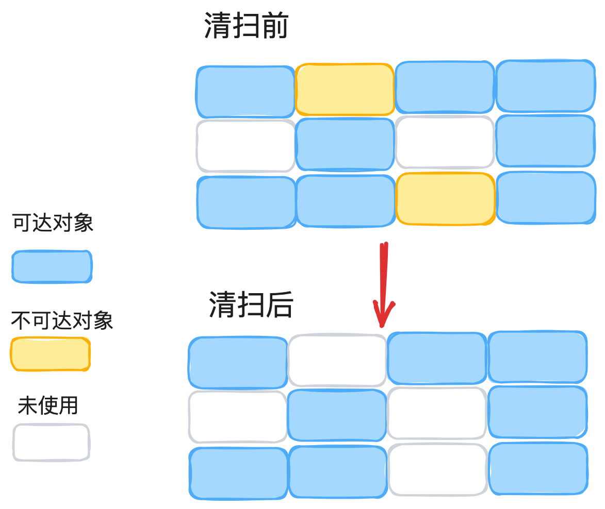  

标记-清扫（Mark-Sweep）算法，两个主要阶段：

1. 标记：扫描并标记当前活着的对象
2. 清扫：清扫没有被标记的垃圾对象

标记-清扫算法是一种间接的垃圾回收算法，它不直接查找垃圾对象，而是通过活着对象推断出垃圾对象。扫描一般从栈上的根对象开始，可以采用深度优先算法或广度优先算法进行扫描。

缺点：经过几次的标记-清扫之后，可能会产生内存碎片，如果这时需要分配大对象，会导致分配内存失败


### 1.2 标记-压缩

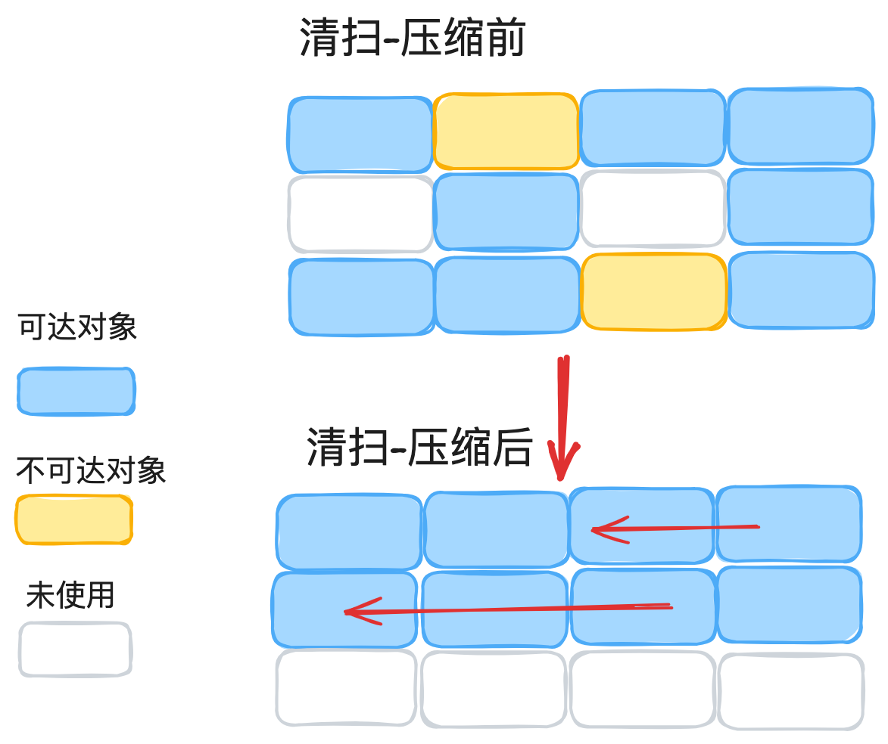

标记-压缩（Mark-Compact）的标记过程和标记-清扫算法类似，在压缩的阶段，需要扫描活着的对象并将其压缩到空闲的区域，使得整体空间更紧凑，从而解决内存碎片问题。

缺点：由于内存的位置是随机性的，会坏缓存的局部性，需要额外空间去标记对象移动的位置，还需要更新引用改对象的指针，增加了实现的复杂度。


### 1.3 半空间复制

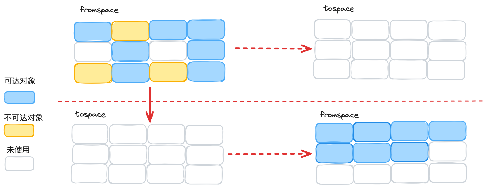

半空间复制（Semispace Copy）是一种空间换时间的算法。只能使用一半的内存空间，保留另外一半的内存空间用于快速压缩内存。

* 分两片相等大小的空间，称为 fromspace 和 tospace
* 每次只使用 fromspace 空间，以 GC 区分
* GC 时，不分阶段，扫描根对象就开始压缩，从 frompace 到  tospace
* GC 后，交换 fromspace 和 tospace，开始新的轮次

半空间复制的压缩性消除了内存碎片，同时，其压缩时间比标记-压缩更短。其缺点就是浪费空间。


### 1.4 引用计数

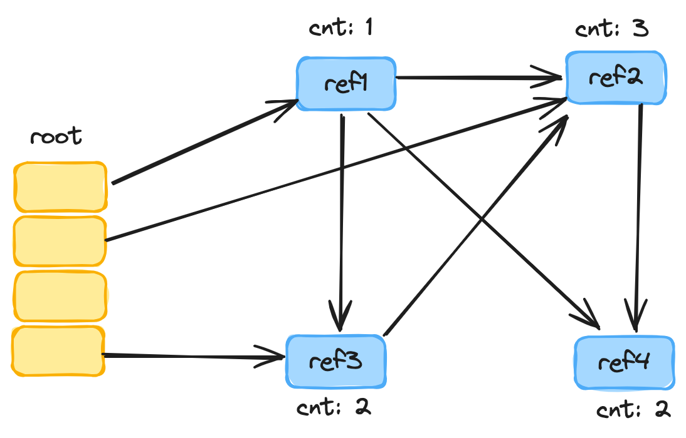

引用计数（Reference Counting）是简单识别垃圾对象的算法。

* 对象每被引用一次，计数器加 1
* 对象每被删除引用一次，计数器减 1
* GC 时，把计数器等于 0 的对象删除

缺点：无法解决循环引用或自身引用问题。


### 1.5 分代 GC

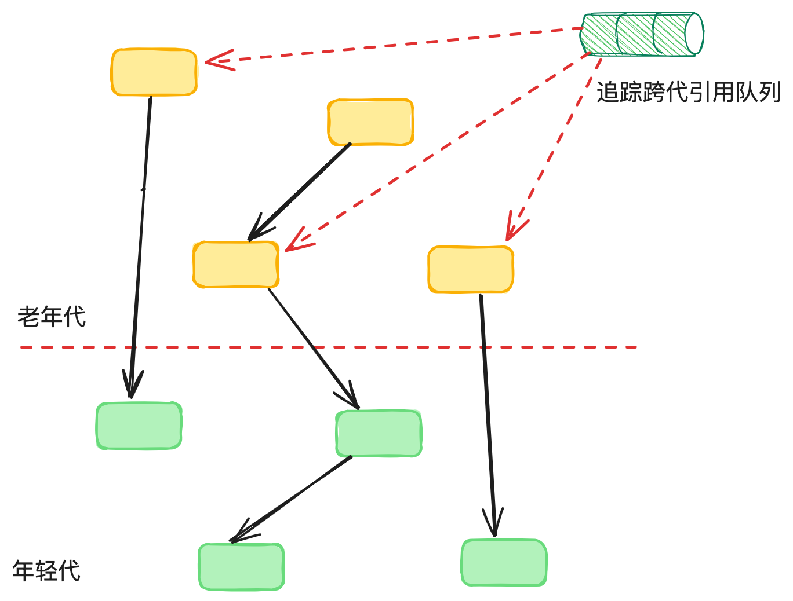

分代 GC 指将对象按照存活时间进行划分。其对象分为年轻代和老年代（甚至更多代），采用不同的 GC 策略进行分类和管理。分代 GC 算法前提是死去的对象都是新创建不久的，拥有更高的 GC 回收率。

没有必要去扫描旧的对象，加快垃圾回收速度，提高处理能力和吞吐量。

缺点：没有办法及时回收老对象，并且需要额外开销引用和区分新老对象，特别是很多代。


## 2 Go 中的垃圾回收

golang 中的垃圾回收算法叫做并发三色标记法。它是标记-清扫算法的一种实现，由 Dijkstra 提出。

### 2.1 Go 垃圾回收演进

#### 2.1.1 Go 1.0

Go 1.0 的单协程垃圾回收，在垃圾回收开始阶段，需要停止所有用户的进程，并且在垃圾回收阶段只有一个协程执行垃圾回收。

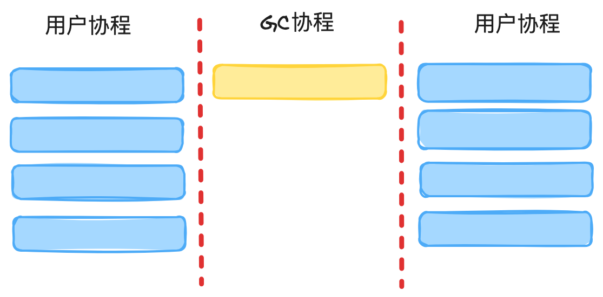  

#### 2.1.2 Go 1.1

垃圾回收由多个协程并行执行，大大加快了垃圾回收速度，但这个阶段仍然不允许用户协程执行。

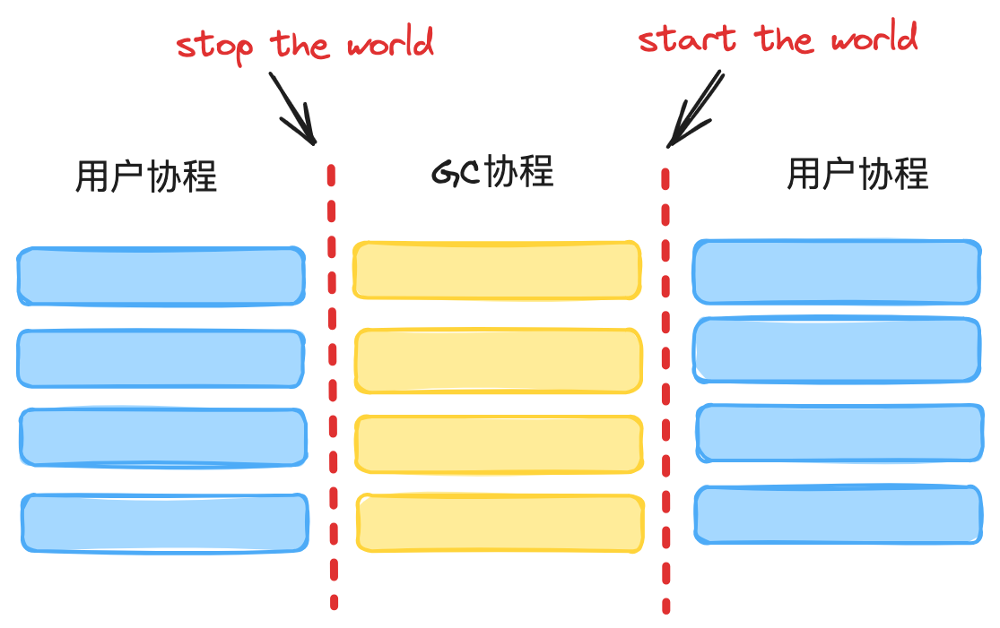  

#### 2.1.3 Go 1.5

该版本允许用户协程与后台垃圾回收同时执行，大大降低了用户协程暂停时间（300ms -> 40ms）

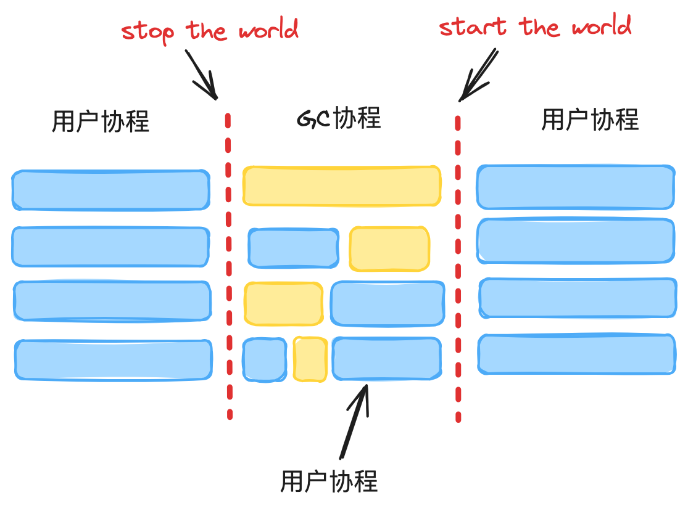  

#### 2.1.4 Go 1.6 

大幅度减少了在 STW 期间的任务，使得用户协程暂停时间从 40 ms 降到 5ms.


#### 2.1.5 Go 1.8 

该版本使用了混合写屏障技术消除了栈重新扫描的时间，将用户协程暂停时间降到 0.5ms ，在之后 GC 框架就已确定：并发三色标记法 + 混合写屏障机制。

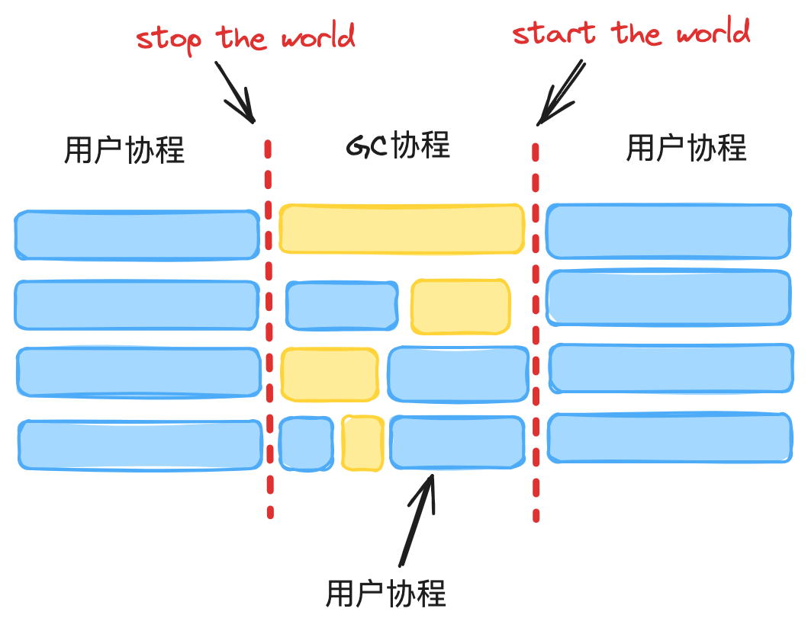  


### 2.2 三色标记法

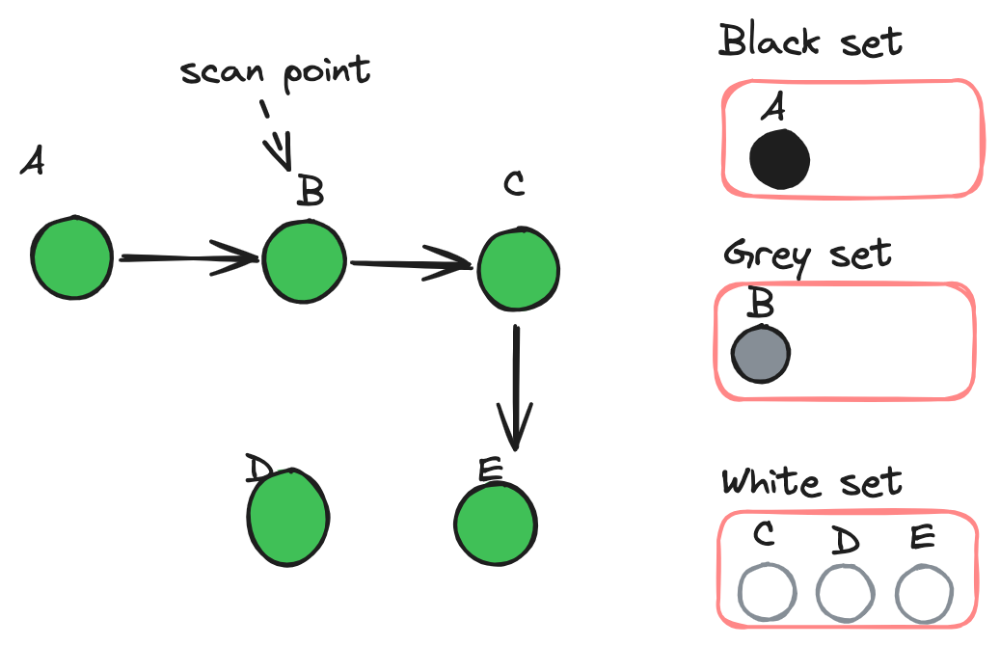

三色标记法的要点：

* 对象分为三种颜色标记：黑、灰、白
* 黑对象代表：对象自身存活，其指向对象都已标记完成
* 灰对象代表：对象自身存活，但其指向对象还未标记完成
* 白对象代表：对象尚未标记到，可能是垃圾对象
* 标记开始前，将根对象（全局对象、栈上局部变量等）置黑，将其所有指向的对象置灰
* 标记规则是，从灰对象出发，将其所有指向对象都置灰，所有指向对象置灰后，当前灰对象置黑
* 标记结束后，白色对象就是不可达的垃圾对象，需要进行清扫


### 2.3 几个问题

#### 2.3.1 Go 并发垃圾回收可能存在漏标问题

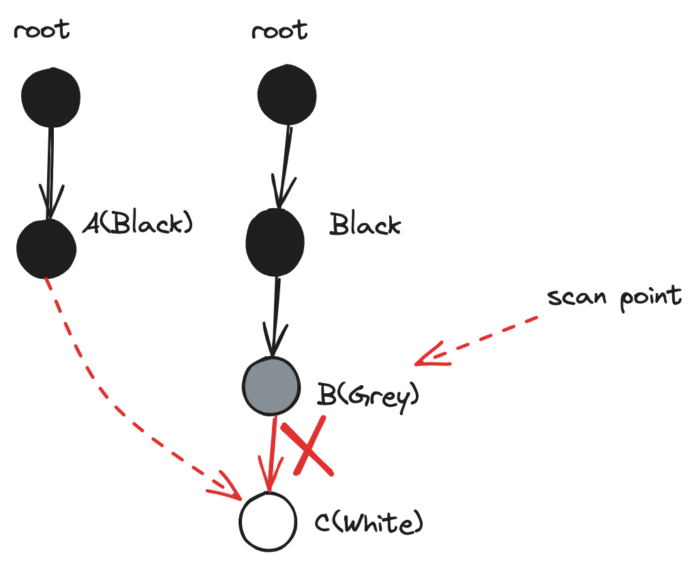

漏标问题指的是在用户协程与 GC 协程并发执行的场景下，部分存活对象未被标记从而被误删的情况。这问题产生的过程如下：

* 条件：初始时刻，对象 B 持有对象 C  的引用
* time1: GC 协程，对象 A 扫描完成，置黑；此时对象 B 是灰色，还未完成扫描
* time2: 用户协程，对象 A 建立指向对象 C 的引用
* time3: 用户协程，对象 B 删除指向对象 C 的引用
* time4: GC 协程，开始执行对对象 B 的扫描

在上述场景中，由于 GC 协程在 对象B 删除对象 C 的引用后才开始扫描对象 B ，因此无法到达对象 C 。又因为对象 A 已经被置黑，不会再重复扫描，因此从扫描结果上看，对象 C 不可达。

事实上，对象 C 应该是存活的（被对象 A 引用），而 GC 结束后会因为 C 仍然是白色，因此被 GC 误删。

漏标问题是无法容忍的，其引起的误删现象可能会导致程序出现致命的错误。针对漏标问题，Go 给出的方案是**屏障机制**。


#### 2.3.2 Go 并发垃圾回收可能存在多标问题

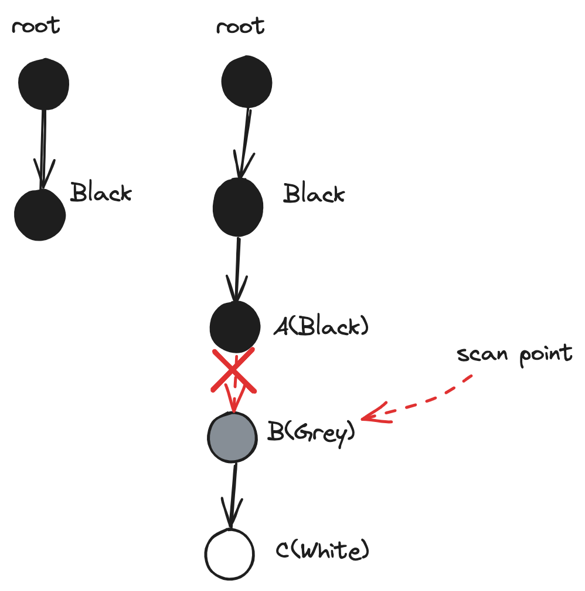

多标问题指的是在用户协程和 GC 协程并发执行的场景下，部分垃圾对象误标记从而导致 GC 未按时将其回收的问题。这问题产生过程如下：

* 条件：初始时刻，对象 A 持有对象 B
* time1：GC 协程，对象 A 被扫描完成，置黑；对象 B 被对象 A  引用，此时置灰
* time2：用户协程，对象 A 删除指向对象 B 的引用

上述场景引发的问题是，事实上，对象 B 在被对象 A 删除引用之后，已成为垃圾对象，但由于事先已经被置灰，因此最终会更新成黑色，不会被 GC 回收。下一轮删除

错标问题对比于漏标问题而言，是相对可以接受的。其导致本该被删除但仍侥幸存活的对象被称为“浮动垃圾“，至多下一轮 GC，这部分对象就会被 GC 回收，因此错误可以得到弥补。


#### 2.3.3 Go 为什么不选择压缩 GC

压缩算法主要优势就是减少碎片并且快速分配。Go 内存分配采用 TCMalloc  机制，依据对象大小将其归属到事先划分好的 spanClass 当中，这样能够消除外部碎片，并且将内部碎片限制在可控的范围内。虽然没有压缩算法那么极致，不过压缩算法实现的复杂高。那么压缩算法带来的优势并不明显。


#### 2.3.4 Go 为什么不选择分代 GC

 分代 GC 假设的是绝大部分变成垃圾对象都是新创建的

由于 Go 的内存逃逸机制，在编译过程中，编译器会将生命周期长的 v继续使用的对象分配在堆上，生命周期短的对象分配在栈上，并以栈为单位对这部分对象进行回收。所以内存逃逸减弱了分代 GC 带来的优势，分代算法也需要其他的成本（比如写屏障保护对象的隔代性），减慢 GC 速度，所以不选择分代 GC 。


## 3 屏障机制

屏障机制主要就是为了解决并发 GC 下漏标的问题

### 3.1 强弱三色不变式

漏标的本质就是，一个已经扫描完成的黑色对象指向了一个被灰\白色对象删除引用的白色对象。可以将这场景拆分来看：

1. 黑色对象指向了白色对象 D
2. 灰\白色对象删除了白色对象 D
3. 1, 2 中的 白色对象 D 是指同一个
4. 1 发生在 2 之前

用于解决漏标问题的方法论称之为强弱三色不变式：

* 强三色不变式：白色对象不能被黑色对象直接引用（直接破坏 1 ）
* 弱三色不变式：白色对象可以被黑色对象引用，但要从某个灰色对象出发仍然可达该白色对象（间接破坏 1，2 的联动）


### 3.2 插入写屏障

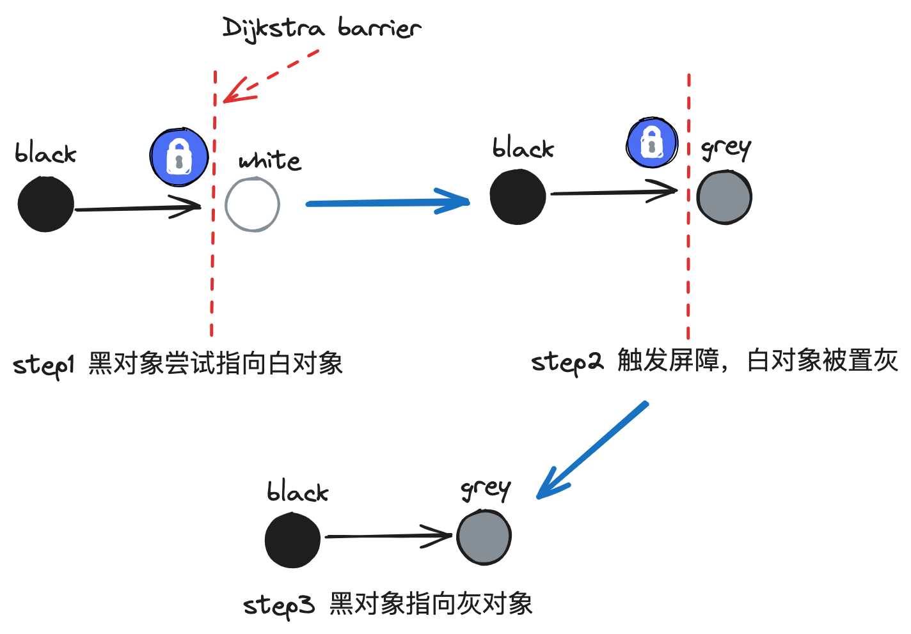

屏障机制类似于一个回调保护机制，指的是在完成某特定动作前，会先完成屏障成设置的内容。

插入写屏障（ dijkstra barrier ）的目标是实现强三色不变式，保证当一个黑色对象指向一个白色对象前，会先触发屏障将白色对象置为灰色，再建立引用。

如果所有流程能保证做到这一点，那么前面的 1 就会被破坏，漏标问题得到解决。


### 3.3 删除写屏障

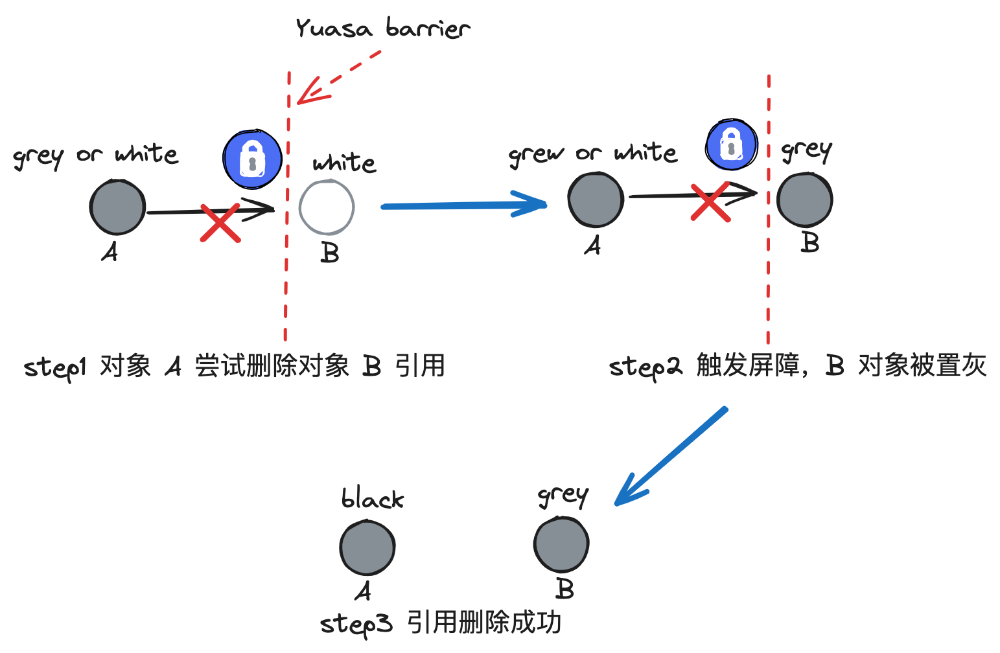

删除写屏障（yuasa barrier）的目标是实现弱三色不变式，保证当一个白色对象即将被上游删除引用前，会触发屏障将其置灰，之后再删除上游指向其的引用。

这流程，前面的 2 就会被破坏，漏标问题得到解决。

### 3.4 混合写屏障

从前面两小节来看，插入写屏障和删除写屏障二者选其一，即可解决并发 GC 的漏标问题，至于错标问题，则采用容忍态度，放到下一轮 GC 中进行延后处理即可。

然而真实场景，需要补充一个新的设定：屏障机制不能作用于栈对象。

因为栈对象可能涉及频繁的轻量操作，倘若这些高频操作都需要一一触发屏障机制，这会大大减慢程序的速度。

在这背景下，单独看插入写屏障或删除写屏障，都无法真正解决漏标问题，除非引入额外的 STW （stop the world）阶段，对栈对象单独处理。

为了消除这额外的 STW 成本，Go 1.8 引入混合写屏障机制，要点如下：

* GC 开始前，以栈为单位分批扫描，将栈中所有对象置黑
* GC 期间，栈上新创建的对象直接置黑
* 堆对象正常启用插入写屏障
* 堆对象正常启用删除写屏障

下面举几个例子，来论证混合写屏障机制是否真正的能够解决并发 GC 下的各种极端场景问题。


#### 3.4.1 case1

 堆对象删除引用，栈对象建立引用

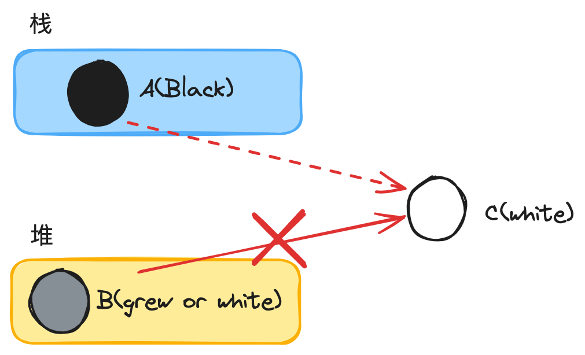   

背景：

* 存在栈上对象 A ，黑色（扫描完）
* 存在堆上对象 B，白色（未被扫描）
* 存在堆上对象 C，被堆上对象 B 引用，白色（未被扫描）

time1：A 建立对 C 的引用，由于栈无屏障机制，因此正常建立引用，无额外操作

time2：B 尝试删除对 C 的引用，删除写屏障被触发，C 被置灰，因此不会被漏标


#### 3.4.2 case2

一个堆对象删除引用，成为另一个堆对象下游

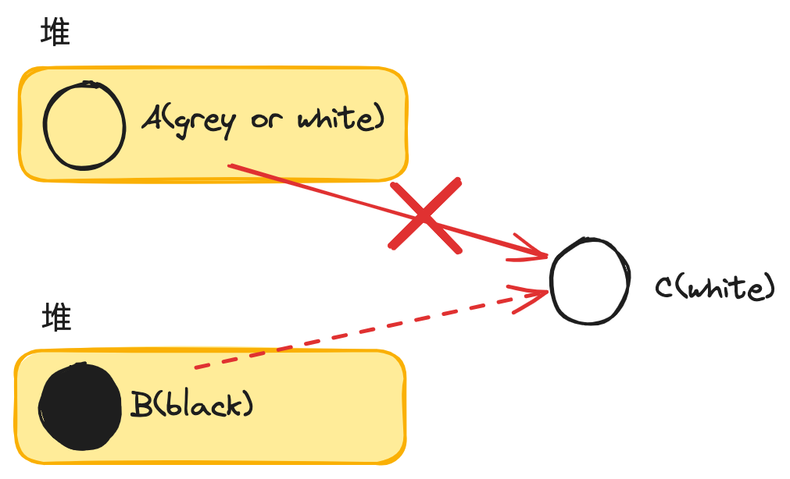  

背景：

* 存在堆对象 A，白色（未被扫描）
* 存在堆对象 B，黑色（已完成扫描）
* 存在堆对象 C，被堆上 对象A 引用，白色（未被扫描）

time1：B 尝试建立对 C 的引用，插入写屏障被触发，C 被置灰

time2：A 删除对对象 C 的引用，此时 C 已经被置灰了，不会误删除


#### 3.4.3 case3

栈对象删除引用，成为堆对象下游

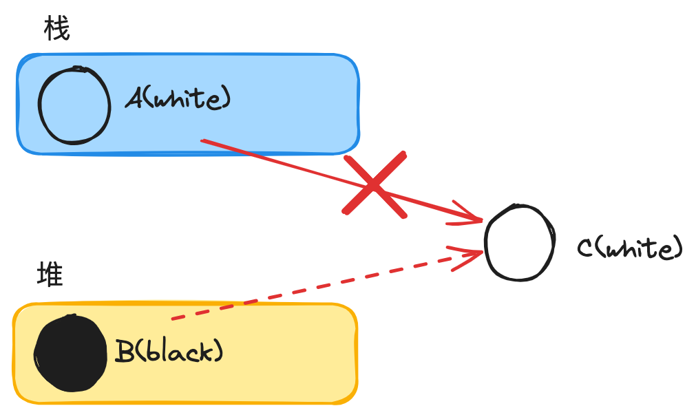  

背景：

* 存在栈上对象 A ，白色（未完成扫描，说明对应的栈未扫描）
* 存在堆上对象 B，黑色（已完成扫描）
* 存在堆上对象 C，被栈上对象 A 引用，白色（未被扫描）

time1：B 尝试建立对 C 引用，插入写屏障触被触发，C 被置灰

time2：A 删除对 C 的引用，此时 C 已置灰，因此不会被漏标


#### 3.4.4 case4 

一个栈中对象删除引用，一个栈中对象建立引用

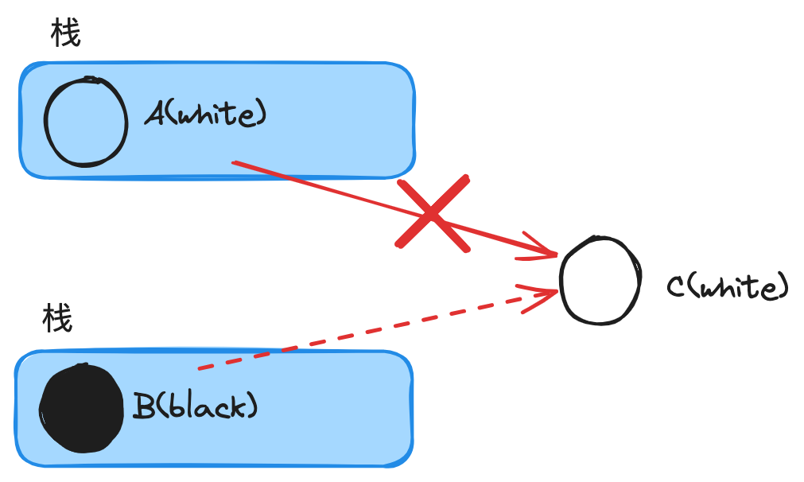  

背景：

* 存在栈对象 A，白色（未扫描，这是因为对应的栈还未开始扫描）
* 存在栈对象 B，黑色（已完成扫描，说明对应的栈已完成扫描）
* 存在堆对象 C，被栈对象 A 引用，白色（未被扫描）

time1：B 建立对 C 的引用

time2：A 删除对 C  的引用

结论：在这种场景下，C 要么已然被置灰，要么从某个灰对象触发仍然可达 C

原因在于：对象的引用不是从天而降的，一定要有来处。当前 case 中，对象 B 能够建立指向 C 的引用，至少满足下面三个条件之一：

1. 栈对象 B 原先就持有 C 的引用，若是如此，那么 C 必然是灰色的（因为 B 已经是黑色）
2. 栈对象 B 持有 A 的引用，通过 A 间接找到 C，这是不可能的，因为倘若 A 能够同时被另一栈上的 B 引用，那么 A 必然会升级到堆中，不满足作为一个栈的前提
3. B 同栈内存在其他对象 X 可达 C，此时从 X 出发，必然存在一个灰色对象，从其出发存在可达 C 的路线


综上，我们得以证明混合写屏障是能够胜任并发 GC 场景的解决方案的，并满足栈无需添加屏障的前提。


## 4 垃圾回收全流程

### 4.1 源码导读

#### 4.1.1源码框架


#### 4.1.2 文件位置

| 流程     | 文件                   |      |
| :------- | ---------------------- | ---- |
| 标记准备 | runtime/mgc.go         |      |
| 调步策略 | runtime/mgcspacer.go   |      |
| 并发标记 | runtime/mgcmark.go     |      |
| 清扫流程 | runtime/msweep.go      |      |
| 位图标识 | runtime/mbitmap.go     |      |
| 触发屏障 | runtime/mbwbuf.go      |      |
| 内存回收 | runtime/mgcscavenge.go |      |

### 4.2 触发 GC


#### 4.2.1 触发类型

触发 GC 的事件类型可以分为如下三种：

| 类型           | 触发事件                          | 校验条件             |
| -------------- | --------------------------------- | -------------------- |
| gcTriggerHeap  | 分配对象时触发                    | 堆已分配内存达到阈值 |
| gcTriggerTime  | 由 forcegchelper 守护协程定时触发 | 每 2 分钟触发一次    |
| gcTriggerCycle | 用户调度 runtime.GC 方法          | 上一轮 GC 已结束     |


在触发 GC 时，会通过 gcTrigger.test 方法，结合具体的触发事件类型进行触发条件校验，校验条件如上表

代码位置：runtime/mgc.go

```go
type gcTriggerKind int


const (
    // 根据堆分配内存情况，判断是否触发GC
    gcTriggerHeap gcTriggerKind = iota
    // 定时触发GC
    gcTriggerTime
    // 手动触发GC
    gcTriggerCycle
}

func (t gcTrigger) test() bool {
	// ...
	switch t.kind {
	case gcTriggerHeap:
		trigger, _ := gcController.trigger()
		return gcController.heapLive.Load() >= trigger
	case gcTriggerTime:
		if gcController.gcPercent.Load() < 0 {
			return false
		}
		lastgc := int64(atomic.Load64(&memstats.last_gc_nanotime))
		return lastgc != 0 && t.now-lastgc > forcegcperiod
	case gcTriggerCycle:
		return int32(t.n-work.cycles.Load()) > 0
	}
	return true
}
```

#### 4.2.2 定时触发 GC

定时触发源码文件及位置：

| 方法           | 文件            | 作用                                          |
| -------------- | --------------- | --------------------------------------------- |
| init           | runtime/proc.go | runtime 包初始化，开启一个 forcegchelper 协程 |
| forcegchelper  | runtime/proc.go | 循环阻塞挂起 + 定时触发 GC                    |
| main           | runtime/proc.go | 调用 sysmon 方法                              |
| sysmon         | runtime/proc.go | 定时唤醒 forcegchelper ，从而触发 GC          |
| gcTrigger.test | runtime/mgc.go  | 校验是否满足 gc 触发条件                      |
| gcStart        | runtime/mgc.go  | 标记准备阶段主流程方法                        |


1. 启动定时触发协程并阻塞等待

   runtime 包初始化的时候，即会异步开启一个守护协程，通过 for 循环 + park 的方式，循环阻塞等待被唤醒。

   当被唤醒后，则调用 gcStart 方法进入标记准备阶段，尝试开启新一轮 GC，此时触发 GC 的事件类型正是 gcTriggerTime（定时触发）。

   ```go
   var forcegc    forcegcstate
   
   type forcegcstate struct {
   	lock mutex
   	g    *g
   	idle atomic.Bool
   }
   
   func init() {
   	go forcegchelper()
   }
   
   func forcegchelper() {
   	forcegc.g = getg()
   	lockInit(&forcegc.lock, lockRankForcegc)
   	for {
   		lock(&forcegc.lock)
   		
   		forcegc.idle.Store(true)
       // 令 forcegc.g 陷入被动阻塞，g 的状态会设置为 waiting，当达成 gc 条件时，会被唤醒
   		goparkunlock(&forcegc.lock, waitReasonForceGCIdle, traceBlockSystemGoroutine, 1)
   		// g 被唤醒，则调用 gcStart 方法真正开启 gc 主流程
   		gcStart(gcTrigger{kind: gcTriggerTime, now: nanotime()})
   	}
   }
   ```

2. 唤醒定时触发协程

   runtime  包下的 main 函数会通过 systemstack 操作切换至 g0，并调用 system 方法，轮询尝试将 forcegchelper 协程添加到 gList 中，并在 injectglist 方法将其唤醒：

   ```go
   func main() {
   	// ...
     systemstack(func(){
       newm(sysmon, nil,  -1)
     })
     // ...
   }
   ```

   ```go
   func sysmon() {
   	// ...
     
   	for {
   		// ...
   		// 通过 gcTrigger.test 方法检查是否发起 gc，触发类型是 gcTriggerTime, 定时触发
   		if t := (gcTrigger{kind: gcTriggerTime, now: now}); t.test() && forcegc.idle.Load() {
   			lock(&forcegc.lock)
   			forcegc.idle.Store(false)
   			var list gList
         // 需要发起 gc，则将 forcegc.g 注入 list 中，injectglist 方法内部会执行唤醒操作
   			list.push(forcegc.g)
   			injectglist(&list)
   			unlock(&forcegc.lock)
   		}
   		// ...
   	}
     // ...
   }
   ```

3. 定时触发 GC 条件校验

   在 gcTrigger.test 方法中，针对 gcTriggerTime 类型的触发事件，其校验条件则是触发时间间隔到达 2 分钟以上。

   ```go
   // 2 * 60 * 1e9 纳秒 = 2 * 60 秒 = 2 分钟
   var forcegcperiod int64 = 2 * 60 * 1e9
   
   func (t gcTrigger) test() bool {
   	// ...
     // 等待 2 min 发起一轮
   	case gcTriggerTime:
   		// ...
   		lastgc := int64(atomic.Load64(&memstats.last_gc_nanotime))
   		return lastgc != 0 && t.now-lastgc > forcegcperiod
   	// ...
   }
   ```


