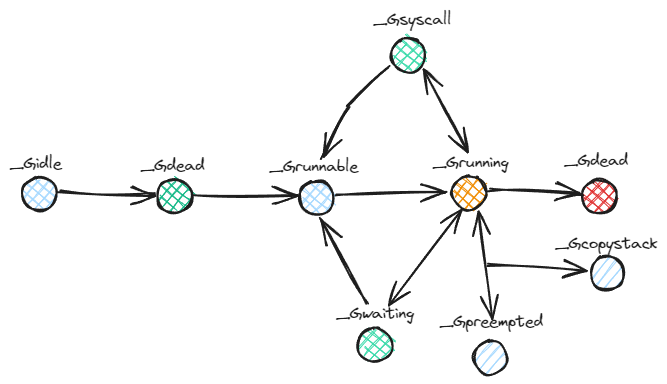
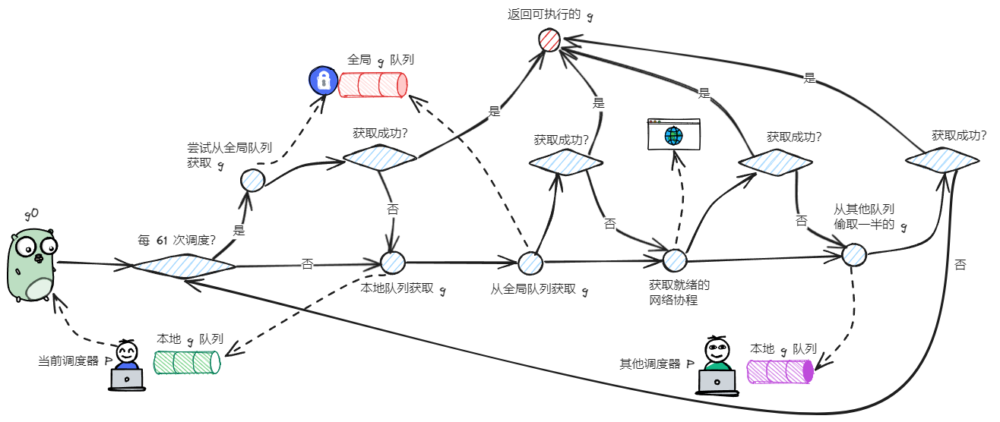
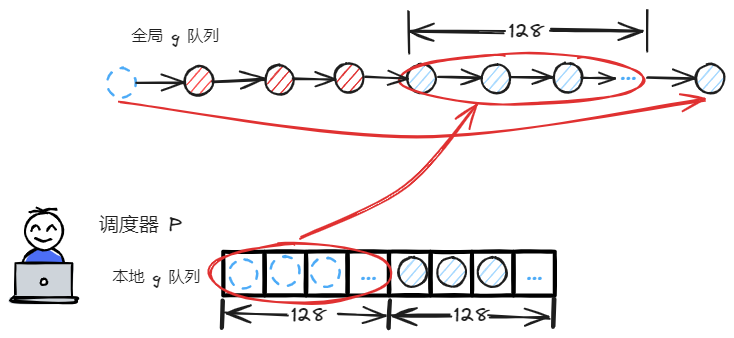
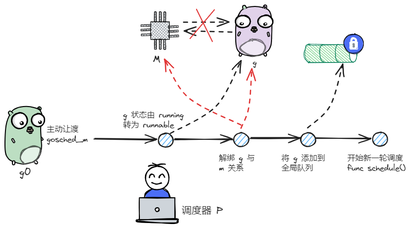
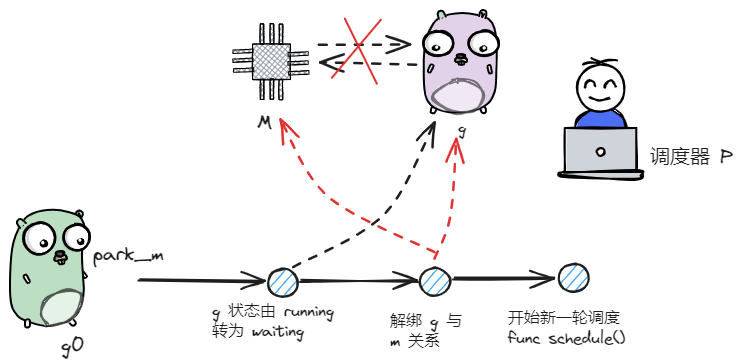
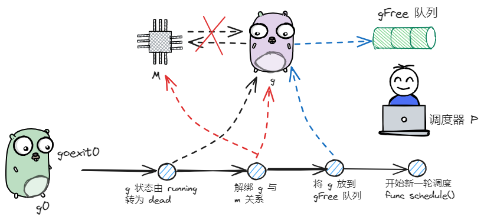

date: 2024-02-01

goversion:  go1.21.6

# 1. 概念

## 1.1 进程与线程

进程是操作系统资源分配的基本单位，线程是处理器任务调度和执行的基本单元。

一个进程可以存在多个线程，这些线程可以共享进程的内存等资源。不同进程具有不同的内存地址。

## 1.2 线程上下文切换

为了平衡每个线程被 CPU 公平利用，操作系统会在适当时间通过 定时器中断、IO 设备中断、系统调用进行上下文切换。

CPU 需完成用户态与内核态间的切换。

在之后说的线程通常指的是内核级线程

## 1.3 线程与协程

和线程不同，协程的创建、销毁、调度 依赖 Go 运行时调度器，对内核透明。

从几个方面来说明他们之间的不同

### 1.3.1 调度方式

协程和线程依赖 运行时调度器，对象关系是: M:N ，多对多的关系


### 1.3.2 上下文切换

协程切换不经过操作系统用户态和内核态的切换

### 1.3.3 调度策略

线程调度是抢占式的

协程调度是协作式的，当完成任务的时候主动将执行权让给其他协程。若一个协程运行很长时间，Go 调度才会抢占。

### 1.3.4 栈的大小

线程的栈大小一般在创建时指定，默认大小 2M；协程默认为2kb，可以动态的扩容


# 2. gmp 模型 

gmp = goroutine + machine + processor，GMP 模型概况了线程与协程的关系，协程依托于线程，借助操作系统将线程调度到 CPU 执行，从而最终执行协程。

## 2.1 g

1. g 即 goroutine，是 golang 中对协程的抽象；
2. g 有自己的运行栈、状态、以及执行的任务函数（由 go func 指定）；
3. g 需要绑定 p 才能执行，在 g 的视角中，p 就是它的 cpu；


## 2.2 p

1. p 即 processor，是 golang 中的调度器；
2. p 是 gmp 中枢，实现 g 和 m 之间的动态有机结合；
3. 对 g 而言，p 是其 cpu，g 只有被 p 调度，才得以执行；
4. 对 m 而言，p 是其执行代理，为其提供必要信息的同时，隐藏了调度细节；
5. p 的数量决定了 g 最大并行数量，可由用户通过 GOMAXPROCS 进行设定；


## 2.3 m

1. m 即 machine，是 golang 中对线程的抽象；
2. m 不直接执行 g，而是先和 p 绑定，由其实现代理；
3. 借由 p 的存在，m 无需和 g 绑死，也无需记录 g 的状态信息，因此在 g 的生命周期中可实现跨 m 执行


## 2.4 GMP


上图是 GMP 宏观模型

1. M 是线程的抽象；G 是 goroutine；P 是承上启下的调度器；
2. M 调度 G 前，需要和 P 绑定；
3. 全局有多个 M 和多个 P，但同时并行的 G 的最大数量等于 P 的数量；
4. G 的存放队列有三类：P 的本地队列；全局队列；wait 队列（上图没有，为 io 阻塞就绪态 goroutine 队列）；
5. M 调度 G 时，优先取 P 的本地队列，其次取全局队列，最后取 wait 队列；这样的好处：取本地队列时，可以接近于无锁化，减少全局竞争；
6. 为了防止不同 P 的闲忙差异过大，设立 work-stealing 机制，本地队列为空的 P 可以尝试从其他 P 队列偷取一半的 G 补充到自身队列；


# 3. 核心数据结构

gmp 数据结构定义在 runtime/runtime2.go 文件中。

## 3.1 g

```go
type g struct {
    // ...
    m *m
    // ...
    sched gobuf
    // ...
}

type gobuf struct {
	sp   uintptr
	pc   uintptr
	ret  uintptr
	bp   uintptr // for framepointer-enabled architectures
    // ...
}
```

1.  m :  在 p 的代理，负责执行当前 g 的  m ；
2. sched.sp: 保存 CPU 的 rsp 寄存器的值，指向调用函数栈顶；
3. sched.pc: 保存 CPU 的 rip 寄存器的值，执行程序下一条执行指令的地址；
4. sched.ret: 保存系统调用的返回值；
5. sched.bp: 保存 CPU 的 rbp 寄存器的值，存储函数栈帧的起始位置；

其中 g 的生命周期由以下几种状态组成：



```go
const (
	_Gidle = iota // 0
	_Grunnable // 1
	_Grunning // 2
	_Gsyscall // 3
	_Gwaiting // 4
	_Gdead // 6
	_Genqueue_unused // 7
	_Gcopystack // 8
	_Gpreempted // 9
)
```

1. _Gidle 值为 0，为协程开始创建状态时的状态，此时尚未完成初始化；
2. _Grunnable 值为 1，协程在等待执行队列中，等待被执行；
3. _Gunning 值为 2，协程正在被执行，同一时刻一个 p 中只有一个 g 处于此状态；
4. _Gsyscall 值为 3，协程正在执行系统调用；
5. _Gwaiting 值为 4，协程处于挂起态，需要等待被唤醒. gc、channel 通信或者锁操作时经常会进入这种状态；
6. _Gdead 值为 6，协程刚初始化完成或者已经被销毁，会处于此状态；
7. _Gcopystack 值为 8，协程正在栈扩容流程中；
8. _Greempted 值为 9，协程被抢占后的状态.


## 3.2 m

```go
type m struct {
	g0      *g     // goroutine with scheduling stack
	// ...
    tls     [tlsSlots]uintptr // thread-local storage (for x86 extern register)
    // ...
}
```

1. g0 : 一类特殊的调度协程，不用执行用户函数，负责 g 之间的切换调度，与  m 的关系为 1:1；
2. tls：thread-local storage，线程本地存储，存储内容只对当前线程可见. 线程本地存储的是 m.tls 的地址，m.tls[0] 存储的是当前运行的 g 的地址，因此线程可以通过线程本地存储 找到当前线程上的 g、m、p、g0 等信息.


## 3.3 p

```go
type p struct {
    // ...
    runqhead uint32
    runqtail uint32
    runq     [256]guintptr
    
    runnext guintptr
    // ...
}
```

1. runq：本地 goroutine 队列，最大长度为 256；
2. runqhead：队列头部；
3. runqtail：队列尾部；
4. runnext：下一个可执行的 goroutine；


## 3.4 schedt

```go
type schedt struct {
    // ...
    lock mutex
    // ...
    runq     gQueue
    runqsize int32
    // ...
}
```

sched 是全局 goroutine 队列的封装：

1. lock：一把操作全局队列时使用的锁;
2. runq：全局 goroutine 队列，是一个链表；
3. runqsize：全局 goroutine 队列的容量；


# 4. 调度流程

## 4.1 两种 g 的切换


之前说的 goroutine 的类型可分为两类：

1. 负责调度普通 g 的 g0，执行固定的调度流程，与 m 的关系为一对一；
2. 负责执行用户函数的普通 g；


m 通过 p 调度执行的 goroutine 永远在普通 g 和 g0 之间进行切换，当 g0 找到可执行的 g 时，会调用 gogo 方法，调度 g 执行用户定义的任务；

当 g 主动调度或被动调度时，会触发 mcall 方法，将执行权重新交给 g0。


gogo 和 mcall 可以理解为对偶关系，其定义在 runtime/stubs.go 文件中

```go
// ...
func gogo(buf *gobuf)
// ...
func mcall(fn func(*g))
```


## 4.2 调度类型


通常调度指的是由 g0 按照特定策略找到下一个可执行 g 的过程。本节谈论的是广义上的“调度”，指的是调度器 P 实现从执行一个 g 切换到另一个 g 的过程。

这种广义上“调度”可分为几种类型：

1. 主动调度

​	用户主动执行让渡的方式，主要方式是，用户在执行代码中调用了 runtime.Goshced() 方法，此时当前 g 会让出执行权，主动进行队列等待下次被调用。放入的是全局队列里面。大多数情况下，用户并不需要执行此函数。

代码位于 runtime/proc.go。

```go
func Gosched() {
	checkTimeouts()
	mcall(gosched_m)
}
```


2. 被动调度

指协程在休眠、channel 通道阻塞、网络 IO 阻塞、执行垃圾回收而暂停，被动让渡自己执行权利的过程。放入的是本地队列，状态 _Grunning->_Gwaiting，所以被动调度需要一个额外的唤醒机制。

代码位于 runtime/proc.go

```go
func gopark(unlockf func(*g, unsafe.Pointer) bool, lock unsafe.Pointer, reason waitReason, traceReason traceBlockReason, traceskip int) {
	// ...
	mcall(park_m)
}
```

goready 方法通常与 gopark 方法成对出现，能够将 g 从阻塞态恢复，重新进入等待执行队列。

代码位于 runtime/proc.go

```go
func goready(gp *g, traceskip int) {
    systemstack(func() {
        ready(gp, traceskip, true)
    })
}
```


3.  正常调度

g 中执行任务已完成，g0 会将当前 g 置为死亡状态，发起新一轮的调度。


4. 抢占调度

Go  在初始化时会启动一个特殊的线程来执行系统监控任务。若 g 执行超过时间过长，或者处于系统调用阶段，全局的 p 资源比较紧缺，此时 p 和 g 进行解绑，抢占出来用于其他 g 的调度。等待 g 完成系统调用，会重新进入可执行队列中等待被调度。

为什么需要 monitor g 来完成？

因为发起系统调用时，此时是内核态，m 也会因为系统调用陷入，无法主动完成抢占调度的行为。

代码位于 runtime/proc.go

```go
func retake(now int64) uint32 {
// ...
}
```


## 4.3 宏观调度流程


对 gmp 宏观调度流程进行串联：

1. 以 g0 -> g -> g0 的一轮循环为例进行串联；
2. g0 执行 schedule() 函数，寻找到用于执行的 g；
3. go 执行 execute() 方法，更新当前 g、p 的状态信息，并调用 gogo() 方法，将执行权交给 g；
4. g 因主动调度（gosched_m）、被动调度（park_m）、正常结束（goexit0()）等原因，调用 mcall 函数，执行权重新回到 g0 手中；
5. g0 执行 schedule() 函数，进行新一轮循环；


## 4.4 schedule()

调度流程方法位于 runtime/proc.go 中的 schedule 函数，此时的执行权位于 g0 手中：

```go
// One round of scheduler: find a runnable goroutine and execute it.
// Never returns.
func schedule() {
	// ...
	gp, inheritTime, tryWakeP := findRunnable() // blocks until work is available
	// ...
	execute(gp, inheritTime)
}
```

schedule 函数处理具体的调度策略，选择下一个要执行的协程。

1. 寻找到下一个执行的 goroutine；
2. 执行该 goroutine；

## 4.5 findRunnable



调度流程中，为 m 找到下一个执行的 g ，代码位于 runtime/proc.go 的 findRunnable 方法中：


```go
// Finds a runnable goroutine to execute.
// Tries to steal from other P's, get g from local or global queue, poll network.
func findRunnable() (gp *g, inheritTime, tryWakeP bool) {
	mp := getg().m

top:
	pp := mp.p.ptr()
	// ...

	// Check the global runnable queue once in a while to ensure fairness.
	// Otherwise two goroutines can completely occupy the local runqueue
	// by constantly respawning each other.
	if pp.schedtick%61 == 0 && sched.runqsize > 0 {
		lock(&sched.lock)
		gp := globrunqget(pp, 1)
		unlock(&sched.lock)
		if gp != nil {
			return gp, false, false
		}
	}

	// local runq
	if gp, inheritTime := runqget(pp); gp != nil {
		return gp, inheritTime, false
	}

	// global runq
	if sched.runqsize != 0 {
		lock(&sched.lock)
		gp := globrunqget(pp, 0)
		unlock(&sched.lock)
		if gp != nil {
			return gp, false, false
		}
	}

	// Poll network.
	// This netpoll is only an optimization before we resort to stealing.
	// We can safely skip it if there are no waiters or a thread is blocked
	// in netpoll already. If there is any kind of logical race with that
	// blocked thread (e.g. it has already returned from netpoll, but does
	// not set lastpoll yet), this thread will do blocking netpoll below
	// anyway.
	if netpollinited() && netpollWaiters.Load() > 0 && sched.lastpoll.Load() != 0 {
		if list := netpoll(0); !list.empty() { // non-blocking
			gp := list.pop()
			injectglist(&list)
			casgstatus(gp, _Gwaiting, _Grunnable)
			if traceEnabled() {
				traceGoUnpark(gp, 0)
			}
			return gp, false, false
		}
	}

	// Spinning Ms: steal work from other Ps.
	//
	// Limit the number of spinning Ms to half the number of busy Ps.
	// This is necessary to prevent excessive CPU consumption when
	// GOMAXPROCS>>1 but the program parallelism is low.
	if mp.spinning || 2*sched.nmspinning.Load() < gomaxprocs-sched.npidle.Load() {
		if !mp.spinning {
			mp.becomeSpinning()
		}

		gp, inheritTime, tnow, w, newWork := stealWork(now)
		if gp != nil {
			// Successfully stole.
			return gp, inheritTime, false
		}
		if newWork {
			// There may be new timer or GC work; restart to
			// discover.
			goto top
		}

		now = tnow
		if w != 0 && (pollUntil == 0 || w < pollUntil) {
			// Earlier timer to wait for.
			pollUntil = w
		}
	}
	// ...
	goto top
}
```

1. p 每执行 61 次调度，会从全局队列中获取一个 goroutine 执行  

```go
if pp.schedtick%61 == 0 && sched.runqsize > 0 {
	lock(&sched.lock)
	gp := globrunqget(pp, 1)
	unlock(&sched.lock)
	if gp != nil {
		return gp, false, false
	}
}
```

核心的代码就是 globrunqget()，得到一个 goroutine 或者没有。

> 注意这里传参 max = 1

2. 尝试从 p 本地队列中获取一个可执行的 goroutine，核心逻辑位于 runqget 方法中：

```go
// local runq
if gp, inheritTime := runqget(pp); gp != nil {
	return gp, inheritTime, false
}
```

```go
func runqget(pp *p) (gp *g, inheritTime bool) {
	// If there's a runnext, it's the next G to run.
	next := pp.runnext
	// If the runnext is non-0 and the CAS fails, it could only have been stolen by another P,
	// because other Ps can race to set runnext to 0, but only the current P can set it to non-0.
	// Hence, there's no need to retry this CAS if it fails.
	if next != 0 && pp.runnext.cas(next, 0) {
		return next.ptr(), true
	}

	for {
		h := atomic.LoadAcq(&pp.runqhead) // load-acquire, synchronize with other consumers
		t := pp.runqtail
		if t == h {
			return nil, false
		}
		gp := pp.runq[h%uint32(len(pp.runq))].ptr()
		if atomic.CasRel(&pp.runqhead, h, h+1) { // cas-release, commits consume
			return gp, false
		}
	}
}
```

> 1. 若当前 p 的 runnext 非空，直接获取
>
>    ```go
>    if next != 0 && pp.runnext.cas(next, 0) {
>    	return next.ptr(), true
>    }
>    ```
>
> 2. 加锁，从本地队列获取 g.   
>
>    本地队列是 p 独有，为什么需要加锁？因为有 work-stealing 机制的存在，其他 p 可能来窃取。
>
>    由于窃取频率不会太高，因此当前 p 取得锁成功率是很高的，因此可以说 p 的本地队列是接近于无锁化，但不是真正意义上的无锁。
>
>    ```go
>    for {
>    	h := atomic.LoadAcq(&pp.runqhead) // load-acquire, synchronize with other consumers
>    	// ...
>    }
>    ```
>
> 3. 若本地队列为空，直接返回
>
>    ```go
>    t := pp.runqtail
>    if t == h {
>    	return nil, false
>    }
>    ```
>
> 4. 若本地队列存在 g，则取得队首的 g，解锁并返回。
>
>    ```go
>    gp := pp.runq[h%uint32(len(pp.runq))].ptr()
>    if atomic.CasRel(&pp.runqhead, h, h+1) { // cas-release, commits consume
>    	return gp, false
>    }
>    ```


3. 若本地队列没有可执行的 g，会从全局队列获取：

   ```go
   if sched.runqsize != 0 {
   	lock(&sched.lock)
   	gp := globrunqget(pp, 0)
   	unlock(&sched.lock)
   	if gp != nil {
   		return gp, false, false
   	}
   }
   ```

   加锁，尝试并从全局队列中取队首的元素，且把全局队列的 g ，放一些到 p 的本地队列中。

   ```go
   func globrunqget(pp *p, max int32) *g {
   	assertLockHeld(&sched.lock)
   
   	if sched.runqsize == 0 {
   		return nil
   	}
   
   	n := sched.runqsize/gomaxprocs + 1
   	if n > sched.runqsize {
   		n = sched.runqsize
   	}
   	if max > 0 && n > max {
   		n = max
   	}
   	if n > int32(len(pp.runq))/2 {
   		n = int32(len(pp.runq)) / 2
   	}
   
   	sched.runqsize -= n
   
   	gp := sched.runq.pop()
   	n--
   	for ; n > 0; n-- {
   		gp1 := sched.runq.pop()
   		runqput(pp, gp1, false)
   	}
   	return gp
   }
   ```

   > 注意这里 max = 0，所以 放入 p 本地队列的数量是：min( sched.runqsize/gomaxprocs + 1,  sched.runqsize,  len(pp.runq)/2) -1

   


将一些 g 由全局队列转移到 本地队列的执行逻辑位于 runqput 方法中：

```go
func runqput(pp *p, gp *g, next bool) {

    // 
retry:
	h := atomic.LoadAcq(&pp.runqhead) // load-acquire, synchronize with consumers
	t := pp.runqtail
	if t-h < uint32(len(pp.runq)) {
		pp.runq[t%uint32(len(pp.runq))].set(gp)
		atomic.StoreRel(&pp.runqtail, t+1) // store-release, makes the item available for consumption
		return
	}
	if runqputslow(pp, gp, h, t) {
		return
	}
	// the queue is not full, now the put above must succeed
	goto retry
}
```

> 1.  取得本地队列队首的索引，同时对本地队列加锁：
>
>    ```go
>    h := atomic.LoadAcq(&pp.runqhead)
>    ```
>
> 2. 若本地队列没有满，则成功转移 g，将本地队列的尾索引 runqtail 加 1 并解锁
>
>    ```go
>    t := pp.runqtail
>    if t-h < uint32(len(pp.runq)) {
>    	pp.runq[t%uint32(len(pp.runq))].set(gp)
>    	atomic.StoreRel(&pp.runqtail, t+1) // store-release, makes the item available for consumption
>    	return
>    }
>    ```
>
>    
>
> 3. 若本地队列已经满了，则会将一半的本地队列 g 放回到全局队列中，帮助当前 p 缓解执行压力，代码位于 runqputslow 中：
>
>    ```
>    func runqputslow(pp *p, gp *g, h, t uint32) bool {
>    	var batch [len(pp.runq)/2 + 1]*g
>                   
>    	// First, grab a batch from local queue.
>    	n := t - h
>    	n = n / 2
>    	if n != uint32(len(pp.runq)/2) {
>    		throw("runqputslow: queue is not full")
>    	}
>    	for i := uint32(0); i < n; i++ {
>    		batch[i] = pp.runq[(h+i)%uint32(len(pp.runq))].ptr()
>    	}
>    	if !atomic.CasRel(&pp.runqhead, h, h+n) { // cas-release, commits consume
>    		return false
>    	}
>    	batch[n] = gp
>                   
>    	if randomizeScheduler {
>    		for i := uint32(1); i <= n; i++ {
>    			j := fastrandn(i + 1)
>    			batch[i], batch[j] = batch[j], batch[i]
>    		}
>    	}
>                   
>    	// Link the goroutines.
>    	for i := uint32(0); i < n; i++ {
>    		batch[i].schedlink.set(batch[i+1])
>    	}
>    	var q gQueue
>    	q.head.set(batch[0])
>    	q.tail.set(batch[n])
>                   
>    	// Now put the batch on global queue.
>    	lock(&sched.lock)
>    	globrunqputbatch(&q, int32(n+1))
>    	unlock(&sched.lock)
>    	return true
>    }
>    ```

4. 若本地队列和全局队列都没有 g，则会从 网络就绪的 goroutine 中获取。

   ```go
   if netpollinited() && netpollWaiters.Load() > 0 && sched.lastpoll.Load() != 0 {
   	if list := netpoll(0); !list.empty() { // non-blocking
   		gp := list.pop()
   		injectglist(&list)
   		casgstatus(gp, _Gwaiting, _Grunnable)
   		if traceEnabled() {
   			traceGoUnpark(gp, 0)
   		}
   		return gp, false, false
   	}
   }
   ```

   将 g 的状态从 waiting 改成 runnable

5. 若还没有，就会从其他 p 窃取，work-stealing

   ```go
   gp, inheritTime, tnow, w, newWork := stealWork(now)
   ```

   ```go
   func stealWork(now int64) (gp *g, inheritTime bool, rnow, pollUntil int64, newWork bool) {
   	pp := getg().m.p.ptr()
   
   	ranTimer := false
   
   	const stealTries = 4
   	for i := 0; i < stealTries; i++ {
   		stealTimersOrRunNextG := i == stealTries-1
   
   		for enum := stealOrder.start(fastrand()); !enum.done(); enum.next() {
               
   			//...
               
   			if !idlepMask.read(enum.position()) {
   				if gp := runqsteal(pp, p2, stealTimersOrRunNextG); gp != nil {
   					return gp, false, now, pollUntil, ranTimer
   				}
   			}
   		}
   	}
   	return nil, false, now, pollUntil, ranTimer
   }
   ```

   偷取操作至多会遍历全局的 p 队列 4 次，过程中只要找到可窃取的 p 则会立即返回.

   为保证窃取行为的公平性，遍历的起点是随机的. 窃取代码位于 runqsteal 方法当中：

   ```go
   func runqsteal(pp, p2 *p, stealRunNextG bool) *g {
   	t := pp.runqtail
   	n := runqgrab(p2, &pp.runq, t, stealRunNextG)
   	// ...
   }
   ```

   ```go
   func runqgrab(pp *p, batch *[256]guintptr, batchHead uint32, stealRunNextG bool) uint32 {
   	for {
   		h := atomic.LoadAcq(&pp.runqhead) // load-acquire, synchronize with other consumers
   		t := atomic.LoadAcq(&pp.runqtail) // load-acquire, synchronize with the producer
   		n := t - h
   		n = n - n/2
   		if n == 0 {
   			if stealRunNextG {
   				// Try to steal from pp.runnext.
   				if next := pp.runnext; next != 0 {
   					if pp.status == _Prunning {
   						// ...
   						if GOOS != "windows" && GOOS != "openbsd" && GOOS != "netbsd" {
   							usleep(3)
   						} else {
   							// ...
   							osyield()
   						}
   					}
   					if !pp.runnext.cas(next, 0) {
   						continue
   					}
   					batch[batchHead%uint32(len(batch))] = next
   					return 1
   				}
   			}
   			return 0
   		}
   		if n > uint32(len(pp.runq)/2) { // read inconsistent h and t
   			continue
   		}
   		for i := uint32(0); i < n; i++ {
   			g := pp.runq[(h+i)%uint32(len(pp.runq))]
   			batch[(batchHead+i)%uint32(len(batch))] = g
   		}
   		if atomic.CasRel(&pp.runqhead, h, h+n) { // cas-release, commits consume
   			return n
   		}
   	}
   }
   ```

   > 1. 每次对一个 p 尝试窃取前，会对队首队尾部加锁；
   >
   >    ```go
   >    h := atomic.LoadAcq(&pp.runqhead) // load-acquire, synchronize with other consumers
   >    t := atomic.LoadAcq(&pp.runqtail) // load-acquire, synchronize with the producer
   >    ```
   >
   > 2. 尝试偷取其现有的一半 g，并且返回实际偷取的数量.
   >
   >    ```go
   >    n := t - h
   >    n = n - n/2
   >                   
   >    //...
   >                   
   >    for i := uint32(0); i < n; i++ {
   >    	g := pp.runq[(h+i)%uint32(len(pp.runq))]
   >    	batch[(batchHead+i)%uint32(len(batch))] = g
   >    }
   >    if atomic.CasRel(&pp.runqhead, h, h+n) { // cas-release, commits consume
   >    	return n
   >    }
   >    ```


## 4.6 execute


当 g0 为 m 找到可执行的 g 之后，接下来就要执行 g. 代码位于 runtime/proc.go 的 execute 方法中：

```go
func execute(gp *g, inheritTime bool) {
	mp := getg().m

	// ...
	mp.curg = gp
	gp.m = mp
	casgstatus(gp, _Grunnable, _Grunning)
	gp.waitsince = 0
	gp.preempt = false
	gp.stackguard0 = gp.stack.lo + stackGuard
	if !inheritTime {
		mp.p.ptr().schedtick++
	}

	// ...

	gogo(&gp.sched)
}
```

1.  建立 g 与 m 之间的绑定，更新 g 的状态信息
2. 更新 p 的总调度次数
3. 调用 gogo 方法，执行 goroutine 中的任务


## 4.7 gosched_m



g 执行主动让渡时，会调用 mcall 方法将执行权归还给 g0，并由 g0 调用 gosched_m 方法，代码位于 runtime/proc.go。

```go
func Gosched() {
	checkTimeouts()
	mcall(gosched_m)
}
```

```go
func gosched_m(gp *g) {
	if traceEnabled() {
		traceGoSched()
	}
	goschedImpl(gp)
}

func goschedImpl(gp *g) {
	status := readgstatus(gp)
	if status&^_Gscan != _Grunning {
		dumpgstatus(gp)
		throw("bad g status")
	}
	casgstatus(gp, _Grunning, _Grunnable)
	dropg()
	lock(&sched.lock)
	globrunqput(gp)
	unlock(&sched.lock)

	schedule()
}
```

1. 将当前 g 状态由 running 切换成 runnable

   ```go
   casgstatus(gp, _Grunning, _Grunnable)
   ```

2. 调用 dropg() 方法，将当前的 m 和 g 解绑

   ```go
   func dropg() {
   	gp := getg()
   
   	setMNoWB(&gp.m.curg.m, nil)
   	setGNoWB(&gp.m.curg, nil)
   }
   ```

3. 将 g 添加到全局队列

   ```go
   lock(&sched.lock)
   globrunqput(gp)
   unlock(&sched.lock)
   ```

4. 开启新一轮的调度

   ```
   schedule()
   ```


## 4.8 park_m 与 goready

g 需要被动调度时，会调用 mcall 方法切换至 g0，并调用 park_m 方法将 g 置为阻塞态，代码位于 runtime/proc.go 的 gopark 方法中。



```go
func gopark(unlockf func(*g, unsafe.Pointer) bool, lock unsafe.Pointer, reason waitReason, traceReason traceBlockReason, traceskip int) {
	// ...
	mcall(park_m)
}
```

```go
func park_m(gp *g) {
	mp := getg().m

	casgstatus(gp, _Grunning, _Gwaiting)
	dropg()

	// ...
	schedule()
}
```

1. 将当前 g 的状态由 running 改为 waiting；
2. 将 g 与 m 解绑；
3. 开启新一轮调度。

因被动调度陷入阻塞态的 g 需要被唤醒时，会由其他协程执行 goready 方法将 g 重新置为可执行的状态，代码位于 runtime/proc.go。

被动调度如果需要被唤醒，则会其他 g 负责将 g 的状态由 waiting 更新为 runnable，然后会将其添加到唤醒者的 p 的本地队列中：

```go
func goready(gp *g, traceskip int) {
	systemstack(func() {
		ready(gp, traceskip, true)
	})
}
```

```go
func ready(gp *g, traceskip int, next bool) {
	//...

	status := readgstatus(gp)

	// Mark runnable.
	mp := acquirem() // disable preemption because it can be holding p in a local var
	if status&^_Gscan != _Gwaiting {
		dumpgstatus(gp)
		throw("bad g->status in ready")
	}

	// status is Gwaiting or Gscanwaiting, make Grunnable and put on runq
	casgstatus(gp, _Gwaiting, _Grunnable)
	runqput(mp.p.ptr(), gp, next)
	wakep()
	releasem(mp)
}
```

1. 先将 g 状态从阻塞态更新为可执行态；
2. 调用 runqget 将当前 g 添加到唤醒者的本地队列，如果队列满了，会连带 g 将一半的 g 添加到全局队列中。


## 4.9 goexit0

正常调度执行完成



当 g 执行完成时，会先执行 mcall 方法切换至 g0，然后调用 goexit0 方法，代码位于 runtime/proc.go：

```go
func goexit1() {

	// ...
	
	mcall(goexit0)
}
```

```go
func goexit0(gp *g) {
	mp := getg().m
	pp := mp.p.ptr()

	casgstatus(gp, _Grunning, _Gdead)

	// ...

	dropg()

    // ...
    
	gfput(pp, gp)
    
	//...
    
	schedule()
}
```

1. 将 g 的状态从 running 更新为 dead；

2. 解绑 g 与 m

3. 将 g 加到 p 的本地 gFree 队列或者全局 gFree 队列

   ```go
   func gfput(pp *p, gp *g) {
   	// ...
   
   	pp.gFree.push(gp)
   	pp.gFree.n++
   	if pp.gFree.n >= 64 {
   		var (
   			inc      int32
   			stackQ   gQueue
   			noStackQ gQueue
   		)
   		for pp.gFree.n >= 32 {
   			gp := pp.gFree.pop()
   			pp.gFree.n--
   			if gp.stack.lo == 0 {
   				noStackQ.push(gp)
   			} else {
   				stackQ.push(gp)
   			}
   			inc++
   		}
   		lock(&sched.gFree.lock)
   		sched.gFree.noStack.pushAll(noStackQ)
   		sched.gFree.stack.pushAll(stackQ)
   		sched.gFree.n += inc
   		unlock(&sched.gFree.lock)
   	}
   }
   ```

   如果 p 的本地 gFree 队列大于 64，就会把一半的 g 转移到 全局 gFree 队列里面。

4. 进行新一轮调度


## 4.10 retake


与 4.7 - 4.9 不同的是，抢占调度的执行者不是 g0，而是一个全局的 monitor g，它是独立运行在 M 上面的，不需要绑定 p，会判断当前协程是否运行时间过长，或者处于系统调用阶段，如果是，则会抢占当前 g 的执行。代码位于 runtime/proc.go 的 retake 函数中：

```go
func retake(now int64) uint32 {
	// 遍历所有 p
	for i := 0; i < len(allp); i++ {
		pp := allp[i]
		pd := &pp.sysmontick
		s := pp.status
		sysretake := false
		if s == _Prunning || s == _Psyscall {
			// 如果 g 运行时间过长，则抢占
			t := int64(pp.schedtick)
			if int64(pd.schedtick) != t {
				pd.schedtick = uint32(t)
				pd.schedwhen = now
			} else if pd.schedwhen+forcePreemptNS <= now {
                // 连续运行时间超过 10ms，设置抢占请求
				preemptone(pp)
				// In case of syscall, preemptone() doesn't
				// work, because there is no M wired to P.
				sysretake = true
			}
		}
		if s == _Psyscall {
			// P 处于系统调用，检查是否需要抢占
		}
	}
	// ...
}
```

### 4.10.1  执行时间过长抢占

调度发生的时机主要是在执行函数调用阶段，编译器会在函数调用前判断 stackguard0 的大小，判断是 g 是否被抢占，调用流程:

morestack_noctxt()→morestack()→newstack(),  morestack_noctxt 为汇编函数，newstatck()  会调用 gopreempt_m 切换到 g0，取消G与M之间的绑定关系，将 g 的状态转换为  runnable，将 g 放入全局运行队列，并调用 schedule 函数开始新一轮调度循环。

```
func newstack() {
	preempt := stackguard0 == stackPreempt
	if preempt {
		//...
		gopreempt_m(gp) // never return
	}
}
```

有种情况是 g 在执行过程中，没有函数调用，所以没有抢占机会，那么就有了 信号强制抢占机制。

go 在初始化时会初始化信号表，并注册信号处理函数。调度器通过向线程发送 sigPreempt ，触发信号处理。

```go
func preemptone(pp *p) bool {
    // ...
    gp.preempt = true
    gp.stackguard0 = stackPreempt
	if preemptMSupported && debug.asyncpreemptoff == 0 {
		pp.preempt = true
		preemptM(mp)
	}

	return true
}
```

1. 设置抢占标志

   ```go
   gp.preempt = true
   gp.stackguard0 = stackPreempt
   ```

2. 调度器通过向线程中发送 sigPreempt 信号，触发信号处理

   

   ```go
   func preemptM(mp *m) {
   	// ...
   	signalM(mp, sigPreempt)
   	// ...
   }
   ```

   信号处理逻辑位于 runtime/signal_unix.go 的 sighandler：

   信号处理时，遇到 sigPreemt 信号，触发异步抢占机制。

   ```go
   func sighandler(sig uint32, info *siginfo, ctxt unsafe.Pointer, gp *g) {
   	// ...
   	if sig == sigPreempt && debug.asyncpreemptoff == 0 && !delayedSignal {
   		doSigPreempt(gp, c)
   	}
   	// ...
   }
   ```

   doSigPreempt函数是平台相关的汇编函数，修改原程序中rsp、rip寄存器中的值，从而在从内核态返回后，执行新的函数路径。

   在Go语言中，内核返回后执行新的 asyncPreempt 函数。asyncPreempt 函数会保存当前程序的寄存器值，并调用 asyncPreempt2 函数。重新切换回 g0 开始新的一轮调度，从而打断密集循环的继续执行。

   ```go
   // asyncPreempt is implemented in assembly.
   func asyncPreempt()
   
   //go:nosplit
   func asyncPreempt2() {
   	gp := getg()
   	gp.asyncSafePoint = true
   	if gp.preemptStop {
   		mcall(preemptPark)
   	} else {
   		mcall(gopreempt_m)
   	}
   	gp.asyncSafePoint = false
   }
   ```


### 4.10.2 系统调用时抢占

```go
if s == _Psyscall {
	// Retake P from syscall if it's there for more than 1 sysmon tick (at least 20us).
	t := int64(pp.syscalltick)
	if !sysretake && int64(pd.syscalltick) != t {
		pd.syscalltick = uint32(t)
		pd.syscallwhen = now
		continue
	}
	
	if runqempty(pp) && sched.nmspinning.Load()+sched.npidle.Load() > 0 && pd.syscallwhen+10*1000*1000 > now {
		continue
	}
	unlock(&allpLock)
	incidlelocked(-1)
	if atomic.Cas(&pp.status, s, _Pidle) {
		if traceEnabled() {
			traceGoSysBlock(pp)
			traceProcStop(pp)
		}
		n++
		pp.syscalltick++
		handoffp(pp)
	}
	incidlelocked(1)
	lock(&allpLock)
}
```

1. 系统调用超过一个 sysmon tick ( 20 us) 就会发生抢占

   ```go
   t := int64(pp.syscalltick)
   if !sysretake && int64(pd.syscalltick) != t {
   	pd.syscalltick = uint32(t)
   	pd.syscallwhen = now
   	continue
   }
   ```

2. p 满足下面下面三种之一就会发生抢占

   ```go
   if runqempty(pp) && sched.nmspinning.Load()+sched.npidle.Load() > 0 && pd.syscallwhen+10*1000*1000 > now {
   	continue
   }
   ```

   1. 当前局部队列有等待运行的 g；
   2. 前期没有空闲的 p 和 自旋的 m；
   3. 当前系统调用时间超过 10ms

3. 抢占调度步骤，先将当前 p 的状态更新为 idle，然后进入 handoffp 函数，判断是否需要新的 m  去接管 p （因为原本和 p 绑定的 m 正在执行系统调用）：

   ```go
   if atomic.Cas(&pp.status, s, _Pidle) {
   	if traceEnabled() {
   		traceGoSysBlock(pp)
   		traceProcStop(pp)
   	}
   	n++
   	pp.syscalltick++
   	handoffp(pp)
   }
   ```

4. 当发生如下条件时，需要启动一个 m 来接管：

   ```go
   func handoffp(pp *p) {
   	
   	// if it has local work, start it straight away
   	if !runqempty(pp) || sched.runqsize != 0 {
   		startm(pp, false, false)
   		return
   	}
   	// if there's trace work to do, start it straight away
   	if (traceEnabled() || traceShuttingDown()) && traceReaderAvailable() != nil {
   		startm(pp, false, false)
   		return
   	}
   	// if it has GC work, start it straight away
   	if gcBlackenEnabled != 0 && gcMarkWorkAvailable(pp) {
   		startm(pp, false, false)
   		return
   	}
   	// no local work, check that there are no spinning/idle M's,
   	// otherwise our help is not required
   	if sched.nmspinning.Load()+sched.npidle.Load() == 0 && sched.nmspinning.CompareAndSwap(0, 1) { // TODO: fast atomic
   		sched.needspinning.Store(0)
   		startm(pp, true, false)
   		return
   	}
   	if sched.runqsize != 0 {
   		unlock(&sched.lock)
   		startm(pp, false, false)
   		return
   	}
   	// If this is the last running P and nobody is polling network,
   	// need to wakeup another M to poll network.
   	if sched.npidle.Load() == gomaxprocs-1 && sched.lastpoll.Load() != 0 {
   		unlock(&sched.lock)
   		startm(pp, false, false)
   		return
   	}
   
   	// The scheduler lock cannot be held when calling wakeNetPoller below
   	// because wakeNetPoller may call wakep which may call startm.
   	when := nobarrierWakeTime(pp)
   	pidleput(pp, 0)
   	unlock(&sched.lock)
   
   	if when != 0 {
   		wakeNetPoller(when)
   	}
   }
   ```

   - 本地队列或者全局队列有 g
   - 有 trace 任务
   - 有垃圾回收任务
   - 所有其他 p 都在运行 g 并且没有自选的 m
   - 全局队列有 g
   - 处理网络读写事件

   获取 m 时，会先尝试获取已有的空闲的 m，若不存在，则会创建一个新的 m.

   ```go
   func startm(pp *p, spinning, lockheld bool) {
   	mp := acquirem()
       
   	// ... 
       
   	nmp := mget()
   	if nmp == nil {
           
   		// ...
           
   		newm(fn, pp, id)
   
   		// ...
   		return
   	}
   	// ...
   }
   ```

   

   如果上述条件不满足，会将 p 放到空闲队列中

   ```go
   pidleput(pp, 0)
   ```


## 4.11 reentersyscall 和 exitsyscall

线程的 p 被抢占后，，系统调用的线程从内核返回后会怎么样？在系统调用前后执行了一些系列逻辑：

- 之前：reentersyscall 
- 之后：exitsyscall

代码都位于 runtime/proc.go


### 4.11.1 reentersyscall

在 m 执行系统调用之前，会先执行 reentersyscall 函数：

```go
func reentersyscall(pc, sp uintptr) {
	gp := getg()

	// ...
	
	save(pc, sp)
	gp.syscallsp = sp
	gp.syscallpc = pc
	casgstatus(gp, _Grunning, _Gsyscall)
	
	// ...
	
	gp.m.syscalltick = gp.m.p.ptr().syscalltick
	pp := gp.m.p.ptr()
	pp.m = 0
	gp.m.oldp.set(pp)
	gp.m.p = 0
	atomic.Store(&pp.status, _Psyscall)

	gp.m.locks--
}
```

1. 此时执行权还是在 m 的 g0 手中

2. 保存当前 g 的执行环境

   ```go
   save(pc, sp)
   gp.syscallsp = sp
   gp.syscallpc = pc
   ```

3. 将 p 和 g 状态更新

   ```go
   casgstatus(gp, _Grunning, _Gsyscall)
   atomic.Store(&pp.status, _Psyscall)
   ```

4. 解除 p 和 m 之间的 绑定

   ```go
   pp := gp.m.p.ptr()
   pp.m = 0
   gp.m.p = 0
   ```

5. 将 p 添加到 当前 m 的 oldP 容器当中，后续 m 恢复后，会优先寻找旧的 p 重新建立绑定关系

   ```
   gp.m.oldp.set(pp)
   ```


### 4.11.2 exitsyscall

当 m 完成系统调用之后，会执行 exitsyscall 函数，尝试寻找 p 重新开始运作：

``` go
func exitsyscall() {
	gp := getg()

	// ...
	oldp := gp.m.oldp.ptr()
	gp.m.oldp = 0
	if exitsyscallfast(oldp) {
		
		// ...
		
		casgstatus(gp, _Gsyscall, _Grunning)
		
		// ...

		return
	}

	// ...
	mcall(exitsyscall0)

	// ...
}
```

1. 此时的执行权是普通的 g

2. 若之前设置的 oldp 可用，则重新 和 odlp 绑定，将当前  g 的状态从 syscall 更新为 running ,然后开始执行后续的用户函数

   ```go
   gp := getg()
   
   // ...
   oldp := gp.m.oldp.ptr()
   gp.m.oldp = 0
   if exitsyscallfast(oldp) {
   		
   	// ...
   		
   	casgstatus(gp, _Gsyscall, _Grunning)
   		
   	// ...
   
   	return
   }
   ```

3. old p 绑定失败，则调用  mcall() 函数切换到 m 的 g0，执行 exitsyscall0 函数

   ```go
   mcall(exitsyscall0)
   ```

   ```go
   func exitsyscall0(gp *g) {
   	casgstatus(gp, _Gsyscall, _Grunnable)
   	dropg()
   	lock(&sched.lock)
   	var pp *p
   	if schedEnabled(gp) {
   		pp, _ = pidleget(0)
   	}
   	var locked bool
   	if pp == nil {
   		globrunqput(gp)
   	} 
   	
   	// ...
   	
   	if pp != nil {
   		acquirep(pp)
   		execute(gp, false) // Never returns.
   	}
   	
   	// ...
   	
   	stopm()
   	schedule() // Never returns.
   }
   ```

4. 将 g 的状态由 syscall 更新为 runnable，并且 m 与 g 解绑

   ```go
   casgstatus(gp, _Gsyscall, _Grunnable)
   dropg()
   ```

5. 从全局 p 队列获取 p，若得到 p ，则执行 g

   ```go
   if schedEnabled(gp) {
   	pp, _ = pidleget(0)
   }
   if pp != nil {
   	acquirep(pp)
   	execute(gp, false) // Never returns.
   }
   ```

6. 若没 p 可用，则将 g 加入到全局队列中，当前 m 陷入沉睡. 直到被唤醒后才会继续发起调度

   ```go
   if pp == nil {
   	globrunqput(gp)
   }
   stopm()
   schedule() // Never returns.
   ```


# 参考

Go 语言底层原理剖析

https://www.bilibili.com/video/BV1oT411Y7m3/?spm_id_from=333.999.0.0
