# 1. 内存模型

golang 内存模型有几个核心要点：

* 以空间换时间，一次缓存，多次复用

  由于每次向操作系统申请内存操作很重，所以就一次多申请一些，以备后用。

  Golang 中的堆 mheap 正是基于这个思想，产生的数据结构，我们可以从两个视角来看 Golang 运行时的堆：

  1. 对操作系统，是用户进程中缓存的内存
  2. 对于 go 进程内部，堆是所有对象的内存起源

* 多级缓存，实现无/细锁化

  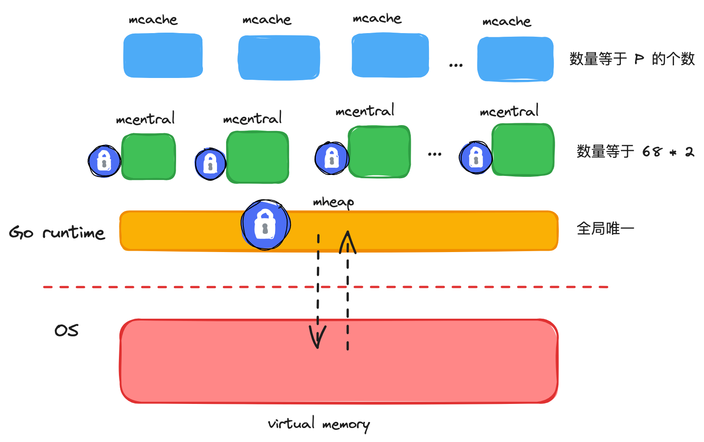

  堆是 Go 运行时最大的临界共享资源，意味着每次存取都要加锁。

  为了解决这个问题，Golang 在堆 mheap 上，依次细粒度化，建立了 mcentral、mcache 的模型，对三者说明如下：

  * mheap：全局的内存起源，访问要加全局锁

  * mcentral ：每种对象大小规格对应的缓存，锁的粒度仅限于同一种规格以内
  * mcache : 每个 P 持有一份的内存缓存，访问时无锁
  
* 多级规格，提高利用率

  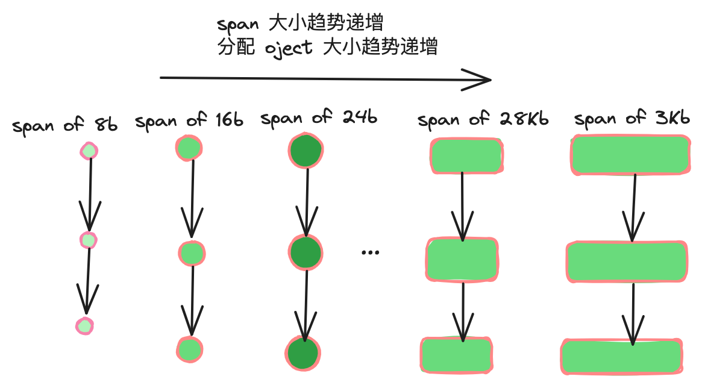  

    

  Page 和 mspan 概念：

  1. page：最小存储单元

     golang 借鉴操作系统分页管理的思想，每个最小存储单元称之为 page，大小为 8K。

  2. mspan：最小管理单元

     mspan 大小为 page 的整数倍，且从 8B  到 32KB 被划分为 67 种不同的规格，分配对象时，会根据大小映射到不同规格的 mspan，从中获取空间。

  多规格 mspan 特点：

  1. 根据规格大小，产生了等级的制度
  2. 消除了外部碎片，但不可避免产生内部碎片
  3. 宏观上能提高整体空间利用率
  4. 有个规格等级的概念，才支持 mcentral 实现细锁化

* 全局总览

  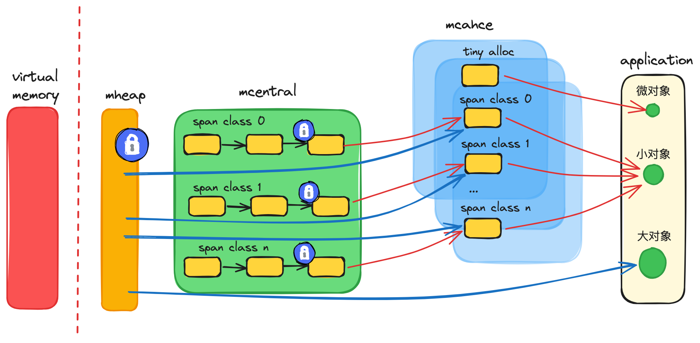  

  上图就是 golang 的整体架构图，它是借鉴 Thread Caching Malloc 的内存模型

# 2. 核心概念

## 2.1 内存单元 mspan

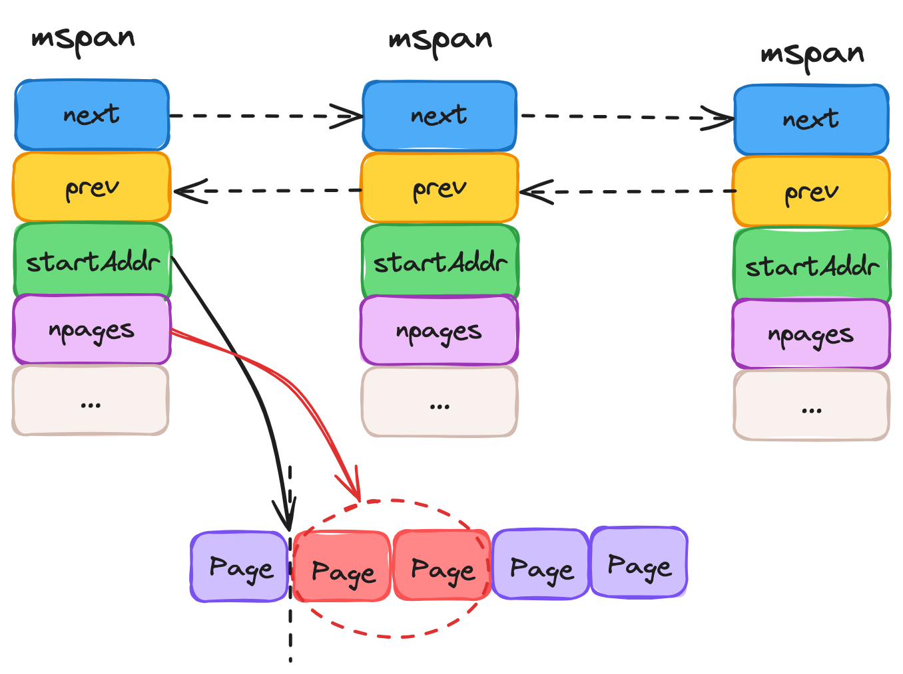 

mspan 的特质：

* mspan 是 golang 内存管理最小单元

* mspan 大小是 page 的整数倍（Go 中的 page 是 8KB），且内部的 page 是连续的。

* 每个 mspan 根据空间大小以及面向分配对象的大小，会被划分为不同等级

* 同等级的 mspan 会从属同一个 mcentral ，最终会被组织成链表，因此带有前后指针

* 由于同等级的 mspan 内聚于同一个 mcentral，所以会基于同一把互斥锁管理

* mspan 会基于 bitMap 辅助快速找到空闲内存块（object）

  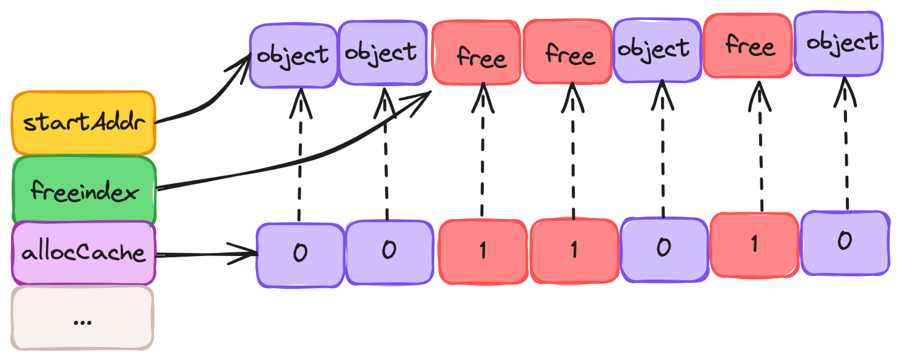  

mspan 的源码位于 runtime/mheap.go 文件中：

```go
type mspan struct {
	next *mspan     // next span in list, or nil if none
	prev *mspan     // previous span in list, or nil if none
	// 起始地址
	startAddr uintptr // address of first byte of span aka s.base()
  // 该 mspan 包含几页
	npages    uintptr // number of pages in span

	// 标记此前位置的 object 都已经被占用
	freeindex uintptr
	// 可以存放多少个 object
	nelems uintptr // number of object in the span.

	// bitMap 每个 bit 对应一个 object，标识该块是否被占用 和 freeindex 一起使用
	allocCache uint64

	// 标识 mspan 等级，包含 class 和 noscan 两部分信息
	spanclass             spanClass     // size class and noscan (uint8)
	// ...
}
```


## 2.2 内存单元等级 spanClass

mspan 根据空间大小和面向分配对象的大小，被划分为 67 种等级（1 - 67，还有一种 0 级，用于处理更大的对象，上不封顶）

下表展示了部分 mspan 的等级列表，数据位于 runtime/sizeclasses.go 

| class | bytes/obj | bytes/span | objects | tail waste | max waste |
| ----- | --------- | ---------- | ------- | ---------- | --------- |
| 1     | 8         | 8192       | 1024    | 0          | 87.50%    |
| 2     | 16        | 8192       | 512     | 0          | 43.75%    |
| 3     | 24        | 8192       | 341     | 8          | 29.24%    |
| 4     | 32        | 8192       | 256     | 0          | 21.88%    |
| ...   |           |            |         |            |           |
| 66    | 28672     | 57344      | 2       | 0          | 4.91%     |
| 67    | 32768     | 32768      | 1       | 0          | 12.50%    |

上表名字解释：

1. class：mspan 等级标识， 1 - 67。

2. bytes/obj：该大小规格的对象会从这一 mspan 中获取空间。创建对象过程 中，大小会向上取整为 8B 的整数倍。

3. bytes/span：该等级的 mspan 的总空间大小。

4. objects：该等级的 mspan 最多可以有多少个对象，结果等于 3/2。

5. tail waste：3%2，2对3取余。

6. max waste：就是分配对象之后最大浪费空间比率。

   > 以 class 3 为例：
   >
   > class 3 最小分配空间是 17 B，那么浪费空间
   >
   > ```
   > ((24-17) * 341 + 8)/8192 = 29.24%
   > ```

在 golang 中，会将 span class + noscan 两部分信息组装成一个 uint8，形成完整的 spanClass 标识。8 个 bit 中，高 7 位表示了上表的 span 等级，最低位表示 noscan 信息。

> noscan 就是是否有指针，gc 的时候是否进一步扫描


 代码位于 runtime/mheap.go

```go
type spanClass uint8

// 高 7位表示 span 等级，最低位表示 noscan 
func makeSpanClass(sizeclass uint8, noscan bool) spanClass {
	return spanClass(sizeclass<<1) | spanClass(bool2int(noscan))
}

func (sc spanClass) sizeclass() int8 {
	return int8(sc >> 1)
}

func (sc spanClass) noscan() bool {
	return sc&1 != 0
}
```


## 2.3 线程缓存 mcache

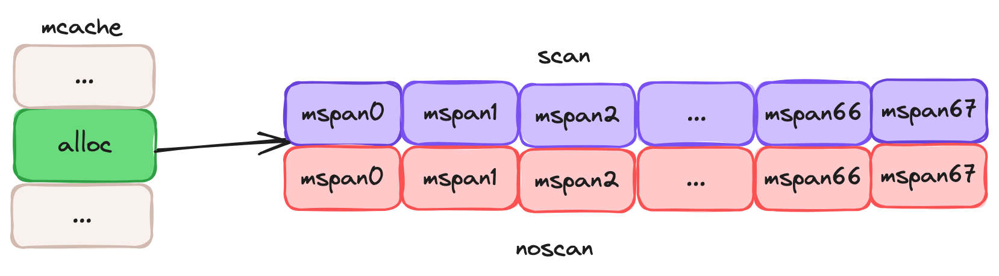  

 要点：  

1. mcache 是每个 P 独有的缓存，因此是无锁的。
2. mcache 将每种 spanClass 等级的 mspan 缓存了两个（noscan, scan），总数 2 * 68。
3. mcache 中还有一个为对象分配器 tiny allocator，用于处理小于 16B 对象的内存分配。


代码位于 runtime/mcache.go

```go
type mcache struct {
	// ...
  // 微对象分配器
	tiny       uintptr
	tinyoffset uintptr
	tinyAllocs uintptr
	// mcache 中缓存的 mspan，noscan, scan 各一个
	alloc [numSpanClasses]*mspan // spans to allocate from, indexed by spanClass

	// ...
}
```


## 2.4 中心缓存 mcentral

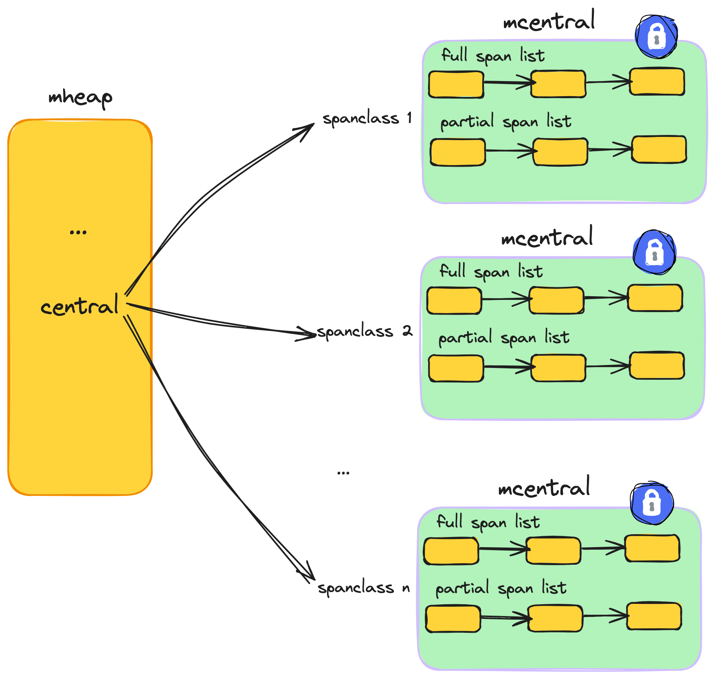  

要点：

1. 每个 mcentral 对应一种 spanClass。
2. 每个 mcentral 下聚合了该 spanClass 下的 mspan。
3. mcentral 下的 mspan 分为两个链表，分别为有空间 mspan 链表 partial 和 满空间 mspan 链表 full。
4. 每个 mcentral 一把锁。


代码位于 runtime/mcentral.go

```go
type mcentral struct {
	// 对应的 spanClass 
	spanclass spanClass
	// 有空位的 mspan 集合，数组长度为 2 是为了 GC
	partial [2]spanSet // list of spans with a free object
  // 无空位的 mspan 集合
	full    [2]spanSet // list of spans with no free objects
}
```


## 2.5 全局堆缓存 mheap

要点：

1. 对于 golang 上层应用来说，堆是操作系统虚拟内存的抽象。
2. 以 page 为单位，作为最小内存存储单元。
3. 负责将连续页组装成 mspan。
4. 全局内存基于 bitMap 标识其使用情况，每个 bit 对应一页，0 为空闲，1 已被 mspan 组装。
5. 通过 heapArena 聚合页，记录了 page 到 mspan 的映射信息。
6. 建立空闲页基数树索引 radix tree index，辅助快速寻找空闲页。
7. 是 mcentral 的持有者，持有所有 spanClass 下的 mcentral，作为自身缓存。
8. 内存不够时，向操作系统申请，申请单位为 heapArena （64M）。


代码位于 runtime/mheap.go

```go
type mheap struct {
	// 全局堆锁
	lock mutex

  // 空闲页分配器，底层是多颗基数树组成的索引，每棵树对应 16GB 内存空间
	pages pageAlloc // page allocation data structure

	// 记录了所有的 mspan ，需要知道，所有 mspan 都是经 mheap，使用连续空闲页组装生成的
	allspans []*mspan // all spans out there

	// heapAreana 数组，64位系统下，容量是[1][2^22]
  // 每个 heapArena 大小是 64M，理论上，golang 堆上限为 2^22 * 64M = 256T
	arenas [1 << arenaL1Bits]*[1 << arenaL2Bits]*heapArena
	
	// ...
  
  // 多个 mcentral ，总个数是 spanClass 的个数
	central [numSpanClasses]struct {
		mcentral mcentral
    // 用于内存地址对齐
		pad      [(cpu.CacheLinePadSize - unsafe.Sizeof(mcentral{})%cpu.CacheLinePadSize) % cpu.CacheLinePadSize]byte
	}

  // ...
}
```


## 2.6 空闲页索引 pageAlloc

https://go.googlesource.com/proposal/+/master/design/35112-scaling-the-page-allocator.md

这是关于空闲页寻址分配的基数树作者的笔记

要懂这颗基数树，要明白下面几点：

1. 数据结构背后的含义：

   1. mheap 会基于 bitMap 标识内存中各页的使用情况，bit 位为 0 代表该页是空闲的，为 1 代表该页已经被 mspan 占用。
   2. 每棵基数树聚合了 16 GB 内存空间中各页使用情况的索引信息，用于帮助 mheap 快速找到指定长度的连续空闲页的所在位置。
   3. mheap 持有 2^14 棵基数树，因此索引全面覆盖到 2^14 * 16GB = 256T 的内存空间。

2. 基数树节点设定

   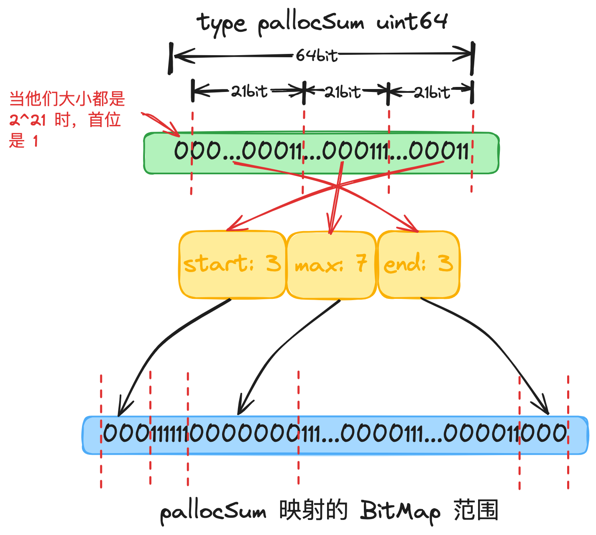 

   基数树中，每个节点称之为 PallocSum，是一个 uint64 类型，体现了索引的聚合信息，包含以下四部分：

   * start：最右侧 21 个 bit ，标识了当前节点映射的 bitMap 范围内首端游多少个连续的 0 bit （空闲页）。
   * max：中间 21 个 bit，标识了当前节点映射的 bitMap 范围内最多有多少个连续的 0 bit（空闲页）。
   * end：左侧 21 个 bit，标识了当前节点映射的 bitMap 范围内最末端有多少个连续的 0 bit（空闲页）。
   * 最左侧一个 bit，如果设值，说明 start, max, end 三者都等于 2^21。

3. 父子关系

   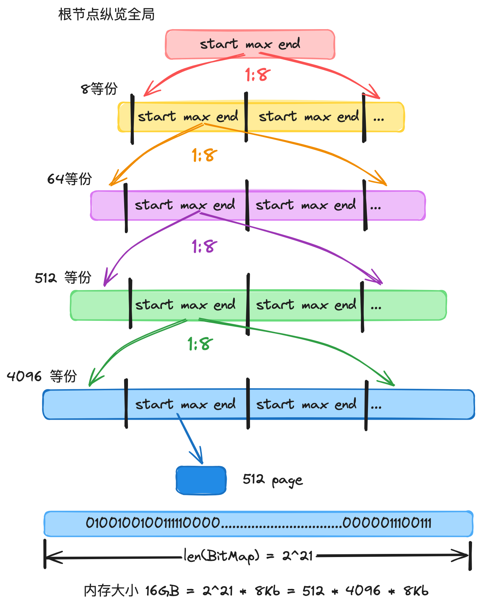  

   * 每个父 pallocSum 有八个子 pallocSum。

   * 根 pallocSum 总揽全局，映射的 bitMap 范围为全局的 16GB 空间（其 max 最大值为 2^21，因此总空间大小为 2^21 * 8KB = 16 GB）。

   * 从首层向下是一个依次 8 等分的过程，每一个 pallocSum 映射其父节点 bitMap 范围的八分之一，因此第二层 pallocSum 的 bitMap 范围为 16GB/8 = 2GB，以此类推，第五层节点的范围为 16GB/(8^4) = 4MB。

   * 聚合信息时，自底向上。每个父 pallocSum 聚合 8 个子 pallocSum 的 start、max、end 信息，形成自己的信息，直到根节点，它就拥有全局 16GB 的 start、max、end 信息。

   * mheap 寻页时，自顶向下。对于遍历到的每个 pallocSum ，先看 start 是否符合，是则寻页成功；再看 max 是否符合，是则进入下一层 pallocSum 中进一步寻访；最后看 end 和下一个同辈 pallocSum 的 start 聚合后是否满足，是则寻页成功。

     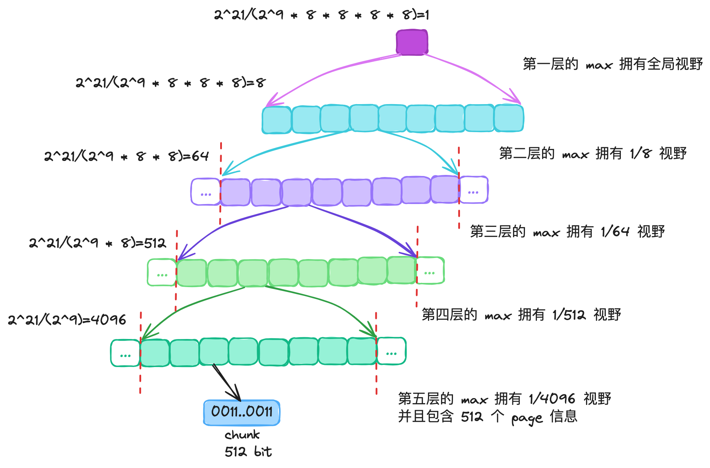  

     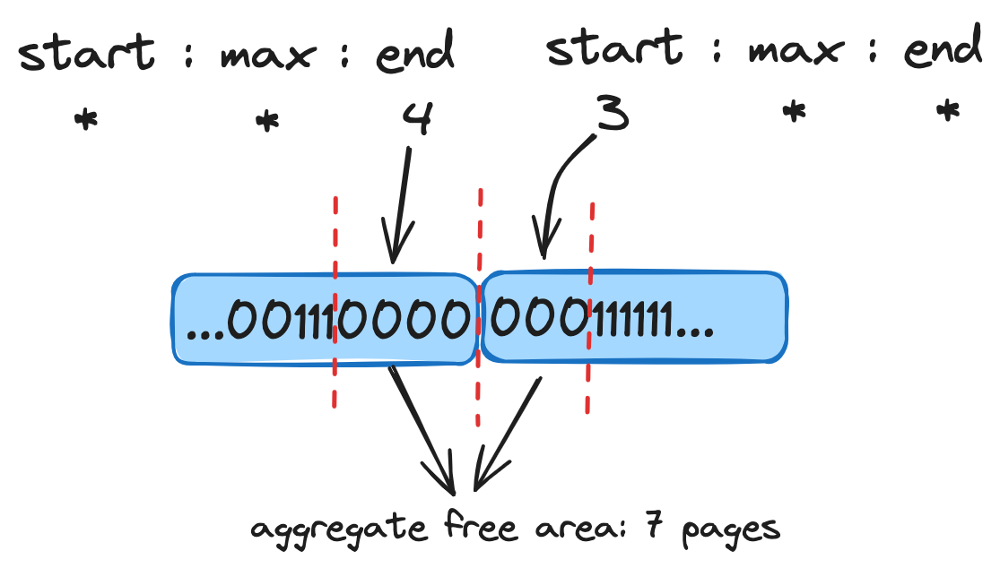  

   代码位于 runtime/mpagealloc.go

   ```go
   const summaryLevels = 5
   
   type pageAlloc struct {
   	// Radix tree of summaries.
   	
     // 总共五层基数树，第一层有 2^14 个节点，因此共有 2^14 棵基数树
     // 总空间大小为 2^14 * 16 GB = 256 T
     // 接下来每层的节点是上一层的 8 倍
   	summary [summaryLevels][]pallocSum
   
   	// 类似 tiny offset, 小于此值的地址无锁检索，没有空间可用
   	searchAddr offAddr
   
   	// ...
   }
   ```

   基数树节点

   ```go
   const (
     logMaxPackedValue = 21	
   	maxPackedValue    = 1 << logMaxPackedValue
   )
   
   type pallocSum uint64
   
   // 基于 start、max、end 组装成一个基数树节点 pallocSum
   func packPallocSum(start, max, end uint) pallocSum {
   	if max == maxPackedValue {
   		return pallocSum(uint64(1 << 63))
   	}
   	return pallocSum((uint64(start) & (maxPackedValue - 1)) |
   		((uint64(max) & (maxPackedValue - 1)) << logMaxPackedValue) |
   		((uint64(end) & (maxPackedValue - 1)) << (2 * logMaxPackedValue)))
   }
   
   // 当前节点对应区域内，首部连续空闲页长度
   // 通过 uint64 最右侧 21 个 bit 标识
   func (p pallocSum) start() uint {
   	if uint64(p)&uint64(1<<63) != 0 {
   		return maxPackedValue
   	}
   	return uint(uint64(p) & (maxPackedValue - 1))
   }
   
   // 当前节点对应区域内，连续空闲页的最大长度
   // 通过 uint64 左数 23 ～ 43 个 bit 标识
   func (p pallocSum) max() uint {
   	if uint64(p)&uint64(1<<63) != 0 {
   		return maxPackedValue
   	}
   	return uint((uint64(p) >> logMaxPackedValue) & (maxPackedValue - 1))
   }
   
   // 当前节点对应区域内，尾部连续空闲页的最大长度
   // 通过 uint64 左数 2 ～ 22 个 bit 标识
   func (p pallocSum) end() uint {
   	if uint64(p)&uint64(1<<63) != 0 {
   		return maxPackedValue
   	}
   	return uint((uint64(p) >> (2 * logMaxPackedValue)) & (maxPackedValue - 1))
   }
   ```


## 2.7 heapArena

* 每个 heapArena 包含 8192 个 page，大小是 8192 * 8KB = 64M
* heapArena 记录了 page 到 mspan 的映射。因为 GC 时，通过地址偏移找到 page 是很方便，但是找到其所属的 mspan 不容易。因此需要通过这个映射信息进行辅助。
* heapArena 是 mheap 向操作系统申请内存的单位（64M）。


代码位于 runtime/mheap.go

```go
const pagesPerArena = 8192

type heapArena struct {
	
  // 实现 page 到 mspan 的映射
	spans [pagesPerArena]*mspan
}
```


## 2.8 三级对象四级内存块

### 2.8.1 三级对象

mcache、mcentral、mheap


### 2.8.2 四级内存块

* HeapArena ：和平台有关，64位系统，大小是 64M
* chunk：大小是 512 Kb
* mspan：根据级别不同而不同，但是 page 的整数倍
* page：大小 8 Kb

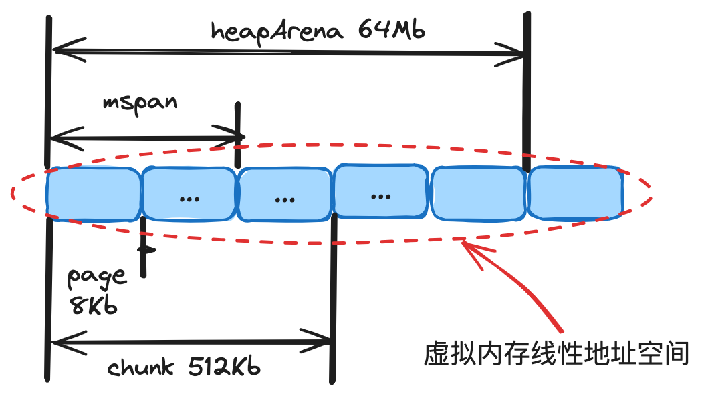  


# 3. 对象分配流程

在 golang 中有几种创建对象的方式：

* new(T)
* &T{}
* make(T)

## 3.1 对象分配流程

在 golang 中，根据 object 大小，会将其分为下述三类：

1. tiny 微对象：(0, 16B)
2. small 小对象：[16B, 32KB]
3. large 大对象：(32KB, ...)

不同类型的对象会有不同的分配策略，这些内容在 mallocgc 方法中都有体现。

核心流程类似于读多级缓存的过程，由上而下，每一步只要成功则直接返回。若失败，则由下层兜底。

对于微对象的分配流程：

1. 从 P 专属 mcache 的 tiny 分配器取内存（无锁）。
2. 根据所属的 spanClass ，从 P 专属 mcache 缓存的 mspan 中取内存（无锁）。
3. 根据所属的 spanClass 从对应的 mcentral 中取 mspan 填充到 mcache，然后从 mspan 中取内存（spanClass 粒度锁）。
4. 根据所属的 spanClass，从 mheap 的页分配器 pageAlloc 取得足够数量的空闲页组装成 mspan 填充到 mcache，然后从 mspan 中取内存（全局锁）。
5. mheap 向操作系统申请内存，更新页分配器的索引信息，然后重复 4。

对于小对象的分配流程是跳过 1 步，执行上述流程的 2 - 5 步；

对于大对象的分配流程是跳过 1 - 3 步，执行上述流程的 4 - 5 步；


## 3.2 主干方法 mallocgc


## 3.3 步骤 1 tiny 分配

每个 P 独有的 mcache 会有个微对象分配器，基于 offset 线性移动的方式对微对象进行分配，每个 16B 成块，对象依据其大小，会向上取整为 2 的整数次幂进行补齐，然后进入分配流程。

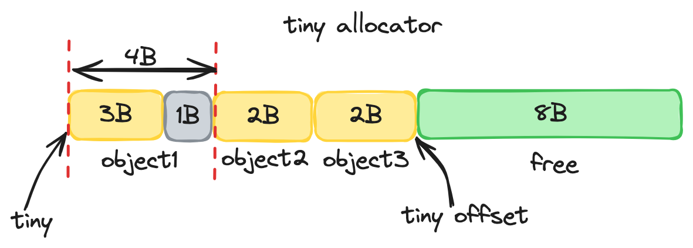. 

```go
off := c.tinyoffset

if size&7 == 0 {
		off = alignUp(off, 8)
} else if size&3 == 0 {
		off = alignUp(off, 4)
} else if size&1 == 0 {
	off = alignUp(off, 2)
}
```

```go
noscan := typ == nil || typ.PtrBytes == 0
// ...
if noscan && size < maxTinySize {
  	// tiny 内存块，从 offset 之后开始找
  	off := c.tinyoffset
		// ...
  	// 如果当前 tiny 内存块空间还够用，则直接分配并返回
		if off+size <= maxTinySize && c.tiny != 0 {
				// 分配空间
				x = unsafe.Pointer(c.tiny + off)
				c.tinyoffset = off + size
				c.tinyAllocs++
				mp.mallocing = 0
				releasem(mp)
				return x
			}
  	// ...
}
```


## 3.4 步骤 2 mcahce 分配

```go
	var sizeclass uint8
	// 根据对象大小，映射到其所属的 span 的等级（0-67）
	size = uintptr(class_to_size[sizeclass])
	spc := makeSpanClass(sizeclass, noscan)
	// 获取 mcache 中的 span
	span = c.alloc[spc]
	// 从 mcache 的 span 中尝试获取空间
	v := nextFreeFast(span)
	if v == 0 {
    	// mcache 分配空间失败，则通过 mcentral, mheap 兜底
			v, span, shouldhelpgc = c.nextFree(spc)
	}
	// 分配空间
	x = unsafe.Pointer(v)
```

在 mspan 中，根据 mspan.allocCache 的 bitMap 信息快速检索到空闲的 object 块，进行返回。

代码位于：runtime/malloc.go

```go
func nextFreeFast(s *mspan) gclinkptr {
  // 在 bitMap 上寻找到首个 object 空位
	theBit := sys.TrailingZeros64(s.allocCache) // Is there a free object in the allocCache?
	if theBit < 64 {
		result := s.freeindex + uintptr(theBit)
		if result < s.nelems {
			freeidx := result + 1
			if freeidx%64 == 0 && freeidx != s.nelems {
				return 0
			}
			s.allocCache >>= uint(theBit + 1)
      // 设置偏移 freeindex
			s.freeindex = freeidx
			s.allocCount++
      // 返回获取 object 空位的内存地址
			return gclinkptr(result*s.elemsize + s.base())
		}
	}
	return 0
}
```


## 3.5 步骤 3 mcentral 分配

当 mspan 无可用的 object 内存块时，会步入 mcache.nextFree 方法进行兜底。

代码位于 runtime/malloc.go

```go
func (c *mcache) nextFree(spc spanClass) (v gclinkptr, s *mspan, shouldhelpgc bool) {
	s = c.alloc[spc]
  // 从 mcache 的 span 获取 object 空位的偏移量
	freeIndex := s.nextFreeIndex()
	if freeIndex == s.nelems {
		// 若 mcache 中 span 已经没有空位，则调用 refill 方法从 mcentral 或者 mheap 中获取新的 span
		c.refill(spc)
		// 从替换后的 span 中获取 object 空位偏移量
		s = c.alloc[spc]
		freeIndex = s.nextFreeIndex()
	}
	// ...

	v = gclinkptr(freeIndex*s.elemsize + s.base())
	s.allocCount++
	// ...
	return
}
```

