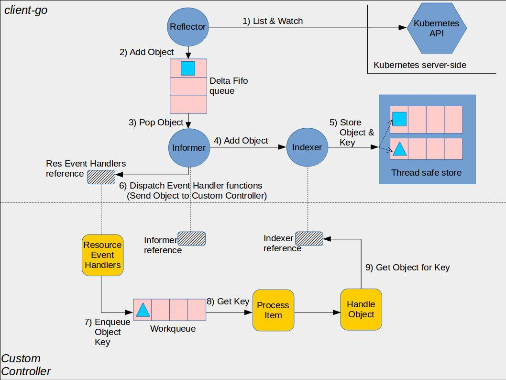

## Informer 机制

k8s 采用 HTTP API 可以查询集群中所有资源对象并 watch 其变化，但是大量的 HTTP 调用会对 API Server 造成较大的负荷，而且网络调用可能存在较大的延迟。

在 k8s 中，informer 可以用于监听 Kubernetes API 服务器中的资源并将它们的当前状态缓存到本地（index->cache），可以避免客户端不断向 API 服务器发送请求，可直接从本地查询。相对于客户端直接 watch, informer 有以下优势：  

*   减少 API 服务器负载：通过本地缓存资源信息。
*   提高应用程序性能：使用缓存数据，应用程序可以快速访问资源信息，而无需等待 API 服务器响应。
*   简化代码：客户端无需编码去管理和 API 服务器的连接等。
*   更高的可靠性：由于 informer 本地有缓存数据，若 API Server 不可用或存在问题，它们也可以正常工作。

## 架构图

 官方架构图




## HTTP API 查询

可查看该链接：https://v1-28.docs.kubernetes.io/docs/reference/generated/kubernetes-api/v1.28/  

> version 可以变化

```shell
# 打开代理
$ kubectl proxy

# 构造 url

# 获取 list
$ curl -iv http://127.0.0.1:8001/api/v1/namespaces/default/pods

# watch
$ curl -iv http://127.0.0.1:8001/api/v1/namespaces/default/pods\?watch\=true

```